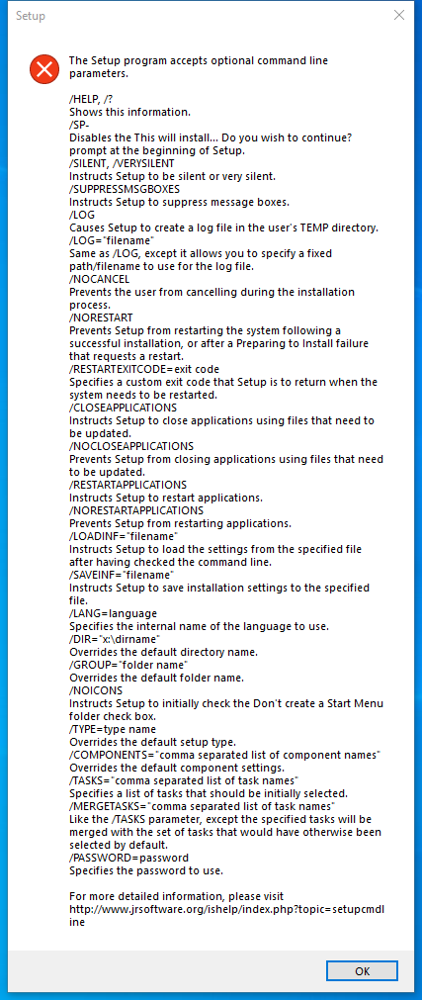

---
title: Recorder-devices-setup.exe | Recorder Devices for ShareX Setup                           
---

# Recorder-devices-setup.exe 

* File Path: `C:\Program Files\ShareX\Recorder-devices-setup.exe`
* Description: Recorder Devices for ShareX Setup                           
* Comments: This installation was built with Inno Setup.

## Screenshot

## Hashes

Type | Hash
-- | --
MD5 | `5666EC81EE3AC85AB6088473B5DA4D2F`
SHA1 | `19F483F1FCE80F9233680052EC9A63ED392F5123`
SHA256 | `CEA1142189B290AFFE70B16708B9D1B43BC63C375FBEB76336397554D207B484`
SHA384 | `54EEFE64499634E76D3FAA8EAB8787803D600FD42B7109EF3FC9C2EDC7CF82DDAC6AAA324440DC002015B5E8630FE9F4`
SHA512 | `1619F16310D734A240CF9A57D6A37B1C0E70BE353428F6C60731949D39B045A5E64A22F2B28A69787C70A49054862E262ECFF7E66E8595976277CD0313DCB35A`
SSDEEP | `24576:DTfEWQMHi9jzdDnAef2L39rcB9XoYcnbQRUu73f7x7B/4V6q3jyjjcw:PcW4ff2L39rA95PRUaP7x7Bjq3+n`

## Runtime Data

### Child Processes:
Recorder-devices-setup.tmp

## Signature

* Status: The file C:\Program Files\ShareX\Recorder-devices-setup.exe is not digitally signed. You cannot run this script on the current system. For more information about running scripts and setting execution policy, see about_Execution_Policies at https:/go.microsoft.com/fwlink/?LinkID=135170
* Serial: ``
* Thumbprint: ``
* Issuer: 
* Subject: 

## File Metadata

* Original Filename:                                                   
* Product Name: Recorder Devices for ShareX                                 
* Company Name:                                                             
* File Version:                     
* Product Version: 0.12.10                                           
* Language: Language Neutral
* Legal Copyright:                                                                                                     

MIT License. Copyright (c) 2020 Strontic.

