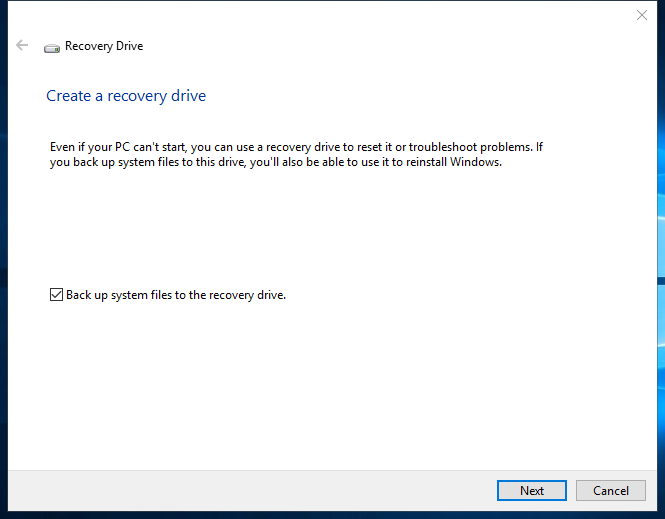

---
title: RecoveryDrive.exe | Recovery Media Creator
---

# RecoveryDrive.exe 

* File Path: `C:\windows\system32\RecoveryDrive.exe`
* Description: Recovery Media Creator

## Screenshot

## Hashes

Type | Hash
-- | --
MD5 | `73FAA89E37E0CA8F480106F253875949`
SHA1 | `3EFFAFFDA8FC835E9DF6B179F9E5CE67812F5C71`
SHA256 | `4F3474844D26E788BB61745B40B2E3BF5F339CA3F229D303C318DE181E638C8A`
SHA384 | `2E16CCD39022CF304E50EB1A76A066C3EF3734AC0011DE43574B12026D6C06B5A1A4973608C559D375A93C197AB3168F`
SHA512 | `580AD7863DFCDF44B65434B7A969E4A2D6D3F26757B06BF14559BFE7C3919429A249F19E12ECB3C7D5149904979A3CB030BF3681F778DEEC281C3008D12A824C`
SSDEEP | `12288:nbOWfVMxkJQHa5Jph46Bp8YZD8s5p4UMEmAsIfTlNc5L8cFPXc1AiCVvv7pyxy:nbOvxkfrN8cdE4STc1Ahvlyx`

### Loaded Modules:

Path |
-- |
C:\Windows\System32\KERNEL32.DLL |
C:\Windows\System32\KERNELBASE.dll |
C:\Windows\SYSTEM32\ntdll.dll |
C:\Windows\system32\recover.exe |

## Signature

* Status: Signature verified.
* Serial: `33000001C422B2F79B793DACB20000000001C4`
* Thumbprint: `AE9C1AE54763822EEC42474983D8B635116C8452`
* Issuer: CN=Microsoft Windows Production PCA 2011, O=Microsoft Corporation, L=Redmond, S=Washington, C=US
* Subject: CN=Microsoft Windows, O=Microsoft Corporation, L=Redmond, S=Washington, C=US

## File Metadata

* Original Filename: RECOVERYDRIVE.EXE.MUI
* Product Name: Microsoft Windows Operating System
* Company Name: Microsoft Corporation
* File Version: 10.0.17763.1 (WinBuild.160101.0800)
* Product Version: 10.0.17763.1
* Language: English (United States)
* Legal Copyright:  Microsoft Corporation. All rights reserved.

## File Similarity (ssdeep match)

File | Score
-- | --
[C:\Windows\system32\RecoveryDrive.exe](RecoveryDrive.exe-FE09ED4BA75107B24DF95D0635A68B69.md) | 90

MIT License. Copyright (c) 2020 Strontic.

