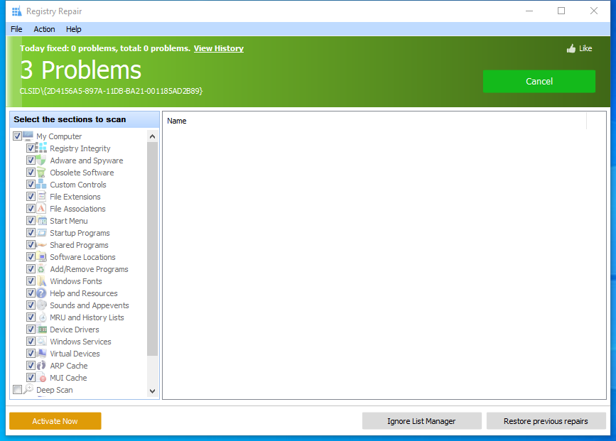

---
title: RegistryCleaner.exe | Glary Utilities RegistryCleaner
excerpt: What is RegistryCleaner.exe?
---

# RegistryCleaner.exe 

* File Path: `C:\Program Files (x86)\Glary Utilities 5\RegistryCleaner.exe`
* Description: Glary Utilities RegistryCleaner

## Screenshot

## Hashes

Type | Hash
-- | --
MD5 | `7AAB426DADA6E4F85740316E212D0BEB`
SHA1 | `AB2FECC4436D19A79D38C622629A7A97384CD00C`
SHA256 | `728E1C2DD04A69C03800524FBE2F5793E753DBF8B65CF210CFA9CD0046DD7D17`
SHA384 | `10E49BCA49346A8DBDD3374200759B2FD95AE68313C7D8D6CF1C80589BB31236C5D101EB4E54EF49A0B0F5B06285AB0E`
SHA512 | `98F89C126CF159AC1BB8CFB81956CF3118CF1CB688568E6357D54C48DEF7B15ADA0E6C400D57F8097A1617DCAE0CC55FB1C0BF21F93AB92803450B90FB9A6BCF`
SSDEEP | `768:uP0euPG+EDOUIxr51zPzzHzzzz+zPz0zzkzzRzzmdzRSzzDzPzsS8zPzAIzPzAI6:uP0eprOUIx7zPzzHzzzz+zPz0zzkzzRn`

## Signature

* Status: Signature verified.
* Serial: `0F05AE21CDC17B9F3CF09D7BFC659BA3`
* Thumbprint: `362EBB303E088105BDCC07D94E6B7875D30C0D06`
* Issuer: CN=DigiCert Assured ID Code Signing CA-1, OU=www.digicert.com, O=DigiCert Inc, C=US
* Subject: CN=Glarysoft LTD, O=Glarysoft LTD, S=Beijing, C=CN

## File Metadata

* Original Filename: RegistryCleaner.exe
* Product Name: Glary Utilities
* Company Name: Glarysoft Ltd
* File Version: 5.0.0.109
* Product Version: 5.0.0.1
* Language: Chinese (Simplified, China)
* Legal Copyright: Copyright (c) 2003-2020 Glarysoft Ltd

## File Similarity (ssdeep match)

File | Score
-- | --
[C:\program files (x86)\Glary Utilities 5\RegistryCleaner.exe](RegistryCleaner.exe-38192935E4087704D08F059221C4A423.md) | 97
[C:\Program Files (x86)\Glary Utilities 5\RegistryCleaner.exe](RegistryCleaner.exe-6C8D3198FB61B7739CF574CF1E71226E.md) | 96

MIT License. Copyright (c) 2020 Strontic.

