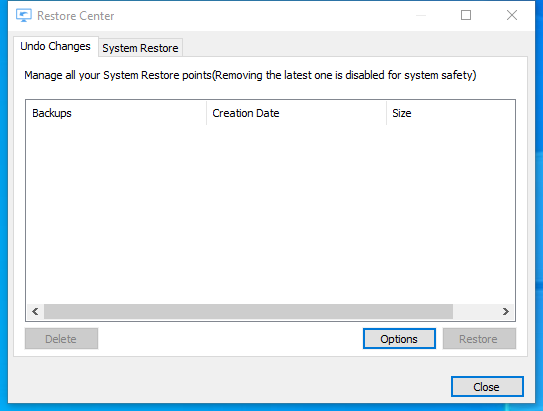

---
title: RestoreCenter.exe | Glary Utilities RestoreCenter
excerpt: What is RestoreCenter.exe?
---

# RestoreCenter.exe 

* File Path: `C:\program files (x86)\Glary Utilities 5\RestoreCenter.exe`
* Description: Glary Utilities RestoreCenter

## Screenshot

## Hashes

Type | Hash
-- | --
MD5 | `490B4D25DB2EE94265D906E248C37E98`
SHA1 | `5A79BF32F7A30949AD970D3601DFDDC66FD8B395`
SHA256 | `694B0E7753C88F6AEA8BC2DE7100BDDFF5BE3AACFB3E1ABD6D8C9CE50451F2B7`
SHA384 | `A76063E82F19599146BA3A31BE83DFC11C526EAE80E28BDF599B5181377117135EEFEE58BA48D4860A447CBE2F0204C3`
SHA512 | `21A3D98C849139A736F9AFB0F616497447C5898ADA5D28C52B9FB4E7B91333D2BC629F71CEEF37FA962C586CCFB50E24BA6491AD2F4E3A9146A7A4DF43F40FE0`
SSDEEP | `768:RP058i4VDOBXFzuzhzvzzuzXXzXePUgadMeKglxV1DGU7Uf2hX:Rc5GOBVzuzhzvzzuzXXzXePUgaiehVDh`

## Runtime Data

### Window Title:
Restore Center

### Open Handles:

Path | Type
-- | --
(R-D)   C:\Windows\Fonts\StaticCache.dat | File
(R-D)   C:\Windows\SysWOW64\en-US\user32.dll.mui | File
(RW-)   C:\Program Files (x86)\Glary Utilities 5 | File
(RW-)   C:\Users\user\Documents | File
(RW-)   C:\Windows | File
(RW-)   C:\Windows\WinSxS\x86_microsoft.vc90.crt_1fc8b3b9a1e18e3b_9.0.30729.9625_none_508ef7e4bcbbe589 | File
(RW-)   C:\Windows\WinSxS\x86_microsoft.windows.common-controls_6595b64144ccf1df_6.0.19041.1_none_fd031af45b0106f2 | File
(RW-)   C:\Windows\WinSxS\x86_microsoft.windows.gdiplus_6595b64144ccf1df_1.1.19041.450_none_4294d6e08a97344a | File
\BaseNamedObjects\NLS_CodePage_1252_3_2_0_0 | Section
\BaseNamedObjects\NLS_CodePage_437_3_2_0_0 | Section
\Sessions\1\Windows\Theme4048709601 | Section
\Windows\Theme603176458 | Section

### Loaded Modules:

Path |
-- |
C:\program files (x86)\Glary Utilities 5\RestoreCenter.exe |
C:\Windows\SYSTEM32\ntdll.dll |
C:\Windows\System32\wow64.dll |
C:\Windows\System32\wow64cpu.dll |
C:\Windows\System32\wow64win.dll |

## Signature

* Status: Signature verified.
* Serial: `0F05AE21CDC17B9F3CF09D7BFC659BA3`
* Thumbprint: `362EBB303E088105BDCC07D94E6B7875D30C0D06`
* Issuer: CN=DigiCert Assured ID Code Signing CA-1, OU=www.digicert.com, O=DigiCert Inc, C=US
* Subject: CN=Glarysoft LTD, O=Glarysoft LTD, S=Beijing, C=CN

## File Metadata

* Original Filename: RestoreCenter.exe
* Product Name: Glary Utilities
* Company Name: Glarysoft Ltd
* File Version: 5.0.0.35
* Product Version: 5.0.0.1
* Language: Chinese (Simplified, China)
* Legal Copyright: Copyright (c) 2003-2020 Glarysoft Ltd

## File Similarity (ssdeep match)

File | Score
-- | --
[C:\Program Files (x86)\Glary Utilities 5\RestoreCenter.exe](RestoreCenter.exe-1E33F934AF4D011481C3446B4100AE74.md) | 86

MIT License. Copyright (c) 2020 Strontic.

