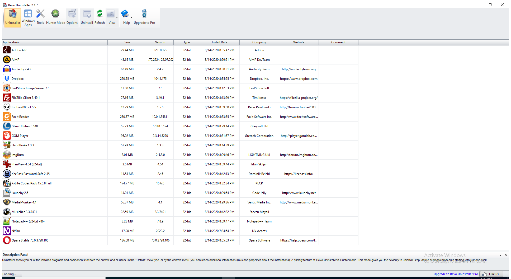

---
title: RevoUnin.exe | Revo Uninstaller
excerpt: What is RevoUnin.exe?
---

# RevoUnin.exe 

* File Path: `C:\Program Files\VS Revo Group\Revo Uninstaller\RevoUnin.exe`
* Description: Revo Uninstaller

## Screenshot

## Hashes

Type | Hash
-- | --
MD5 | `919A5D34B4E302BFFF653DA2606B678E`
SHA1 | `901BEF98E73559AEBCFFF8E8309F1DB3BDCE5FAF`
SHA256 | `B155DE1EC7BD46D79936766D581F97838E4C8D34301EE3DFC57F7D62D78E05DB`
SHA384 | `1AC448AD726FAC2AED43A158B0428F0C80DB6AF60E513939265A593872A988C4F501BF5840D17243EBBB87DCC897CEB9`
SHA512 | `4C9109789861677AB42B5DDA53202EDCEC428B02CA508357583F777BDF75EAA17CDC7BFFACF51C79ED24F4E5016C4FD3AE58D4D828F3846133C87A357DCC88EE`
SSDEEP | `196608:qLhPXhfqNEqeWrAoyYzFCwPWpGplR806IIIIIIIIIIIIIIIIIIIIIIIIIIIIIIIJ:qdPXhfqNEqeCyY55PWpGplR8Z7I`
IMP | `6F5205FEF2F54A040E50181AC219D32B`
PESHA1 | `1D13F5E867B09DDD9509D500C19855EA25432D69`
PE256 | `D3CE29B68DF1DA0ED36FFA3D1B40B2CE5966094EB1E89FE7F11FBE550583146D`

## Runtime Data

### Window Title:
Revo Uninstaller 2.1.7

### Open Handles:

Path | Type
-- | --
(R-D)   C:\Windows\Fonts\StaticCache.dat | File
(R-D)   C:\Windows\System32\en-US\propsys.dll.mui | File
(R-D)   C:\Windows\System32\en-US\user32.dll.mui | File
(R-D)   C:\Windows\WinSxS\amd64_microsoft.windows.c..-controls.resources_6595b64144ccf1df_6.0.19041.1_en-us_cb612d02732b0fd9\comctl32.dll.mui | File
(RW-)   C:\Windows\WinSxS\amd64_microsoft.windows.c..-controls.resources_6595b64144ccf1df_6.0.19041.1_en-us_cb612d02732b0fd9 | File
(RW-)   C:\Windows\WinSxS\amd64_microsoft.windows.common-controls_6595b64144ccf1df_6.0.19041.488_none_ca04af081b815d21 | File
(RW-)   C:\Windows\WinSxS\amd64_microsoft.windows.gdiplus_6595b64144ccf1df_1.1.19041.508_none_faefa4f37613d18e | File
(RW-)   C:\xCyclopedia | File
(RWD)   C:\Program Files | File
(RWD)   C:\Program Files (x86) | File
(RWD)   C:\ProgramData\Microsoft\Windows\Start Menu\Programs | File
(RWD)   C:\Users\user\AppData\Local\Microsoft\Windows\Explorer\iconcache_16.db | File
(RWD)   C:\Users\user\AppData\Local\Microsoft\Windows\Explorer\iconcache_32.db | File
(RWD)   C:\Users\user\AppData\Local\Microsoft\Windows\Explorer\iconcache_idx.db | File
\BaseNamedObjects\__ComCatalogCache__ | Section
\BaseNamedObjects\C:\*ProgramData\*Microsoft\*Windows\*Caches\*{6AF0698E-D558-4F6E-9B3C-3716689AF493}.2.ver0x0000000000000003.db | Section
\BaseNamedObjects\C:\*ProgramData\*Microsoft\*Windows\*Caches\*{DDF571F2-BE98-426D-8288-1A9A39C3FDA2}.2.ver0x0000000000000002.db | Section
\BaseNamedObjects\C:\*ProgramData\*Microsoft\*Windows\*Caches\*cversions.2 | Section
\BaseNamedObjects\NLS_CodePage_1252_3_2_0_0 | Section
\BaseNamedObjects\NLS_CodePage_437_3_2_0_0 | Section
\BaseNamedObjects\windows_shell_global_counters | Section
\Sessions\1\BaseNamedObjects\13acHWNDInterface:180890 | Section
\Sessions\1\BaseNamedObjects\13acHWNDInterface:1c0886 | Section
\Sessions\1\BaseNamedObjects\13acHWNDInterface:9f088a | Section
\Sessions\1\BaseNamedObjects\13acHWNDInterface:bc0880 | Section
\Sessions\1\BaseNamedObjects\windows_ie_global_counters | Section
\Sessions\1\BaseNamedObjects\windows_shell_global_counters | Section
\Sessions\1\Windows\Theme2547664911 | Section
\Windows\Theme3854699184 | Section

### Loaded Modules:

Path |
-- |
C:\Program Files\VS Revo Group\Revo Uninstaller\RevoUnin.exe |
C:\Windows\System32\ADVAPI32.dll |
C:\Windows\System32\GDI32.dll |
C:\Windows\System32\KERNEL32.DLL |
C:\Windows\System32\KERNELBASE.dll |
C:\Windows\SYSTEM32\msi.dll |
C:\Windows\System32\msvcrt.dll |
C:\Windows\SYSTEM32\ntdll.dll |
C:\Windows\System32\PSAPI.DLL |
C:\Windows\System32\RPCRT4.dll |
C:\Windows\System32\sechost.dll |
C:\Windows\System32\SHLWAPI.dll |
C:\Windows\WinSxS\amd64_microsoft.windows.common-controls_6595b64144ccf1df_6.0.19041.488_none_ca04af081b815d21\COMCTL32.dll |

## Signature

* Status: Signature verified.
* Serial: `0D7AAE3B360869A3BA28BD7D1FD0B8F6`
* Thumbprint: `E0504D965BF65DC63E8A2DA7328A392EA3D6641E`
* Issuer: CN=DigiCert EV Code Signing CA (SHA2), OU=www.digicert.com, O=DigiCert Inc, C=US
* Subject: CN=VS Revo Group Ltd., O=VS Revo Group Ltd., L=Ruse, C=BG, SERIALNUMBER=200204019, OID.2.5.4.15=Private Organization, OID.1.3.6.1.4.1.311.60.2.1.3=BG

## File Metadata

* Original Filename: RevoUnin.exe
* Product Name: Revo Uninstaller
* Company Name: VS Revo Group
* File Version: 2.1.7.0
* Product Version: 2.1.7.0
* Language: Language Neutral
* Legal Copyright: (c) VS Revo Group Ltd.  All rights reserved.
* Machine Type: 64-bit

## File Scan

* VirusTotal Detections: 0/67
* VirusTotal Link: https://www.virustotal.com/gui/file/b155de1ec7bd46d79936766d581f97838e4c8d34301ee3dfc57f7d62d78e05db/detection/

MIT License. Copyright (c) 2020-2021 Strontic.

