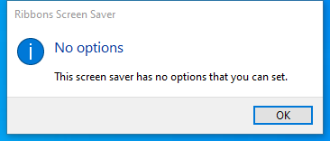

---
title: Ribbons.scr | Ribbons Screen Saver
excerpt: What is Ribbons.scr?
---

# Ribbons.scr 

* File Path: `C:\Windows\system32\Ribbons.scr`
* Description: Ribbons Screen Saver

## Screenshot

## Hashes

Type | Hash
-- | --
MD5 | `8B34A9DEA0F6040DE7CAA188DCDA8D98`
SHA1 | `43C03B9F3F93F90B2B8BAA1715A7212986015502`
SHA256 | `D63666ACDA98473B4D97937DBD512DFD241C4603F08190B35FF1DA7431016FD1`
SHA384 | `5528CA31111329CCF20A163B08E51C913AA6FE2C5D44E7CF7B55AC66E6C8A5DF4A087BC5AE2AE3EE9CCCA3397FA53FBB`
SHA512 | `41256FA6384BA69889886B69F8F31B86B1445ADACD695F2CD8F9604E29269FCDE9CBA24DCCA9BE540FE5D78542899BB8DABE50C748549894F55AE815049DE964`
SSDEEP | `3072:tNHfFE24AOjbi6q/PKNp0LcOGefEDGJqP4yciLgj5L:RWXmXLG1JC5`
IMP | `E3EDD3408C26D0CB7273BC99781B3447`
PESHA1 | `08FB127195B4A812E11CE3CE9F427A97696DE1F9`
PE256 | `E2A4AE1E0C246EC3A8DBFB3BAAFAAC3218F0DE5BFFBAAB9DF264D22B50EEFD05`

## Runtime Data

### Window Title:
Ribbons

### Open Handles:

Path | Type
-- | --
(R-D)   C:\Windows\System32\en-US\Ribbons.scr.mui | File
(RW-)   C:\Users\user | File
(RW-)   C:\Windows\WinSxS\amd64_microsoft.windows.common-controls_6595b64144ccf1df_6.0.19041.746_none_ca02b4b61b8320a4 | File
\BaseNamedObjects\C:\*ProgramData\*Microsoft\*Windows\*Caches\*{6AF0698E-D558-4F6E-9B3C-3716689AF493}.2.ver0x0000000000000002.db | Section
\BaseNamedObjects\C:\*ProgramData\*Microsoft\*Windows\*Caches\*{DDF571F2-BE98-426D-8288-1A9A39C3FDA2}.2.ver0x0000000000000002.db | Section
\BaseNamedObjects\C:\*ProgramData\*Microsoft\*Windows\*Caches\*cversions.2 | Section
\BaseNamedObjects\NLS_CodePage_1252_3_2_0_0 | Section
\BaseNamedObjects\NLS_CodePage_437_3_2_0_0 | Section
\Sessions\1\Windows\Theme3205582532 | Section
\Windows\Theme3800351183 | Section

### Loaded Modules:

Path |
-- |
C:\Windows\System32\ADVAPI32.dll |
C:\Windows\System32\KERNEL32.DLL |
C:\Windows\System32\KERNELBASE.dll |
C:\Windows\System32\msvcrt.dll |
C:\Windows\SYSTEM32\ntdll.dll |
C:\Windows\system32\Ribbons.scr |
C:\Windows\System32\sechost.dll |

## Signature

* Status: Signature verified.
* Serial: `3300000266BD1580EFA75CD6D3000000000266`
* Thumbprint: `A4341B9FD50FB9964283220A36A1EF6F6FAA7840`
* Issuer: CN=Microsoft Windows Production PCA 2011, O=Microsoft Corporation, L=Redmond, S=Washington, C=US
* Subject: CN=Microsoft Windows, O=Microsoft Corporation, L=Redmond, S=Washington, C=US

## File Metadata

* Original Filename: Ribbons
* Product Name: Microsoft Windows Operating System
* Company Name: Microsoft Corporation
* File Version: 10.0.19041.1 (WinBuild.160101.0800)
* Product Version: 10.0.19041.1
* Language: English (United States)
* Legal Copyright:  Microsoft Corporation. All rights reserved.
* Machine Type: 64-bit

## File Scan

* VirusTotal Detections: 0/76
* VirusTotal Link: https://www.virustotal.com/gui/file/d63666acda98473b4d97937dbd512dfd241c4603f08190b35ff1da7431016fd1/detection

MIT License. Copyright (c) 2020-2021 Strontic.

