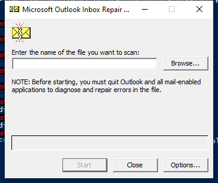

---
title: SCANPST.EXE | Microsoft Office component
excerpt: What is SCANPST.EXE?
---

# SCANPST.EXE 

* File Path: `C:\Program Files (x86)\Microsoft Office\root\Office16\SCANPST.EXE`
* Description: Microsoft Office component

## Screenshot

## Hashes

Type | Hash
-- | --
MD5 | `2833670F9BB5DB603447A82DC88376B5`
SHA1 | `C6C107B4936B67153AF4457642733C864C2BEF38`
SHA256 | `9C73AA0CB8EFA0B445CE6FB0811729864A47679644F60B270BDCA1A09956C5D3`
SHA384 | `9F31B05CDD22C644C4D13188B6E56FE1063D2722F1EFBD96C58E5F9293DC89E7B5C46D006B1E4AC5A2442DBBC5B3BBD4`
SHA512 | `760EB061657DCC7B1A2FE73A226C17FDC11633C9ECFB6B7639B227B055BCF6A20AEA67F69C12B2C62F747C21F13874F5D39FB4AEA2165740A42252FEC0B92EF7`
SSDEEP | `1536:63qYk/F8wJz2G890kJCGVnJ+C4RtlAlU+1DnsHkbIQ:L98wJz2G00kJCW+BRtlAlUeDE6`
IMP | `36576B9CFA084EB1D1743115CAC462F0`
PESHA1 | `1340740A9E5C1E48C232D8A45A60FF4018D2EB26`
PE256 | `B0A9783562DB4021326BB005C4E09F9D6096B35954195B9342631DA071DCA256`

## Runtime Data

### Window Title:
Microsoft Outlook Inbox Repair Tool

### Open Handles:

Path | Type
-- | --
(R--)   C:\ProgramData\Microsoft\Office\ClickToRunPackageLocker | File
(R-D)   C:\Windows\Fonts\StaticCache.dat | File
(R-D)   C:\Windows\System32\en-US\crypt32.dll.mui | File
(R-D)   C:\Windows\System32\en-US\KernelBase.dll.mui | File
(R-D)   C:\Windows\System32\en-US\mswsock.dll.mui | File
(R-D)   C:\Windows\System32\en-US\Windows.Security.Authentication.Web.Core.dll.mui | File
(R-D)   C:\Windows\System32\en-US\winnlsres.dll.mui | File
(R-D)   C:\Windows\SysWOW64\en-US\user32.dll.mui | File
(RW-)   C:\Users\user\Documents | File
(RW-)   C:\Windows | File
(RW-)   C:\Windows\WinSxS\x86_microsoft.windows.common-controls_6595b64144ccf1df_5.82.19041.488_none_89e6152f0b32762e | File
(RW-)   C:\Windows\WinSxS\x86_microsoft.windows.common-controls_6595b64144ccf1df_6.0.19041.488_none_11b1e5df2ffd8627 | File
(RW-)   C:\Windows\WinSxS\x86_microsoft.windows.gdiplus_6595b64144ccf1df_1.1.19041.508_none_429cdbca8a8ffa94 | File
\BaseNamedObjects\__ComCatalogCache__ | Section
\BaseNamedObjects\F932B6C7-3A20-46A0-B8A0-8894AA421973 | Section
\BaseNamedObjects\NLS_CodePage_1252_3_2_0_0 | Section
\BaseNamedObjects\NLS_CodePage_437_3_2_0_0 | Section
\Sessions\1\BaseNamedObjects\UrlZonesSM_user | Section
\Sessions\1\BaseNamedObjects\windows_shell_global_counters | Section
\Sessions\1\BaseNamedObjects\windows_webcache_counters_{9B6AB5B3-91BC-4097-835C-EA2DEC95E9CC}_S-1-5-21-2047949552-857980807-821054962-504 | Section
\Sessions\1\Windows\Theme64749523 | Section
\Windows\Theme1120315852 | Section

### Loaded Modules:

Path |
-- |
C:\Program Files (x86)\Microsoft Office\root\Office16\SCANPST.EXE |
C:\Windows\SYSTEM32\ntdll.dll |
C:\Windows\System32\wow64.dll |
C:\Windows\System32\wow64cpu.dll |
C:\Windows\System32\wow64win.dll |

## Signature

* Status: Signature verified.
* Serial: `33000002CE7C9ACE7D905ED2B70000000002CE`
* Thumbprint: `B10607FB914700B40F794610850C1DE0A21566C1`
* Issuer: CN=Microsoft Code Signing PCA 2010, O=Microsoft Corporation, L=Redmond, S=Washington, C=US
* Subject: CN=Microsoft Corporation, O=Microsoft Corporation, L=Redmond, S=Washington, C=US

## File Metadata

* Original Filename: scanpst.exe
* Product Name: Microsoft Outlook
* Company Name: Microsoft Corporation
* File Version: 16.0.12527.20482
* Product Version: 16.0.12527.20482
* Language: Language Neutral
* Legal Copyright: 
* Machine Type: 32-bit

## File Scan

* VirusTotal Detections: 0/71
* VirusTotal Link: https://www.virustotal.com/gui/file/9c73aa0cb8efa0b445ce6fb0811729864a47679644f60b270bdca1a09956c5d3/detection/

MIT License. Copyright (c) 2020-2021 Strontic.

