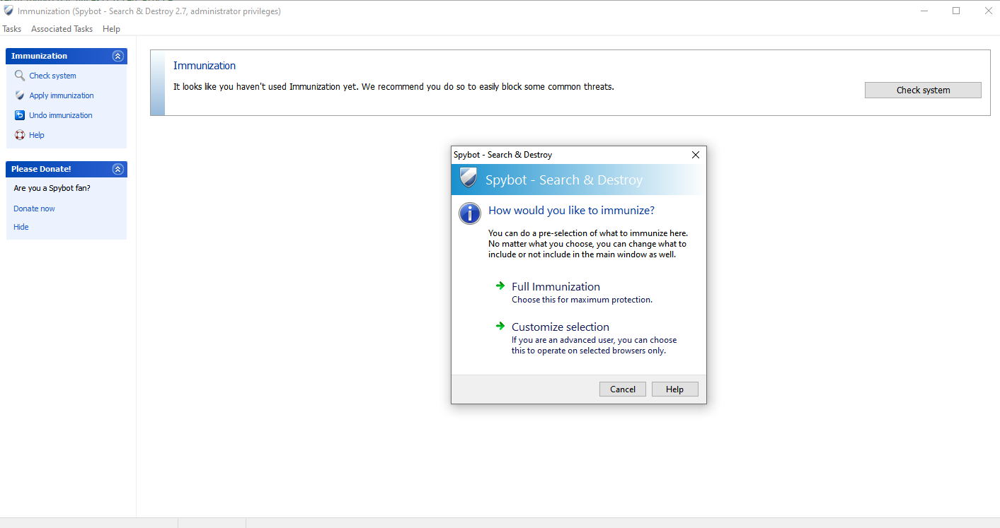

---
title: SDImmunize.exe | Pro-active browser protection
excerpt: What is SDImmunize.exe?
---

# SDImmunize.exe 

* File Path: `C:\Program Files (x86)\Spybot - Search & Destroy 2\SDImmunize.exe`
* Description: Pro-active browser protection

## Screenshot

## Hashes

Type | Hash
-- | --
MD5 | `CF037C5A2A24E2517091D8D701AFF037`
SHA1 | `E2422373F8CBDAE0E76B0F867B07A9F1DBFB8267`
SHA256 | `546673A751387DA0311489E463CF996854253F8194726C92D352B8E47040F464`
SHA384 | `46A4605CFF598101A79E81E06BEAEC7D08F349818393634152DEDD11122C6BFDB442FDAE80CA1E81C3253256A1FE1D2C`
SHA512 | `10C963F3E9C50BA59C787F7B74B73DF932B4B9779969BA9563DFA2DBD73E79C3EE4D2D40BD558443476F712B3D29F805ADA65D143FB45E6552B0D13F8B787232`
SSDEEP | `98304:FOcBInn93uV9JtpN/F2ethHlRpZSn3zjAL5/iqt2SA:69stpRxHltS4ZMZ`
IMP | `A1E8A4B3453013EFD9ACD18DD3AB6B99`
PESHA1 | `4734FD21AEEC1D5080F864D4EBBDEEE23F45BBEE`
PE256 | `4BF77883FF2123931ECDC06D2FBC3DAC54F8BB83A8A777DC533A54E65A4C711C`

## Runtime Data

### Window Title:
Immunization (Spybot - Search & Destroy 2.7, administrator privileges)

### Open Handles:

Path | Type
-- | --
(R-D)   C:\Windows\Fonts\StaticCache.dat | File
(R-D)   C:\Windows\System32\en-US\crypt32.dll.mui | File
(R-D)   C:\Windows\System32\en-US\KernelBase.dll.mui | File
(R-D)   C:\Windows\System32\en-US\wdmaud.drv.mui | File
(R-D)   C:\Windows\System32\en-US\winmm.dll.mui | File
(R-D)   C:\Windows\SysWOW64\en-US\user32.dll.mui | File
(R-D)   C:\Windows\WinSxS\x86_microsoft.windows.c..-controls.resources_6595b64144ccf1df_6.0.19041.1_en-us_130e63d987a738df\comctl32.dll.mui | File
(RW-)   C:\Windows | File
(RW-)   C:\Windows\WinSxS\x86_microsoft.windows.c..-controls.resources_6595b64144ccf1df_6.0.19041.1_en-us_130e63d987a738df | File
(RW-)   C:\Windows\WinSxS\x86_microsoft.windows.common-controls_6595b64144ccf1df_6.0.19041.488_none_11b1e5df2ffd8627 | File
(RW-)   C:\xCyclopedia | File
(RWD)   C:\Users | File
(RWD)   C:\Users\user\AppData\Roaming\Microsoft\SystemCertificates\My | File
\BaseNamedObjects\__ComCatalogCache__ | Section
\BaseNamedObjects\NLS_CodePage_1252_3_2_0_0 | Section
\BaseNamedObjects\NLS_CodePage_437_3_2_0_0 | Section
\BaseNamedObjects\windows_shell_global_counters | Section
\Sessions\1\BaseNamedObjects\windows_shell_global_counters | Section
\Sessions\1\BaseNamedObjects\windows_webcache_counters_{9B6AB5B3-91BC-4097-835C-EA2DEC95E9CC}_S-1-5-21-2047949552-857980807-821054962-504 | Section
\Sessions\1\Windows\Theme2547664911 | Section
\Windows\Theme3854699184 | Section

### Loaded Modules:

Path |
-- |
C:\Program Files (x86)\Spybot - Search & Destroy 2\SDImmunize.exe |
C:\Windows\SYSTEM32\ntdll.dll |
C:\Windows\System32\wow64.dll |
C:\Windows\System32\wow64cpu.dll |
C:\Windows\System32\wow64win.dll |

## Signature

* Status: Signature verified.
* Serial: `0B3FD32E39B247B09C8040571D6AD2F3`
* Thumbprint: `9A32249E9A6B9CF5C36B0749C81613524D37C594`
* Issuer: CN=DigiCert EV Code Signing CA (SHA2), OU=www.digicert.com, O=DigiCert Inc, C=US
* Subject: CN=Safer-Networking Ltd., O=Safer-Networking Ltd., L=Greystones, S=County Wicklow, C=IE, STREET=Unit 5 Watson & Johnson Centre, SERIALNUMBER=377893, OID.1.3.6.1.4.1.311.60.2.1.3=IE, OID.2.5.4.15=Private Organization

## File Metadata

* Original Filename: SDImmunize.exe
* Product Name: Spybot - Search & Destroy
* Company Name: Safer-Networking Ltd.
* File Version: 2.7.64.133
* Product Version: 2.7.64.0
* Language: English (Ireland)
* Legal Copyright:  2000-2018 Safer-Networking Ltd. All rights reserved.
* Machine Type: 32-bit

## File Scan

* VirusTotal Detections: 0/70
* VirusTotal Link: https://www.virustotal.com/gui/file/546673a751387da0311489e463cf996854253f8194726c92d352b8e47040f464/detection/

## File Similarity (ssdeep match)

File | Score
-- | --
[C:\Program Files (x86)\Spybot - Search & Destroy 2\explorer.exe](explorer.exe-93C039905E587E60842D0C8FF2E8988E.md) | 33
[C:\Program Files (x86)\Spybot - Search & Destroy 2\SDBootCD.exe](SDBootCD.exe-4DB104C5B1742B2061E48D26C11837B1.md) | 36
[C:\Program Files (x86)\Spybot - Search & Destroy 2\SDCleaner.exe](SDCleaner.exe-0FDE330837830102673073FA4C5EEAD7.md) | 33
[C:\Program Files (x86)\Spybot - Search & Destroy 2\SDFiles.exe](SDFiles.exe-D4973562BFA8E178EF72A8816C1C5557.md) | 33
[C:\Program Files (x86)\Spybot - Search & Destroy 2\SDHelp.exe](SDHelp.exe-D1B3480B016A952C6A7C683E453B3C7C.md) | 29
[C:\Program Files (x86)\Spybot - Search & Destroy 2\SDLogReport.exe](SDLogReport.exe-E0E49C7329EECC60EE907A5E7725A737.md) | 30
[C:\Program Files (x86)\Spybot - Search & Destroy 2\SDPEStart.exe](SDPEStart.exe-ED943067AF3C2B31F9D56415A64029A5.md) | 33
[C:\Program Files (x86)\Spybot - Search & Destroy 2\SDPhoneScan.exe](SDPhoneScan.exe-D053AED7F467E45FE3B0FA58D82DAEAC.md) | 35
[C:\Program Files (x86)\Spybot - Search & Destroy 2\SDPrepPos.exe](SDPrepPos.exe-7822DAFEB5D90E81D53E50B3A8BF97E0.md) | 35
[C:\Program Files (x86)\Spybot - Search & Destroy 2\SDQuarantine.exe](SDQuarantine.exe-498015661C0E7B197ED3DB62D03DBF85.md) | 36
[C:\Program Files (x86)\Spybot - Search & Destroy 2\SDRootAlyzer.exe](SDRootAlyzer.exe-47F02E23C6EDEA58DA2CC0CA8F67828D.md) | 36
[C:\Program Files (x86)\Spybot - Search & Destroy 2\SDSBIEdit.exe](SDSBIEdit.exe-9766A0E790E3F17BC61C42956183F405.md) | 33
[C:\Program Files (x86)\Spybot - Search & Destroy 2\SDScan.exe](SDScan.exe-93C039905E587E60842D0C8FF2E8988E.md) | 33
[C:\Program Files (x86)\Spybot - Search & Destroy 2\SDScript.exe](SDScript.exe-E1117C0FFF026B3CF51990E2A6F474E6.md) | 43
[C:\Program Files (x86)\Spybot - Search & Destroy 2\SDSettings.exe](SDSettings.exe-4ACDC47B703A0C390C92B4F85A75E3F8.md) | 32
[C:\Program Files (x86)\Spybot - Search & Destroy 2\SDShred.exe](SDShred.exe-21F7D3606C1BF53FF51CBE07AC0065FA.md) | 33
[C:\Program Files (x86)\Spybot - Search & Destroy 2\SDSysRepair.exe](SDSysRepair.exe-2EC096C12C9FB5B922CB4307EF76DE13.md) | 33
[C:\Program Files (x86)\Spybot - Search & Destroy 2\SDTools.exe](SDTools.exe-F32C4CF34160CF485D41FA4241DA27EC.md) | 29
[C:\Program Files (x86)\Spybot - Search & Destroy 2\SDTray.exe](SDTray.exe-06B43CB00B61BE55B6D100B15EDFBC39.md) | 40
[C:\Program Files (x86)\Spybot - Search & Destroy 2\SDUpdate.exe](SDUpdate.exe-3F181359C3975DD6908F0759B1BFAB30.md) | 30
[C:\Program Files (x86)\Spybot - Search & Destroy 2\SDWelcome.exe](SDWelcome.exe-333F7FE978921B78A38EDF043AB0C1CA.md) | 36

MIT License. Copyright (c) 2020-2021 Strontic.

