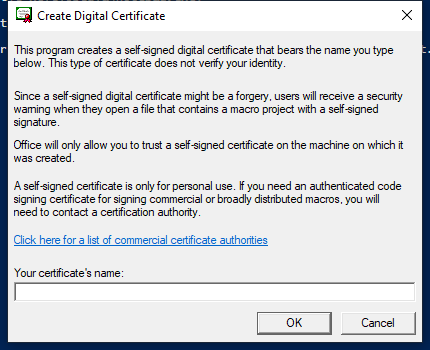

---
title: SELFCERT.EXE | Create a self-signed digital certificate
excerpt: What is SELFCERT.EXE?
---

# SELFCERT.EXE 

* File Path: `C:\Program Files (x86)\Microsoft Office\root\Office16\SELFCERT.EXE`
* Description: Create a self-signed digital certificate

## Screenshot

## Hashes

Type | Hash
-- | --
MD5 | `751BB7B3063F2E2D25067A204EA55B4F`
SHA1 | `8C47AD6CEF8B3E3A4145AE955882FF8B18DFDA16`
SHA256 | `02449A20ED793CFCDB4DC2FB643FB6CDB79D95472EF67F37022C4DB93D54A8EE`
SHA384 | `37DA6084EE2AE874F775E795887F3658BF9696D28BF988E658DFE075E950F4953B2D4B083846571876A10A69C365314F`
SHA512 | `DEDE459BB9F72BE193A3FD3B297A064503704117F24EAAD77C31D7BC75FE158B59E11DA425A4668D3925FFAC6D70BBDEC2F6874F4A0DDDA0887FFC78652ADC27`
SSDEEP | `12288:dMItOei3kVxXsJklyWKSqNfJJVRkZyelf6eLS9Qfw:xtO30VxXs9dfJJXkZyf9Qfw`
IMP | `E5648921C0C09F89605F05E1BBFC5178`
PESHA1 | `B3291D0E925F1F5C45C83DBBA358DC62DA53B77B`
PE256 | `1BE5D886B4EE1E275D4D202D020B6D62905B72724C4F7643436D3BBE501FEA23`

## Runtime Data

### Window Title:
Create Digital Certificate

### Open Handles:

Path | Type
-- | --
(R--)   C:\ProgramData\Microsoft\Office\ClickToRunPackageLocker | File
(R-D)   C:\Windows\Fonts\StaticCache.dat | File
(RW-)   C:\Users\user\Documents | File
(RW-)   C:\Windows | File
(RW-)   C:\Windows\WinSxS\x86_microsoft.windows.common-controls_6595b64144ccf1df_5.82.19041.488_none_89e6152f0b32762e | File
\BaseNamedObjects\__ComCatalogCache__ | Section
\BaseNamedObjects\NLS_CodePage_1252_3_2_0_0 | Section
\BaseNamedObjects\NLS_CodePage_437_3_2_0_0 | Section
\Sessions\1\Windows\Theme64749523 | Section
\Windows\Theme1120315852 | Section

### Loaded Modules:

Path |
-- |
C:\Program Files (x86)\Microsoft Office\root\Office16\SELFCERT.EXE |
C:\Windows\SYSTEM32\ntdll.dll |
C:\Windows\System32\wow64.dll |
C:\Windows\System32\wow64cpu.dll |
C:\Windows\System32\wow64win.dll |

## Signature

* Status: Signature verified.
* Serial: `33000002CE7C9ACE7D905ED2B70000000002CE`
* Thumbprint: `B10607FB914700B40F794610850C1DE0A21566C1`
* Issuer: CN=Microsoft Code Signing PCA 2010, O=Microsoft Corporation, L=Redmond, S=Washington, C=US
* Subject: CN=Microsoft Corporation, O=Microsoft Corporation, L=Redmond, S=Washington, C=US

## File Metadata

* Original Filename: Selfcert.exe
* Product Name: SelfCert
* Company Name: Microsoft Corporation
* File Version: 16.0.12527.20482
* Product Version: 16.0.12527.20482
* Language: Language Neutral
* Legal Copyright: 
* Machine Type: 32-bit

## File Scan

* VirusTotal Detections: Unknown

MIT License. Copyright (c) 2020-2021 Strontic.

