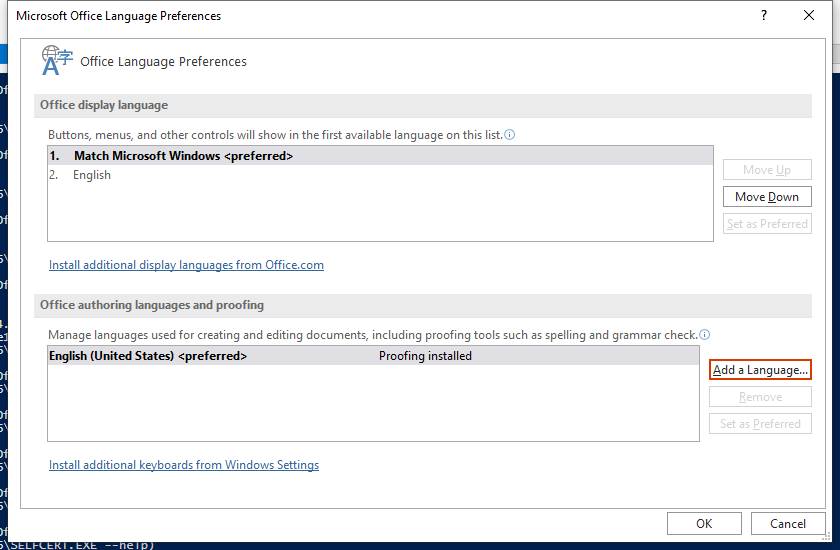

---
title: SETLANG.EXE | Microsoft Office 15 Language Preferences
excerpt: What is SETLANG.EXE?
---

# SETLANG.EXE 

* File Path: `C:\Program Files (x86)\Microsoft Office\root\Office16\SETLANG.EXE`
* Description: Microsoft Office 15 Language Preferences

## Screenshot

## Hashes

Type | Hash
-- | --
MD5 | `22A1139F5BD51A7399115973FFA680B5`
SHA1 | `46E3EE56E45FD037A21A2770C2A1F6C753596D8C`
SHA256 | `EB0B471BB947020964E240F0CD955DEBAD4F3027557880713178C83609A90B3C`
SHA384 | `033274909C2E24A9B8A6983EA74E849ED9F9E246BBDF67ED153200569F3AE0B510517A5B4FC4972B371DE1E69F37C16F`
SHA512 | `DD27987A8D24ADADBFA66E3615B12A573ABCDE5072E214A273E5369694EABF1D8AF38A72EDAF5C56116CD1F819538FC9F3B0825D14A99B221EEED417DC6E6A6B`
SSDEEP | `768:4Xp3wRZiQOz4qlHSCv5gwnPl1FiRbUa6qeYTUamNK75RpO4O2gbH:4X/Nz4qZXPluR0qXTUawK75RpO52gbH`
IMP | `D2688769D0D1A0FAD0E7478CCBBD683E`
PESHA1 | `4932620712A49F1DF775A96A895BA66F32829087`
PE256 | `0656538CF5DCA4B7120D5174D504669B068FBCAA6A90D6C2F44C4C0846C11921`

## Runtime Data

### Window Title:
Microsoft Office Language Preferences

### Open Handles:

Path | Type
-- | --
(R--)   C:\ProgramData\Microsoft\Office\ClickToRunPackageLocker | File
(R-D)   C:\Windows\System32\en-US\mswsock.dll.mui | File
(R-D)   C:\Windows\System32\en-US\winnlsres.dll.mui | File
(R-D)   C:\Windows\SysWOW64\en-US\user32.dll.mui | File
(RW-)   C:\Users\user\Documents | File
(RW-)   C:\Windows | File
(RW-)   C:\Windows\WinSxS\x86_microsoft.windows.common-controls_6595b64144ccf1df_6.0.19041.488_none_11b1e5df2ffd8627 | File
(RW-)   C:\Windows\WinSxS\x86_microsoft.windows.gdiplus_6595b64144ccf1df_1.1.19041.508_none_429cdbca8a8ffa94 | File
\BaseNamedObjects\__ComCatalogCache__ | Section
\BaseNamedObjects\F932B6C7-3A20-46A0-B8A0-8894AA421973 | Section
\BaseNamedObjects\NLS_CodePage_1252_3_2_0_0 | Section
\BaseNamedObjects\NLS_CodePage_437_3_2_0_0 | Section
\Sessions\1\BaseNamedObjects\UrlZonesSM_user | Section
\Sessions\1\BaseNamedObjects\windows_shell_global_counters | Section
\Sessions\1\BaseNamedObjects\windows_webcache_counters_{9B6AB5B3-91BC-4097-835C-EA2DEC95E9CC}_S-1-5-21-2047949552-857980807-821054962-504 | Section
\Sessions\1\Windows\Theme64749523 | Section
\Windows\Theme1120315852 | Section

### Loaded Modules:

Path |
-- |
C:\Program Files (x86)\Microsoft Office\root\Office16\SETLANG.EXE |
C:\Windows\SYSTEM32\ntdll.dll |
C:\Windows\System32\wow64.dll |
C:\Windows\System32\wow64cpu.dll |
C:\Windows\System32\wow64win.dll |

## Signature

* Status: Signature verified.
* Serial: `33000002CE7C9ACE7D905ED2B70000000002CE`
* Thumbprint: `B10607FB914700B40F794610850C1DE0A21566C1`
* Issuer: CN=Microsoft Code Signing PCA 2010, O=Microsoft Corporation, L=Redmond, S=Washington, C=US
* Subject: CN=Microsoft Corporation, O=Microsoft Corporation, L=Redmond, S=Washington, C=US

## File Metadata

* Original Filename: SetLang.Exe
* Product Name: Microsoft Office
* Company Name: Microsoft Corporation
* File Version: 16.0.12527.20482
* Product Version: 16.0.12527.20482
* Language: Language Neutral
* Legal Copyright: 
* Machine Type: 32-bit

## File Scan

* VirusTotal Detections: 0/72
* VirusTotal Link: https://www.virustotal.com/gui/file/eb0b471bb947020964e240f0cd955debad4f3027557880713178c83609a90b3c/detection/

MIT License. Copyright (c) 2020-2021 Strontic.

