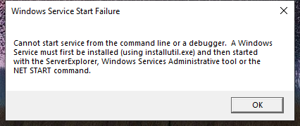

---
title: SMSvcHost.exe | SMSvcHost.exe
excerpt: What is SMSvcHost.exe?
---

# SMSvcHost.exe 

* File Path: `C:\Windows\Microsoft.NET\Framework\v4.0.30319\SMSvcHost.exe`
* Description: SMSvcHost.exe
* Comments: Flavor=Retail

## Screenshot

## Hashes

Type | Hash
-- | --
MD5 | `B9D455C60292DF5FCB064834CA5802AA`
SHA1 | `09AFEFF9CB54ED9620DBE6D04E7D418423BDFFAD`
SHA256 | `75DCE4E5FA08CCEAF4D3D30FE8E26903FCDD14CC852E820F63B40F374C706DBD`
SHA384 | `F09AFB8E4B8B6A0867B4365469116C4619D2DA6C8734F05C1C76263647965EFE2E2F6841DEBCEB74FAD5EDE7D8379776`
SHA512 | `7413017C84316267CBB147562F70FA3AD0BE493872FC9ED7AE17CF1813AAF3349C7656AD8A4F467C37DF613A081BEC5C2762740842492C7A92699FDAA0620C50`
SSDEEP | `3072:E3Cpwak5J5ywaza+zDEJivKkuaj9/wwbK8L8G7LfU7IIHxICfUI/E1lcFH8:oCpGhTUua7bK8oYfU7IIHxHR/Enic`
IMP | `F34D5F2D4577ED6D9CEEC516C1F5A744`
PESHA1 | `02C9277F61864302DE767C670CB398D118741614`
PE256 | `CE81CE348DAD8D3BF723FD2C24F0AE0F79F69C94F2EEEEBBD5F0E922B076E8B0`

## Runtime Data

### Child Processes:
conhost.exe

### Window Title:
Windows Service Start Failure

### Open Handles:

Path | Type
-- | --
(R-D)   C:\Windows\Fonts\StaticCache.dat | File
(R-D)   C:\Windows\Microsoft.NET\assembly\GAC_64\mscorlib\v4.0_4.0.0.0__b77a5c561934e089\mscorlib.dll | File
(R-D)   C:\Windows\Microsoft.NET\assembly\GAC_MSIL\System.Drawing\v4.0_4.0.0.0__b03f5f7f11d50a3a\System.Drawing.dll | File
(R-D)   C:\Windows\Microsoft.NET\assembly\GAC_MSIL\System.ServiceModel.Internals\v4.0_4.0.0.0__31bf3856ad364e35\System.ServiceModel.Internals.dll | File
(R-D)   C:\Windows\Microsoft.NET\assembly\GAC_MSIL\System.ServiceModel\v4.0_4.0.0.0__b77a5c561934e089\System.ServiceModel.dll | File
(R-D)   C:\Windows\Microsoft.NET\assembly\GAC_MSIL\System.ServiceProcess\v4.0_4.0.0.0__b03f5f7f11d50a3a\System.ServiceProcess.dll | File
(R-D)   C:\Windows\Microsoft.NET\assembly\GAC_MSIL\System.Windows.Forms\v4.0_4.0.0.0__b77a5c561934e089\System.Windows.Forms.dll | File
(R-D)   C:\Windows\Microsoft.NET\assembly\GAC_MSIL\System\v4.0_4.0.0.0__b77a5c561934e089\System.dll | File
(R-D)   C:\Windows\System32\en-US\KernelBase.dll.mui | File
(RW-)   C:\Users\user | File
\...\Cor_SxSPublic_IPCBlock | Section
\BaseNamedObjects\C:\*ProgramData\*Microsoft\*Windows\*Caches\*{6AF0698E-D558-4F6E-9B3C-3716689AF493}.2.ver0x0000000000000002.db | Section
\BaseNamedObjects\C:\*ProgramData\*Microsoft\*Windows\*Caches\*{DDF571F2-BE98-426D-8288-1A9A39C3FDA2}.2.ver0x0000000000000002.db | Section
\BaseNamedObjects\C:\*ProgramData\*Microsoft\*Windows\*Caches\*cversions.2 | Section
\BaseNamedObjects\Cor_Private_IPCBlock_v4_3388 | Section
\BaseNamedObjects\NLS_CodePage_1252_3_2_0_0 | Section
\BaseNamedObjects\NLS_CodePage_437_3_2_0_0 | Section
\Sessions\1\Windows\Theme1800662698 | Section
\Windows\Theme722103516 | Section

### Loaded Modules:

Path |
-- |
C:\Windows\Microsoft.NET\Framework\v4.0.30319\SMSvcHost.exe |
C:\Windows\System32\KERNEL32.dll |
C:\Windows\System32\KERNELBASE.dll |
C:\Windows\SYSTEM32\MSCOREE.DLL |
C:\Windows\SYSTEM32\ntdll.dll |

## Signature

* Status: Signature verified.
* Serial: `330000023241FB59996DCC4DFF000000000232`
* Thumbprint: `FF82BC38E1DA5E596DF374C53E3617F7EDA36B06`
* Issuer: CN=Microsoft Windows Production PCA 2011, O=Microsoft Corporation, L=Redmond, S=Washington, C=US
* Subject: CN=Microsoft Windows, O=Microsoft Corporation, L=Redmond, S=Washington, C=US

## File Metadata

* Original Filename: SMSvcHost.exe
* Product Name: Microsoft .NET Framework
* Company Name: Microsoft Corporation
* File Version: 4.8.4084.0 built by: NET48REL1
* Product Version: 4.8.4084.0
* Language: English (United States)
* Legal Copyright:  Microsoft Corporation.  All rights reserved.
* Machine Type: 32-bit

## File Scan

* VirusTotal Detections: 0/75
* VirusTotal Link: https://www.virustotal.com/gui/file/75dce4e5fa08cceaf4d3d30fe8e26903fcdd14cc852e820f63b40f374c706dbd/detection

## File Similarity (ssdeep match)

File | Score
-- | --
[C:\Windows\Microsoft.NET\Framework64\v4.0.30319\SMSvcHost.exe](SMSvcHost.exe-B9D455C60292DF5FCB064834CA5802AA.md) | 100

MIT License. Copyright (c) 2020 Strontic.

