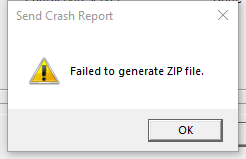

---
title: SendCrashReport.exe | SendCrashReport
---

# SendCrashReport.exe 

* File Path: `C:\Program Files (x86)\Foxit Software\Foxit Reader\SendCrashReport.exe`
* Description: SendCrashReport

## Screenshot

## Hashes

Type | Hash
-- | --
MD5 | `091D41C7E4A7D994118D6B2A3DDC5EF0`
SHA1 | `FA0AB4EB742232CA20AEBD551D52677EF147B38A`
SHA256 | `7C6569AEE3D041FBF0575A38086602BB8668F3A8460C7942DB5CA1CE1EF8538E`
SHA384 | `5FA8CF64C5CBF2B5D10F5835BF996A734A40EB78D26445D96D4E398A4A6EDE4F3967BA797BE3933C645B4B0D6037C3CB`
SHA512 | `E5A78399FA61CDD0367DF99F292F83F49A445AA12C422139CAFEAF75D4C1FDB79E447526E281BCDEBF6DFA37EAF22A0F80894D028B9992936180D32151D13A55`
SSDEEP | `49152:r29apmwV+4KN18Apxa+he0QEdFSQE+fkyLGkMCNy30nGTdRoY:MWmwV8N2Mxa+w0ldFSQEz+y30n`

## Signature

* Status: Signature verified.
* Serial: `08404767E0D6C26CBD443F664AEF0A5C`
* Thumbprint: `45C6EB08FB79930455F7C26198AB61C7952B5447`
* Issuer: CN=DigiCert EV Code Signing CA, OU=www.digicert.com, O=DigiCert Inc, C=US
* Subject: CN=FOXIT SOFTWARE INC., O=FOXIT SOFTWARE INC., L=Fremont, S=California, C=US, SERIALNUMBER=C3105953, OID.2.5.4.15=Private Organization, OID.1.3.6.1.4.1.311.60.2.1.2=California, OID.1.3.6.1.4.1.311.60.2.1.3=US

## File Metadata

* Original Filename: SendCrashReport.exe
* Product Name: SendCrashReport
* Company Name: Foxit Corporation
* File Version: 1.2.1.725
* Product Version: 1.2.1.725
* Language: Language Neutral
* Legal Copyright: Copyright  2013-2020 Foxit Software Inc. All Rights Reserved.

MIT License. Copyright (c) 2020 Strontic.

