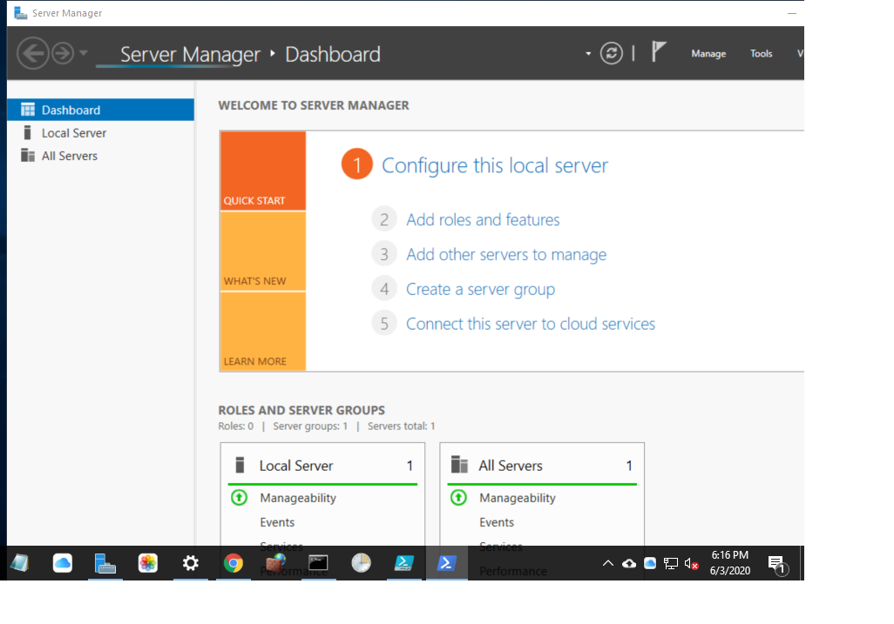

---
title: ServerManager.exe | Server Manager
---

# ServerManager.exe 

* File Path: `C:\Windows\system32\ServerManager.exe`
* Description: Server Manager

## Screenshot

## Hashes

Type | Hash
-- | --
MD5 | `83D44E309295488A933B084288B976D8`
SHA1 | `22A5A2339EFB8003531D972AD485590B6E87F3F7`
SHA256 | `A143F35F4F8674340F71A4669BCD8E7F82A6FC3E2FB682AA56B2D4E1E153A7B2`
SHA384 | `ED6244B92A8809E1295048C241EC96BCD7FA7BDCA386EE94C50980969BC18BA3A26B92C52DC798ADB30E6912A28DA161`
SHA512 | `5D32B05803603F1910E0C8F0F3659042F40C966B99564FE99C8F354DAD4F275A9E89147B8C19C3C71D0A362264D80F8AFF03F52F2BD66FD8C10358B066497A3E`
SSDEEP | `3072:wBQrNQUQXf8fyOcR1HnPYctZLF9nM6zQHo:wGuUQPzAGR9M`

### Loaded Modules:

Path |
-- |
C:\Windows\Microsoft.NET\Framework64\v4.0.30319\mscoreei.dll |
C:\Windows\System32\ADVAPI32.dll |
C:\Windows\System32\bcryptPrimitives.dll |
C:\Windows\System32\combase.dll |
C:\Windows\System32\GDI32.dll |
C:\Windows\System32\gdi32full.dll |
C:\Windows\System32\KERNEL32.dll |
C:\Windows\System32\KERNELBASE.dll |
C:\Windows\SYSTEM32\MSCOREE.DLL |
C:\Windows\System32\msvcp_win.dll |
C:\Windows\System32\msvcrt.dll |
C:\Windows\SYSTEM32\ntdll.dll |
C:\Windows\System32\RPCRT4.dll |
C:\Windows\System32\sechost.dll |
C:\Windows\system32\ServerManager.exe |
C:\Windows\System32\SHLWAPI.dll |
C:\Windows\System32\ucrtbase.dll |
C:\Windows\System32\USER32.dll |
C:\Windows\System32\win32u.dll |

## Signature

* Status: Signature verified.
* Serial: `3300000266BD1580EFA75CD6D3000000000266`
* Thumbprint: `A4341B9FD50FB9964283220A36A1EF6F6FAA7840`
* Issuer: CN=Microsoft Windows Production PCA 2011, O=Microsoft Corporation, L=Redmond, S=Washington, C=US
* Subject: CN=Microsoft Windows, O=Microsoft Corporation, L=Redmond, S=Washington, C=US

## File Metadata

* Original Filename: servermanager.dll
* Product Name: Microsoft Windows Operating System
* Company Name: Microsoft Corporation
* File Version: 10.0.14393.2608 (rs1_release.181024-1742)
* Product Version: 10.0.14393.2608
* Language: English (United States)
* Legal Copyright:  Microsoft Corporation. All rights reserved.

## File Similarity (ssdeep match)

File | Score
-- | --
[C:\Windows\system32\ServerManager.exe](ServerManager.exe-65ADE21DC82C01972891285581D85866.md) | 68

MIT License. Copyright (c) 2020 Strontic.

