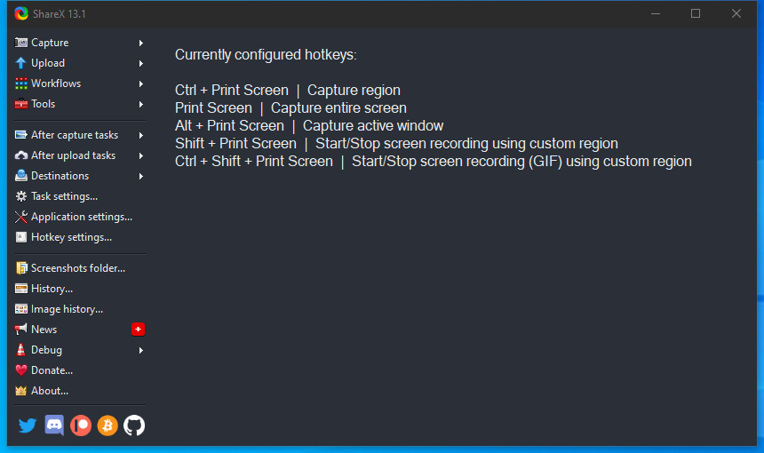

---
title: ShareX.exe | ShareX
excerpt: What is ShareX.exe?
---

# ShareX.exe 

* File Path: `C:\Program Files\ShareX\ShareX.exe`
* Description: ShareX
* Comments: Screen capture, file sharing and productivity tool

## Screenshot

## Hashes

Type | Hash
-- | --
MD5 | `266776244FD9701915EF1BFA9F76091E`
SHA1 | `C5AC43B5D5180F0ABEE26593B3161C8E33E7EC45`
SHA256 | `976CC9D2058F949D4544BA2AFBFC2DC49313C4625E3336234EEA2123F0004720`
SHA384 | `1A508A2531C0C48E7F160D3F94D5C16F64AB5697C0AA8D7040E23DC2BDD465ED3BA99BBF5473E4BAA49A1600201BD52A`
SHA512 | `24C0C85CDE034C260EF8A14B0DD1CAC0BE6E662DA7CC5903F14B445D2603E2B6D8D65C3CFE8D5EAA7332B460757E0A392B83EC2E015CAB3FC6469B1307753CD6`
SSDEEP | `49152:R3ti9Vn7Exr0udItTNKz7ghj5CsY7Dqx2rnl+:tYCsY7Dqx2h+`
IMP | `F34D5F2D4577ED6D9CEEC516C1F5A744`
PESHA1 | `C944FDC36776133B808DD4FAE3077C2FC11BD037`
PE256 | `27FC09553530EB1A28A6EBAFBDEC5F9250F3495C182361531E23506683104F41`

## Runtime Data

### Window Title:
ShareX 13.2.1

### Open Handles:

Path | Type
-- | --
(R-D)   C:\Program Files\ShareX\MegaApiClient.dll | File
(R-D)   C:\Program Files\ShareX\Newtonsoft.Json.dll | File
(R-D)   C:\Program Files\ShareX\ShareX.HelpersLib.dll | File
(R-D)   C:\Program Files\ShareX\ShareX.HistoryLib.dll | File
(R-D)   C:\Program Files\ShareX\ShareX.ImageEffectsLib.dll | File
(R-D)   C:\Program Files\ShareX\ShareX.IndexerLib.dll | File
(R-D)   C:\Program Files\ShareX\ShareX.MediaLib.dll | File
(R-D)   C:\Program Files\ShareX\ShareX.ScreenCaptureLib.dll | File
(R-D)   C:\Program Files\ShareX\ShareX.UploadersLib.dll | File
(R-D)   C:\Windows\Fonts\StaticCache.dat | File
(R-D)   C:\Windows\Microsoft.NET\assembly\GAC_64\System.Data\v4.0_4.0.0.0__b77a5c561934e089\System.Data.dll | File
(R-D)   C:\Windows\Microsoft.NET\assembly\GAC_MSIL\System.Design\v4.0_4.0.0.0__b03f5f7f11d50a3a\System.Design.dll | File
(R-D)   C:\Windows\Microsoft.NET\assembly\GAC_MSIL\System.Runtime.Remoting\v4.0_4.0.0.0__b77a5c561934e089\System.Runtime.Remoting.dll | File
(R-D)   C:\Windows\System32\en-US\KernelBase.dll.mui | File
(R-D)   C:\Windows\System32\en-US\winnlsres.dll.mui | File
(R-D)   C:\Windows\SystemResources\imageres.dll.mun | File
(RW-)   C:\Windows\WinSxS\amd64_microsoft.windows.common-controls_6595b64144ccf1df_5.82.19041.488_none_4238de57f6b64d28 | File
(RW-)   C:\Windows\WinSxS\amd64_microsoft.windows.common-controls_6595b64144ccf1df_6.0.19041.488_none_ca04af081b815d21 | File
(RW-)   C:\Windows\WinSxS\amd64_microsoft.windows.gdiplus_6595b64144ccf1df_1.1.19041.508_none_faefa4f37613d18e | File
(RW-)   C:\xCyclopedia | File
(RWD)   C:\Windows\Fonts\arialbd.ttf | File
\...\Cor_SxSPublic_IPCBlock | Section
\BaseNamedObjects\__ComCatalogCache__ | Section
\BaseNamedObjects\Cor_Private_IPCBlock_v4_4700 | Section
\BaseNamedObjects\NLS_CodePage_1252_3_2_0_0 | Section
\BaseNamedObjects\NLS_CodePage_437_3_2_0_0 | Section
\Sessions\1\BaseNamedObjects\125cHWNDInterface:68084c | Section
\Sessions\1\BaseNamedObjects\windows_shell_global_counters | Section
\Sessions\1\BaseNamedObjects\windows_webcache_counters_{9B6AB5B3-91BC-4097-835C-EA2DEC95E9CC}_S-1-5-21-2047949552-857980807-821054962-504 | Section
\Sessions\1\Windows\Theme2547664911 | Section
\Windows\Theme3854699184 | Section

### Loaded Modules:

Path |
-- |
C:\Program Files\ShareX\ShareX.exe |
C:\Windows\Microsoft.NET\Framework64\v4.0.30319\mscoreei.dll |
C:\Windows\System32\ADVAPI32.dll |
C:\Windows\System32\KERNEL32.dll |
C:\Windows\System32\KERNELBASE.dll |
C:\Windows\SYSTEM32\MSCOREE.DLL |
C:\Windows\System32\msvcrt.dll |
C:\Windows\SYSTEM32\ntdll.dll |
C:\Windows\System32\RPCRT4.dll |
C:\Windows\System32\sechost.dll |

## Signature

* Status: The file C:\Program Files\ShareX\ShareX.exe is not digitally signed. You cannot run this script on the current system. For more information about running scripts and setting execution policy, see about_Execution_Policies at https:/go.microsoft.com/fwlink/?LinkID=135170
* Serial: ``
* Thumbprint: ``
* Issuer: 
* Subject: 

## File Metadata

* Original Filename: ShareX.exe
* Product Name: ShareX
* Company Name: ShareX Team
* File Version: 13.2.1
* Product Version: 13.2.1
* Language: Language Neutral
* Legal Copyright: Copyright (c) 2007-2020 ShareX Team
* Machine Type: 32-bit

## File Scan

* VirusTotal Detections: 0/69
* VirusTotal Link: https://www.virustotal.com/gui/file/976cc9d2058f949d4544ba2afbfc2dc49313c4625e3336234eea2123f0004720/detection/

## File Similarity (ssdeep match)

File | Score
-- | --
[C:\program files\ShareX\ShareX.exe](ShareX.exe-2EF1B73623CA8F0B4EC33A635216F499.md) | 74

MIT License. Copyright (c) 2020 Strontic.

