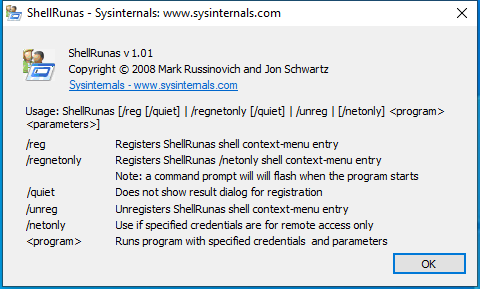
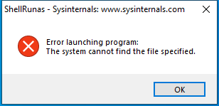
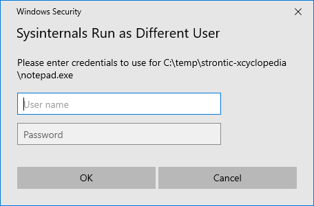

---
title: ShellRunas.exe | Run as different user
excerpt: What is ShellRunas.exe?
---

# ShellRunas.exe 

* File Path: `C:\SysinternalsSuite\ShellRunas.exe`
* Description: Run as different user

## Screenshot

## Hashes

Type | Hash
-- | --
MD5 | `6C7C5345ED337ED6B04E322A1DE6DA40`
SHA1 | `37D1C83DA81109201B037E60866C0D76E3C1714A`
SHA256 | `4386A9B0539DC4B216525F8ACD28972CAC5DDCCF2DB9623B8CC559B53F575072`
SHA384 | `FD5A8D70B9754F0D510AA94F5408474A3CD009EE0C63266947F979B9EDD1A9431A16EB6C1337A65C0B96CF5563C91F22`
SHA512 | `4E853CA943128059FB7843F6E267EA8B9DD7961E2D0FACC187568DE516F8C5BC0C03636FAFA13EAFD0B0BF51A1229F16CFDBF162BF461355FF193A872AB21D5D`
SSDEEP | `1536:jaY0LwJ1GRFrA6cRC5oQ8bWFE27byIrxC5YUDtDwT8HafdUafd48:jaY0LwJXqkCPyIrxC5zDS8HafOafa8`
IMP | `A19128C77D60D2B394DFA78B2E70B342`
PESHA1 | `C3CCE2CCC4D6E4F0FFE7490DC2B556B02159A0FE`
PE256 | `226D9D3DC1E2E81DE1C1F4D03D6E298BA2E5FA0613498482C3B1858AAE824369`

## Runtime Data

### Window Title:
Windows Security

### Open Handles:

Path | Type
-- | --
(R-D)   C:\Windows\apppatch\DirectXApps_FOD.sdb | File
(R-D)   C:\Windows\System32\en-US\credprovs.dll.mui | File
(R-D)   C:\Windows\System32\en-US\KernelBase.dll.mui | File
(R-D)   C:\Windows\SysWOW64\en-US\user32.dll.mui | File
(R-D)   C:\Windows\SysWOW64\en-US\windows.ui.xaml.dll.mui | File
(RW-)   \Device\Mup\TSCLIENT\SCARD\1 | File
(RW-)   C:\Windows | File
(RW-)   C:\Windows\WinSxS\x86_microsoft.windows.common-controls_6595b64144ccf1df_6.0.19041.488_none_11b1e5df2ffd8627 | File
(RW-)   C:\xCyclopedia | File
(RWD)   C:\ProgramData\Microsoft\User Account Pictures\user-48.png | File
(RWD)   C:\Windows\Fonts\segoeui.ttf | File
\BaseNamedObjects\__ComCatalogCache__ | Section
\BaseNamedObjects\NLS_CodePage_1252_3_2_0_0 | Section
\BaseNamedObjects\NLS_CodePage_437_3_2_0_0 | Section
\Sessions\1\BaseNamedObjects\1f8HWNDInterface:790450 | Section
\Sessions\1\BaseNamedObjects\SessionImmersiveColorPreference | Section
\Sessions\1\BaseNamedObjects\windows_shell_global_counters | Section
\Sessions\1\Windows\Theme2036293991 | Section
\Windows\Theme1324212991 | Section

### Loaded Modules:

Path |
-- |
C:\SysinternalsSuite\ShellRunas.exe |
C:\Windows\SYSTEM32\ntdll.dll |
C:\Windows\System32\wow64.dll |
C:\Windows\System32\wow64cpu.dll |
C:\Windows\System32\wow64win.dll |

## Signature

* Status: Signature verified.
* Serial: `610F784D000000000003`
* Thumbprint: `D57FAC60F1A8D34877AEB350E83F46F6EFC9E5F1`
* Issuer: CN=Microsoft Code Signing PCA, O=Microsoft Corporation, L=Redmond, S=Washington, C=US
* Subject: CN=Microsoft Corporation, O=Microsoft Corporation, L=Redmond, S=Washington, C=US

## File Metadata

* Original Filename: ShellRunas
* Product Name: Sysinternals ShellRunAs
* Company Name: Sysinternals - www.sysinternals.com
* File Version: 1.01
* Product Version: 1.01
* Language: English (United States)
* Legal Copyright: Copyright  2008 Mark Russinovich and Jon Schwartz
* Machine Type: 32-bit

## File Scan

* VirusTotal Detections: 0/68
* VirusTotal Link: https://www.virustotal.com/gui/file/4386a9b0539dc4b216525f8acd28972cac5ddccf2db9623b8cc559b53f575072/detection/

MIT License. Copyright (c) 2020 Strontic.

