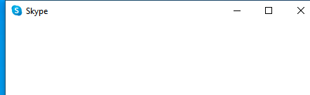

---
title: Skype.exe | Skype
excerpt: What is Skype.exe?
---

# Skype.exe 

* File Path: `C:\program files (x86)\Microsoft\Skype for Desktop\Skype.exe`
* Description: Skype

## Screenshot



## Hashes

Type | Hash
-- | --
MD5 | `33BFBD4D3DA31EB63FF04A9C2C7E0949`
SHA1 | `CB038918070D0175AEA9D2E1729B9EDA7D1643E0`
SHA256 | `215A1ED35678346F100FDA21A84DF555EDA9FC3DA14290A74D19DFB3B85741FF`
SHA384 | `98A9712C8A7BB59E398E0A7B32E75FF4F911F33C356ED7666B94003C3108413082F71EFF9D660D7578FA3D5D12E7B097`
SHA512 | `6F2DC8E6D0277508C774DCD26991EDEA8F70F67CA59DEBEB744BE7D92458D6452D0E9C0087838DD793D6B9CEEB1DA0B4E8CD524FB2F519E5CA8F56FA01FEBE43`
SSDEEP | `1572864:jGGnP7IzXACVMPLEUuSDQ642d4fR6ChQzmha0efMBIDBWBDj3Ol4mKousFAzqEfd:TczXACVMPLEUuSDQ642SsSha06oI8j3z`

## Runtime Data

### Usage (stdout):
```cmhg


```

### Child Processes:
Skype.exe Skype.exe Skype.exe Skype.exe

### Open Handles:

Path | Type
-- | --
(R--)   C:\Users\user\AppData\Roaming\Microsoft\Skype for Desktop\lockfile | File
(R-D)   C:\Windows\Fonts\StaticCache.dat | File
(R-D)   C:\Windows\System32\en-US\mswsock.dll.mui | File
(R-D)   C:\Windows\SysWOW64\en-US\user32.dll.mui | File
(RW-)   C:\Program Files (x86)\Microsoft\Skype for Desktop | File
(RW-)   C:\Program Files (x86)\Microsoft\Skype for Desktop\chrome_100_percent.pak | File
(RW-)   C:\Program Files (x86)\Microsoft\Skype for Desktop\chrome_200_percent.pak | File
(RW-)   C:\Program Files (x86)\Microsoft\Skype for Desktop\icudtl.dat | File
(RW-)   C:\Program Files (x86)\Microsoft\Skype for Desktop\locales\en-US.pak | File
(RW-)   C:\Program Files (x86)\Microsoft\Skype for Desktop\natives_blob.bin | File
(RW-)   C:\Program Files (x86)\Microsoft\Skype for Desktop\resources.pak | File
(RW-)   C:\Program Files (x86)\Microsoft\Skype for Desktop\resources\app.asar | File
(RW-)   C:\Program Files (x86)\Microsoft\Skype for Desktop\v8_context_snapshot.bin | File
(RW-)   C:\Users\user\AppData\Roaming\Microsoft\Skype for Desktop\Dictionaries\en-US-8-0.bdic | File
(RW-)   C:\Users\user\AppData\Roaming\Microsoft\Skype for Desktop\Local Storage\leveldb\000003.log | File
(RW-)   C:\Users\user\AppData\Roaming\Microsoft\Skype for Desktop\Local Storage\leveldb\LOCK | File
(RW-)   C:\Users\user\AppData\Roaming\Microsoft\Skype for Desktop\Local Storage\leveldb\LOG | File
(RW-)   C:\Users\user\AppData\Roaming\Microsoft\Skype for Desktop\Local Storage\leveldb\MANIFEST-000001 | File
(RW-)   C:\Windows | File
(RW-)   C:\Windows\WinSxS\x86_microsoft.windows.common-controls_6595b64144ccf1df_6.0.19041.1_none_fd031af45b0106f2 | File
(RW-)   C:\Windows\WinSxS\x86_microsoft.windows.gdiplus_6595b64144ccf1df_1.1.19041.450_none_4294d6e08a97344a | File
(RWD)   C:\Users\user\AppData\Roaming\Microsoft\Spelling | File
(RWD)   C:\Windows\Fonts\segoeui.ttf | File
(RWD)   C:\Windows\Fonts\segoeuib.ttf | File
(RWD)   C:\Windows\System32\drivers\etc | File
\BaseNamedObjects\__ComCatalogCache__ | Section
\BaseNamedObjects\C:\*ProgramData\*Microsoft\*Windows\*Caches\*{6AF0698E-D558-4F6E-9B3C-3716689AF493}.2.ver0x0000000000000002.db | Section
\BaseNamedObjects\C:\*ProgramData\*Microsoft\*Windows\*Caches\*{DDF571F2-BE98-426D-8288-1A9A39C3FDA2}.2.ver0x0000000000000001.db | Section
\BaseNamedObjects\C:\*ProgramData\*Microsoft\*Windows\*Caches\*cversions.2.ro | Section
\BaseNamedObjects\NLS_CodePage_1252_3_2_0_0 | Section
\BaseNamedObjects\NLS_CodePage_437_3_2_0_0 | Section
\BaseNamedObjects\windows_shell_global_counters | Section
\Sessions\1\BaseNamedObjects\1f0cHWNDInterface:570732 | Section
\Sessions\1\BaseNamedObjects\1f0cHWNDInterface:740812 | Section
\Sessions\1\BaseNamedObjects\node-debug-handler-7948 | Section
\Sessions\1\BaseNamedObjects\windows_shell_global_counters | Section
\Sessions\1\Windows\Theme4048709601 | Section
\Windows\Theme603176458 | Section


### Loaded Modules:

Path |
-- |
C:\program files (x86)\Microsoft\Skype for Desktop\Skype.exe |
C:\Windows\SYSTEM32\ntdll.dll |
C:\Windows\System32\wow64.dll |
C:\Windows\System32\wow64cpu.dll |
C:\Windows\System32\wow64win.dll |


## Signature

* Status: Signature verified.
* Serial: `330000017BB47778D9105DF03500000000017B`
* Thumbprint: `BEEAE4260DF5E82B6339FC4E31EF525A26A17AD0`
* Issuer: CN=Microsoft Code Signing PCA 2011, O=Microsoft Corporation, L=Redmond, S=Washington, C=US
* Subject: CN=Skype Software Sarl, O=Microsoft Corporation, L=Redmond, S=Washington, C=US

## File Metadata

* Original Filename: Skype.exe
* Product Name: Skype
* Company Name: Skype Technologies S.A.
* File Version: 8.63.0.76
* Product Version: 8.63
* Language: English (United States)
* Legal Copyright: (c) 2020 Skype and/or Microsoft


## Possible Misuse

*The following table contains possible examples of `Skype.exe` being misused. While `Skype.exe` is **not** inherently malicious, its legitimate functionality can be abused for malicious purposes.*

Source | Source File | Example | License
-- | -- | -- | --
[sigma](https://github.com/Neo23x0/sigma) | [win_susp_squirrel_lolbin.yml](https://github.com/Neo23x0/sigma/blob/master/rules/windows/process_creation/win_susp_squirrel_lolbin.yml) | `- Skype`{:.highlight .language-yaml} | [DRL 1.0](https://github.com/Neo23x0/sigma/blob/master/LICENSE.Detection.Rules.md)
[malware-ioc](https://github.com/eset/malware-ioc) | [groundbait](https://github.com/eset/malware-ioc/blob/master/groundbait/README.adoc) | `=== Prikormka *SKYPE* modules`{:.highlight .language-cmhg} | [© ESET 2014-2018](https://github.com/eset/malware-ioc/blob/master/LICENSE)
[malware-ioc](https://github.com/eset/malware-ioc) | [interception](https://github.com/eset/malware-ioc/blob/master/interception/README.adoc) | `C:\ProgramData\Skype\Skype.exe`{:.highlight .language-cmhg} | [© ESET 2014-2018](https://github.com/eset/malware-ioc/blob/master/LICENSE)
[signature-base](https://github.com/Neo23x0/signature-base) | [apt_lazarus_dec17.yar](https://github.com/Neo23x0/signature-base/blob/master/yara/apt_lazarus_dec17.yar) | $s3 = "Skype Technologies S.A." fullword wide | [CC BY-NC 4.0](https://github.com/Neo23x0/signature-base/blob/master/LICENSE)


MIT License. Copyright (c) 2020-2021 Strontic.


