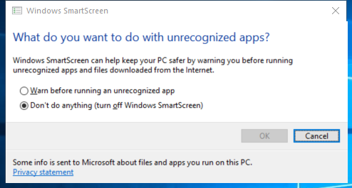

---
title: SmartScreenSettings.exe | SmartScreenSettings
excerpt: What is SmartScreenSettings.exe?
---

# SmartScreenSettings.exe 

* File Path: `C:\windows\system32\SmartScreenSettings.exe`
* Description: SmartScreenSettings

## Screenshot

## Hashes

Type | Hash
-- | --
MD5 | `C263337C2301AAFC68243A9A2A006621`
SHA1 | `3D16BC3B7D5B4C08E71D155D6B6C1A595625023F`
SHA256 | `2A83D0563431D686222F93E53E3699054A447887CDAED5DD1596F8F3993653CE`
SHA384 | `07009B71C9688787959C02987CB282E413F08B75679B03A6F44BFAB80ABF51D2B2D5CD31BB8DA192C0E1D16BF2DA9927`
SHA512 | `5B47C8A1A6E346B0FB3735057726F6A7C1B7A1D6689C949DD09B70E6AE090CE22620B3523637E7906D7433816573EA8798A714685BC1B76892CB7888ABEC031D`
SSDEEP | `3072:aaSTp0rcKl2MXtPofEeRNywSuMpCkQ/D+Vm/JYpW+j:aagmrp2MXt6Vkw7YrQiVZA+`

## Signature

* Status: The file C:\windows\system32\SmartScreenSettings.exe is not digitally signed. You cannot run this script on the current system. For more information about running scripts and setting execution policy, see about_Execution_Policies at http://go.microsoft.com/fwlink/?LinkID=135170
* Serial: ``
* Thumbprint: ``
* Issuer: 
* Subject: 

## File Metadata

* Original Filename: SmartScreenSettings.exe.mui
* Product Name: Microsoft Windows Operating System
* Company Name: Microsoft Corporation
* File Version: 6.3.9600.16384 (winblue_rtm.130821-1623)
* Product Version: 6.3.9600.16384
* Language: English (United States)
* Legal Copyright:  Microsoft Corporation. All rights reserved.

## File Similarity (ssdeep match)

File | Score
-- | --
[C:\windows\system32\UserAccountControlSettings.exe](UserAccountControlSettings.exe-601679C218E707954A86A693DB9A5326.md) | 93
[C:\windows\SysWOW64\SmartScreenSettings.exe](SmartScreenSettings.exe-43D69652F91822C4A0873884B829DD0A.md) | 93
[C:\windows\SysWOW64\UserAccountControlSettings.exe](UserAccountControlSettings.exe-046325408558B6EBF7EFDA3511C5289D.md) | 93

MIT License. Copyright (c) 2020-2021 Strontic.

