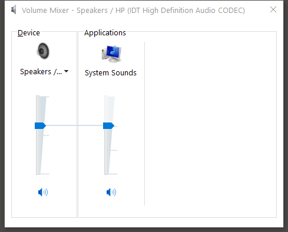

---
title: SndVol.exe | Volume Mixer
---

# SndVol.exe 

* File Path: `C:\Windows\system32\SndVol.exe`
* Description: Volume Mixer

## Screenshot

## Hashes

Type | Hash
-- | --
MD5 | `0F415CFABCB78020AF106642CA3F398E`
SHA1 | `F25D9705EEF9E4D0C4458F6AE1F25D37670763EB`
SHA256 | `1FF763F1BD807C33D52A9C28482F55916417A0CD221099AC4132714200BF6EC4`
SHA384 | `4E3824CEBDA866FB5393D88171355071C18DDB341F93330F0A6BB77917517E173F178740AE2282331A5A46F475BCB6AD`
SHA512 | `6777A906AD62BC0A6D8F773B6166EE5C36EE27851F24464CDC5BCA07F3F2393C50C55F82D17CC36BC45FD928564783DA47E4067E10FBE047D83BFD8B517BCD38`
SSDEEP | `6144:f619U07ugLIx0VRdvZaZLiCc++Hny10fF/:f+xigK05RaNoyAx`

## Signature

* Status: Signature verified.
* Serial: `33000001733031072665B8B9B3000000000173`
* Thumbprint: `14590DC5C3AAF238FCFD7785B4B93F4071402C34`
* Issuer: CN=Microsoft Windows Production PCA 2011, O=Microsoft Corporation, L=Redmond, S=Washington, C=US
* Subject: CN=Microsoft Windows, O=Microsoft Corporation, L=Redmond, S=Washington, C=US

## File Metadata

* Original Filename: SndVol.exe.mui
* Product Name: Microsoft Windows Operating System
* Company Name: Microsoft Corporation
* File Version: 10.0.14393.0 (rs1_release.160715-1616)
* Product Version: 10.0.14393.0
* Language: English (United States)
* Legal Copyright:  Microsoft Corporation. All rights reserved.

## Possible Misuse

*The following table contains possible examples of `SndVol.exe` being misused. While `SndVol.exe` is **not** inherently malicious, its legitimate functionality can by abused for malicious purposes.*

Source | Source File | Example | License
-- | -- | -- | --
[signature-base](https://github.com/Neo23x0/signature-base) | [thor_inverse_matches.yar](https://github.com/Neo23x0/signature-base/blob/master/yara/thor_inverse_matches.yar) | 		description = "Anomaly rule looking for certain strings in a system file (maybe false positive on certain systems) - file SndVol.exe" | [CC BY-NC 4.0](https://github.com/Neo23x0/signature-base/blob/master/LICENSE)
[signature-base](https://github.com/Neo23x0/signature-base) | [thor_inverse_matches.yar](https://github.com/Neo23x0/signature-base/blob/master/yara/thor_inverse_matches.yar) | 		filename == "sndvol.exe" | [CC BY-NC 4.0](https://github.com/Neo23x0/signature-base/blob/master/LICENSE)

MIT License. Copyright (c) 2020 Strontic.

