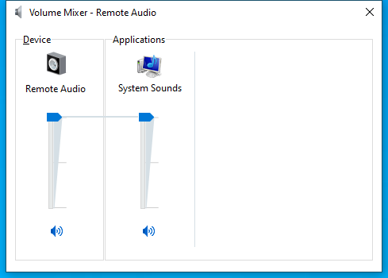

---
title: SndVol.exe | Volume Mixer
excerpt: What is SndVol.exe?
---

# SndVol.exe 

* File Path: `C:\windows\system32\SndVol.exe`
* Description: Volume Mixer

## Screenshot

## Hashes

Type | Hash
-- | --
MD5 | `DA0973777069BEFF69D9D89476340104`
SHA1 | `E9F6F51DECBB6EEBA62D22DE2EC23962501A571D`
SHA256 | `8B72FC4CA330772DA1236D6A809452DB4F6FB3CE62F80F2B5750E65A74D799D8`
SHA384 | `EC31FB083A3ECF88DDE1146EA5939456DCE47BDA04408CE9713E5485E0C269F9DD51698B3DA16C5E31D27F790154029F`
SHA512 | `2BB0A0032FCBC7ECEC5653708C1BB53EB777379E2AF1A097BC422111EFE41A705DB96F8278D9155FCEE631F9504CF6FA9E624572C844EEB5941B870AC8E6C41D`
SSDEEP | `3072:XAX1Tz8W559nIJdBiFOksFYPZ3uI8qoMpkjbEyB7HbI2l:STZ5xIJdBiFOtG378qooy10y`

## Signature

* Status: Signature verified.
* Serial: `330000004EA1D80770A9BBE94400000000004E`
* Thumbprint: `DF3B9B7E5AEA1AA0B82EA25F542A6A00963AB890`
* Issuer: CN=Microsoft Windows Production PCA 2011, O=Microsoft Corporation, L=Redmond, S=Washington, C=US
* Subject: CN=Microsoft Windows, O=Microsoft Corporation, L=Redmond, S=Washington, C=US

## File Metadata

* Original Filename: SndVol.exe.mui
* Product Name: Microsoft Windows Operating System
* Company Name: Microsoft Corporation
* File Version: 6.3.9600.16384 (winblue_rtm.130821-1623)
* Product Version: 6.3.9600.16384
* Language: English (United States)
* Legal Copyright:  Microsoft Corporation. All rights reserved.

## File Similarity (ssdeep match)

File | Score
-- | --
[C:\Windows\system32\SndVol.exe](SndVol.exe-0D8208F039702F6D7FEA2FC002836408.md) | 29
[C:\WINDOWS\system32\SndVol.exe](SndVol.exe-BE6B28D62DB5B2AAF92B00DBD717D453.md) | 32
[C:\Windows\SysWOW64\SndVol.exe](SndVol.exe-2A724F091A5C7329F41CE3B99D420EBD.md) | 32
[C:\Windows\SysWOW64\SndVol.exe](SndVol.exe-5AC83D3D18F9B6E1C5B78BD712661524.md) | 36
[C:\WINDOWS\SysWOW64\SndVol.exe](SndVol.exe-779D706DE5A512A06AF4933035970AE5.md) | 32
[C:\Windows\SysWOW64\SndVol.exe](SndVol.exe-7D7D5466FCDCD28976A004B5B08864E3.md) | 30
[C:\windows\SysWOW64\SndVol.exe](SndVol.exe-8D40C30D3BA0030D55C1249C118D7F63.md) | 30
[C:\Windows\SysWOW64\SndVol.exe](SndVol.exe-FC0BFFE396750BB00FAFAD0C62E7ACDA.md) | 32

## Possible Misuse

*The following table contains possible examples of `SndVol.exe` being misused. While `SndVol.exe` is **not** inherently malicious, its legitimate functionality can be abused for malicious purposes.*

Source | Source File | Example | License
-- | -- | -- | --
[signature-base](https://github.com/Neo23x0/signature-base) | [thor_inverse_matches.yar](https://github.com/Neo23x0/signature-base/blob/master/yara/thor_inverse_matches.yar) | description = "Anomaly rule looking for certain strings in a system file (maybe false positive on certain systems) - file SndVol.exe" | [CC BY-NC 4.0](https://github.com/Neo23x0/signature-base/blob/master/LICENSE)
[signature-base](https://github.com/Neo23x0/signature-base) | [thor_inverse_matches.yar](https://github.com/Neo23x0/signature-base/blob/master/yara/thor_inverse_matches.yar) | filename == "sndvol.exe" | [CC BY-NC 4.0](https://github.com/Neo23x0/signature-base/blob/master/LICENSE)

MIT License. Copyright (c) 2020-2021 Strontic.

