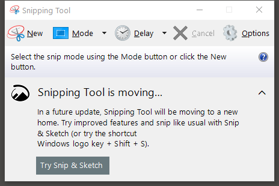
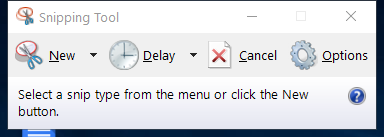

---
title: SnippingTool.exe | Snipping Tool
excerpt: What is SnippingTool.exe?
---

# SnippingTool.exe 

* File Path: `C:\Windows\system32\SnippingTool.exe`
* Description: Snipping Tool

## Screenshot

## Hashes

Type | Hash
-- | --
MD5 | `0D42E0492585153117F6ECF250EC8993`
SHA1 | `DB90A82E8131B24432E8C19C1D9689B12D2FA25E`
SHA256 | `6B7B9973B5C5099626A97CC45B70BA6456EF6615692CDE1149FBD06022AA4856`
SHA384 | `58F3B3EAA3C641AF442C4FEBA60BBEE298F008932B890E7B7BAEC51CBD189A2C4E576020F7BF45B3A84DDF2B452C26CE`
SHA512 | `06115F1F73BE64DBF8AEA1AF1EA0716A68584C3C5A02168E37EC960D4520482552D8FB41D57709849FFD11E67DB16CEA7B093DF715EFB30A919AE6849183A424`
SSDEEP | `98304:mRTlxL4TsqaA2SRmXUrymuXB2rmaOOaCa2PKCZZNRwtPV3Oy:eTvDqaA2SRmXUrymuXB2rmaOOaCa2PKL`
IMP | `1E5B697DA460222A16D80AC56256B657`
PESHA1 | `EB7A4E986B579BDAE9D2C278BE28C574BCFB53A3`
PE256 | `23E94A47139EC19171590F6E0424340C8251109D1D9782E4F44308D8DBD9D7B9`

## Runtime Data

### Window Title:
Snipping Tool

### Open Handles:

Path | Type
-- | --
(R-D)   C:\Windows\Fonts\StaticCache.dat | File
(R-D)   C:\Windows\System32\en-US\SnippingTool.exe.mui | File
(RW-)   C:\Users\user | File
(RW-)   C:\Windows\WinSxS\amd64_microsoft.windows.common-controls_6595b64144ccf1df_6.0.19041.488_none_ca04af081b815d21 | File
(RW-)   C:\Windows\WinSxS\amd64_microsoft.windows.gdiplus_6595b64144ccf1df_1.1.19041.685_none_faeca4db76168538 | File
(RWD)   C:\Windows\Fonts\segoeui.ttf | File
(RWD)   C:\Windows\Fonts\seguisym.ttf | File
\BaseNamedObjects\__ComCatalogCache__ | Section
\BaseNamedObjects\C:\*ProgramData\*Microsoft\*Windows\*Caches\*{6AF0698E-D558-4F6E-9B3C-3716689AF493}.2.ver0x0000000000000002.db | Section
\BaseNamedObjects\C:\*ProgramData\*Microsoft\*Windows\*Caches\*{DDF571F2-BE98-426D-8288-1A9A39C3FDA2}.2.ver0x0000000000000002.db | Section
\BaseNamedObjects\C:\*ProgramData\*Microsoft\*Windows\*Caches\*cversions.2 | Section
\BaseNamedObjects\NLS_CodePage_1252_3_2_0_0 | Section
\BaseNamedObjects\NLS_CodePage_437_3_2_0_0 | Section
\Sessions\1\BaseNamedObjects\SessionImmersiveColorPreference | Section
\Sessions\1\Windows\Theme1175649999 | Section
\Windows\Theme601709542 | Section

### Loaded Modules:

Path |
-- |
C:\Windows\System32\ADVAPI32.dll |
C:\Windows\System32\GDI32.dll |
C:\Windows\System32\gdi32full.dll |
C:\Windows\System32\KERNEL32.DLL |
C:\Windows\System32\KERNELBASE.dll |
C:\Windows\System32\msvcp_win.dll |
C:\Windows\System32\msvcrt.dll |
C:\Windows\SYSTEM32\ntdll.dll |
C:\Windows\System32\RPCRT4.dll |
C:\Windows\System32\sechost.dll |
C:\Windows\system32\SnippingTool.exe |
C:\Windows\System32\ucrtbase.dll |
C:\Windows\System32\USER32.dll |
C:\Windows\System32\win32u.dll |
C:\Windows\WinSxS\amd64_microsoft.windows.gdiplus_6595b64144ccf1df_1.1.19041.685_none_faeca4db76168538\gdiplus.dll |

## Signature

* Status: Signature verified.
* Serial: `3300000266BD1580EFA75CD6D3000000000266`
* Thumbprint: `A4341B9FD50FB9964283220A36A1EF6F6FAA7840`
* Issuer: CN=Microsoft Windows Production PCA 2011, O=Microsoft Corporation, L=Redmond, S=Washington, C=US
* Subject: CN=Microsoft Windows, O=Microsoft Corporation, L=Redmond, S=Washington, C=US

## File Metadata

* Original Filename: SnippingTool.exe.mui
* Product Name: Microsoft Windows Operating System
* Company Name: Microsoft Corporation
* File Version: 10.0.19041.1 (WinBuild.160101.0800)
* Product Version: 10.0.19041.1
* Language: English (United States)
* Legal Copyright:  Microsoft Corporation. All rights reserved.
* Machine Type: 64-bit

## File Scan

* VirusTotal Detections: 0/74
* VirusTotal Link: https://www.virustotal.com/gui/file/6b7b9973b5c5099626a97cc45b70ba6456ef6615692cde1149fbd06022aa4856/detection

## File Similarity (ssdeep match)

File | Score
-- | --
[C:\Windows\system32\SnippingTool.exe](SnippingTool.exe-B7B2F164769C738D5CB30A418EEAE8B2.md) | 94
[C:\WINDOWS\system32\SnippingTool.exe](SnippingTool.exe-D57CA86AC22DC057456ACC7FDE4E492F.md) | 94
[C:\Windows\system32\SnippingTool.exe](SnippingTool.exe-F06D69F2FDD4D6A4E16F55769B7DCCC1.md) | 94

MIT License. Copyright (c) 2020-2021 Strontic.

