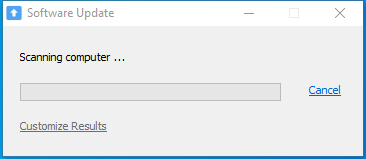
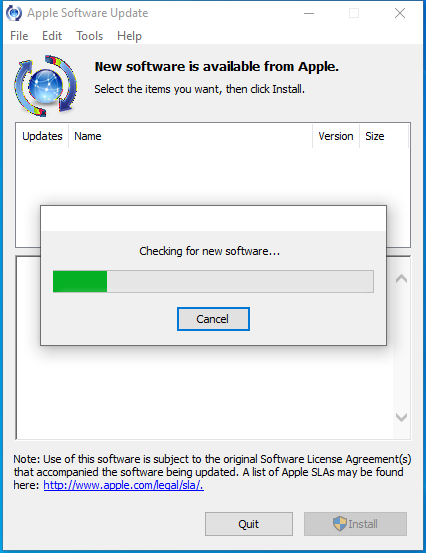

---
title: SoftwareUpdate.exe | Apple Software Update
excerpt: What is SoftwareUpdate.exe?
---

# SoftwareUpdate.exe 

* File Path: `C:\Program Files (x86)\Apple Software Update\SoftwareUpdate.exe`
* Description: Apple Software Update

## Screenshot




## Hashes

Type | Hash
-- | --
MD5 | `627F6B696B2F71AEF080F9919BDE3188`
SHA1 | `0B6D64281CA7A250650AC99D8C1FBF25BE11BD20`
SHA256 | `0682EEF4AE722D6DAD6B0C41F530D86E44F094F8487105372D5A03E0F0A437E9`
SHA384 | `D5059A6A9CDDAB57BC7EFC0A2B55643A16402A6E8C5213B133EC011A7A3C65DDE0D191D17247B58A595CC0EB7586DAF6`
SHA512 | `750E8A0993388A7281AE0A33865787113D0E7444A49D1C787A557861BA3A820B8300CAEF4874C150408BCAC46E630ED0C5C407C6473603752BAD4198B3761A5C`
SSDEEP | `12288:BzyGVIg6KGX8OmOKIFrvOE++Yz34B5dGBPDU++:z6jX8O1FrGEC4B5dGJDU++`
IMP | `914F23557AA259BAA831C13EF899BEA5`
PESHA1 | `FAD41B3C3C5BC87DAEB5E47C0852664ADE8EA38E`
PE256 | `9746E70AA96E34B2AAD384D9B20BA015C628950573256E4B8D571450E1D4BBA6`

## Runtime Data

### Usage (stdout):
```cmhg
[2020/09/24 18:37:27:0873] Notice | Loaded language resources from C:\Program Files (x86)\Apple Software Update\SoftwareUpdateFiles.Resources\en.lproj\SoftwareUpdateFilesLocalized.dll
[2020/09/24 18:37:28:0466] Notice | Loaded language resources from C:\Program Files (x86)\Apple Software Update\SoftwareUpdate.Resources\en.lproj\SoftwareUpdateLocalized.dll
[2020/09/24 18:37:28:0717] Error | CIgnoreList::LoadListFromRegistry | Exception reading register. error = 2
[2020/09/24 18:37:29:0732] Notice | CSUDownloadFileObject::DownloadToCache | Downloading https://swcatalog.apple.com/content/catalogs/others/index-windows-1.sucatalog.
[2020/09/24 18:37:29:0904] Notice | CSUDownloadFileObject::DeleteFile | Deleting C:\Users\user\AppData\Local\Apple\Apple Software Update\DistCache\index-windows-1[1].sucatalog
[2020/09/24 18:37:29:0935] Notice | Using distribution: https://swdist.apple.com/content/downloads/61/34/061-8153/WgWXrHyJVmFn9KrXRg3w2XPXNFXxhnZFS6/061-8153.English.dist (English)
[2020/09/24 18:37:29:0935] Notice | CSUDownloadFileObject::DownloadToCache | Downloading https://swdist.apple.com/content/downloads/61/34/061-8153/WgWXrHyJVmFn9KrXRg3w2XPXNFXxhnZFS6/061-8153.English.dist.
[2020/09/24 18:37:29:0998] Notice | CSUDownloadFileObject::DeleteFile | Deleting C:\Users\user\AppData\Local\Apple\Apple Software Update\DistCache\061-8153.English[1].dist
[2020/09/24 18:37:29:0998] Error | CSUXMLObject::LoadXMLFile | IXMLDOMDocument::Load failed. The XML must be invalid for URL https://swdist.apple.com/content/downloads/61/34/061-8153/WgWXrHyJVmFn9KrXRg3w2XPXNFXxhnZFS6/061-8153.English.dist.
[2020/09/24 18:37:29:0998] Error | CSUDistributionObject::ParseDistribution | Could not parse distribution https://swdist.apple.com/content/downloads/61/34/061-8153/WgWXrHyJVmFn9KrXRg3w2XPXNFXxhnZFS6/061-8153.English.dist.
[2020/09/24 18:37:30:0045] Notice | Using distribution: https://swdist.apple.com/content/downloads/02/58/061-3418/n6BBhLszLr6SN3XDXWT9N3YgpfHChbQTgb/061-3418.English.dist (English)
[2020/09/24 18:37:30:0045] Notice | CSUDownloadFileObject::DownloadToCache | Downloading https://swdist.apple.com/content/downloads/02/58/061-3418/n6BBhLszLr6SN3XDXWT9N3YgpfHChbQTgb/061-3418.English.dist.
[2020/09/24 18:37:30:0060] Notice | CSUDownloadFileObject::DeleteFile | Deleting C:\Users\user\AppData\Local\Apple\Apple Software Update\DistCache\061-3418.English[1].dist
[2020/09/24 18:37:30:0060] Error | CSUXMLObject::LoadXMLFile | IXMLDOMDocument::Load failed. The XML must be invalid for URL https://swdist.apple.com/content/downloads/02/58/061-3418/n6BBhLszLr6SN3XDXWT9N3YgpfHChbQTgb/061-3418.English.dist.
[2020/09/24 18:37:30:0060] Error | CSUDistributionObject::ParseDistribution | Could not parse distribution https://swdist.apple.com/content/downloads/02/58/061-3418/n6BBhLszLr6SN3XDXWT9N3YgpfHChbQTgb/061-3418.English.dist.
[2020/09/24 18:37:30:0091] Notice | Using distribution: https://swdist.apple.com/content/downloads/25/60/061-6867/WjSJ6JqjV34mZLtS944ndrx9RYQZJX6qHY/061-6867.English.dist (English)
[2020/09/24 18:37:30:0091] Notice | CSUDownloadFileObject::DownloadToCache | Downloading https://swdist.apple.com/content/downloads/25/60/061-6867/WjSJ6JqjV34mZLtS944ndrx9RYQZJX6qHY/061-6867.English.dist.
[2020/09/24 18:37:30:0107] Notice | CSUDownloadFileObject::DeleteFile | Deleting C:\Users\user\AppData\Local\Apple\Apple Software Update\DistCache\061-6867.English[1].dist
[2020/09/24 18:37:30:0107] Error | CSUXMLObject::LoadXMLFile | IXMLDOMDocument::Load failed. The XML must be invalid for URL https://swdist.apple.com/content/downloads/25/60/061-6867/WjSJ6JqjV34mZLtS944ndrx9RYQZJX6qHY/061-6867.English.dist.
[2020/09/24 18:37:30:0107] Error | CSUDistributionObject::ParseDistribution | Could not parse distribution https://swdist.apple.com/content/downloads/25/60/061-6867/WjSJ6JqjV34mZLtS944ndrx9RYQZJX6qHY/061-6867.English.dist.
[2020/09/24 18:37:30:0123] Notice | Using distribution: https://swdist.apple.com/content/downloads/21/23/061-4512/BKYTZyKmtNr5wpxQCTy9f8xDSYPZ5MTGf4/061-4512.English.dist (English)
[2020/09/24 18:37:30:0123] Notice | CSUDownloadFileObject::DownloadToCache | Downloading https://swdist.apple.com/content/downloads/21/23/061-4512/BKYTZyKmtNr5wpxQCTy9f8xDSYPZ5MTGf4/061-4512.English.dist.
[2020/09/24 18:37:30:0154] Notice | CSUDownloadFileObject::DeleteFile | Deleting C:\Users\user\AppData\Local\Apple\Apple Software Update\DistCache\061-4512.English[1].dist
[2020/09/24 18:37:30:0154] Error | CSUXMLObject::LoadXMLFile | IXMLDOMDocument::Load failed. The XML must be invalid for URL https://swdist.apple.com/content/downloads/21/23/061-4512/BKYTZyKmtNr5wpxQCTy9f8xDSYPZ5MTGf4/061-4512.English.dist.
[2020/09/24 18:37:30:0154] Error | CSUDistributionObject::ParseDistribution | Could not parse distribution https://swdist.apple.com/content/downloads/21/23/061-4512/BKYTZyKmtNr5wpxQCTy9f8xDSYPZ5MTGf4/061-4512.English.dist.
[2020/09/24 18:37:30:0154] Notice | Using distribution: https://swdist.apple.com/content/downloads/20/63/061-7511/XJqPCzWtXgkNgSZXp6DTn7gjNvHQVMZ4dP/061-7511.English.dist (English)
[2020/09/24 18:37:30:0154] Notice | CSUDownloadFileObject::DownloadToCache | Downloading https://swdist.apple.com/content/downloads/20/63/061-7511/XJqPCzWtXgkNgSZXp6DTn7gjNvHQVMZ4dP/061-7511.English.dist.
[2020/09/24 18:37:30:0185] Notice | CSUDownloadFileObject::DeleteFile | Deleting C:\Users\user\AppData\Local\Apple\Apple Software Update\DistCache\061-7511.English[1].dist
[2020/09/24 18:37:30:0185] Error | CSUXMLObject::LoadXMLFile | IXMLDOMDocument::Load failed. The XML must be invalid for URL https://swdist.apple.com/content/downloads/20/63/061-7511/XJqPCzWtXgkNgSZXp6DTn7gjNvHQVMZ4dP/061-7511.English.dist.
[2020/09/24 18:37:30:0185] Error | CSUDistributionObject::ParseDistribution | Could not parse distribution https://swdist.apple.com/content/downloads/20/63/061-7511/XJqPCzWtXgkNgSZXp6DTn7gjNvHQVMZ4dP/061-7511.English.dist.
[2020/09/24 18:37:30:0201] Notice | Using distribution: https://swdist.apple.com/content/downloads/27/49/061-4514/Tcfqf4NdtQTpYj7Pn8qwLgWgj6kYcy26Zf/061-4514.English.dist (English)
[2020/09/24 18:37:30:0201] Notice | CSUDownloadFileObject::DownloadToCache | Downloading https://swdist.apple.com/content/downloads/27/49/061-4514/Tcfqf4NdtQTpYj7Pn8qwLgWgj6kYcy26Zf/061-4514.English.dist.
[2020/09/24 18:37:30:0216] Notice | CSUDownloadFileObject::DeleteFile | Deleting C:\Users\user\AppData\Local\Apple\Apple Software Update\DistCache\061-4514.English[1].dist
[2020/09/24 18:37:30:0216] Error | CSUXMLObject::LoadXMLFile | IXMLDOMDocument::Load failed. The XML must be invalid for URL https://swdist.apple.com/content/downloads/27/49/061-4514/Tcfqf4NdtQTpYj7Pn8qwLgWgj6kYcy26Zf/061-4514.English.dist.
[2020/09/24 18:37:30:0216] Error | CSUDistributionObject::ParseDistribution | Could not parse distribution https://swdist.apple.com/content/downloads/27/49/061-4514/Tcfqf4NdtQTpYj7Pn8qwLgWgj6kYcy26Zf/061-4514.English.dist.
[2020/09/24 18:37:30:0232] Notice | Using distribution: https://swdist.apple.com/content/downloads/57/25/061-7340/TJXt7nNzc4cS57fvwx8zg3GScrcLBWtdpR/061-7340.English.dist (English)
[2020/09/24 18:37:30:0232] Notice | CSUDownloadFileObject::DownloadToCache | Downloading https://swdist.apple.com/content/downloads/57/25/061-7340/TJXt7nNzc4cS57fvwx8zg3GScrcLBWtdpR/061-7340.English.dist.
[2020/09/24 18:37:30:0248] Notice | CSUDownloadFileObject::DeleteFile | Deleting C:\Users\user\AppData\Local\Apple\Apple Software Update\DistCache\061-7340.English[1].dist
[2020/09/24 18:37:30:0248] Error | CSUXMLObject::LoadXMLFile | IXMLDOMDocument::Load failed. The XML must be invalid for URL https://swdist.apple.com/content/downloads/57/25/061-7340/TJXt7nNzc4cS57fvwx8zg3GScrcLBWtdpR/061-7340.English.dist.
[2020/09/24 18:37:30:0248] Error | CSUDistributionObject::ParseDistribution | Could not parse distribution https://swdist.apple.com/content/downloads/57/25/061-7340/TJXt7nNzc4cS57fvwx8zg3GScrcLBWtdpR/061-7340.English.dist.
[2020/09/24 18:37:30:0263] Notice | Using distribution: https://swdist.apple.com/content/downloads/56/25/041-3097/S
```

### Window Title:
Apple Software Update

### Open Handles:

Path | Type
-- | --
(R-D)   C:\Windows\apppatch\DirectXApps_FOD.sdb | File
(R-D)   C:\Windows\Fonts\StaticCache.dat | File
(R-D)   C:\Windows\System32\en-US\crypt32.dll.mui | File
(R-D)   C:\Windows\System32\en-US\ieframe.dll.mui | File
(R-D)   C:\Windows\System32\en-US\KernelBase.dll.mui | File
(R-D)   C:\Windows\System32\en-US\mlang.dll.mui | File
(R-D)   C:\Windows\System32\en-US\mshtml.dll.mui | File
(R-D)   C:\Windows\System32\en-US\mswsock.dll.mui | File
(R-D)   C:\Windows\System32\en-US\winmm.dll.mui | File
(R-D)   C:\Windows\SystemResources\imageres.dll.mun | File
(R-D)   C:\Windows\SysWOW64\en-US\msxml3r.dll.mui | File
(R-D)   C:\Windows\SysWOW64\en-US\urlmon.dll.mui | File
(R-D)   C:\Windows\SysWOW64\en-US\user32.dll.mui | File
(R-D)   C:\Windows\SysWOW64\msscript.ocx | File
(RW-)   C:\Windows | File
(RW-)   C:\Windows\WinSxS\x86_microsoft.windows.common-controls_6595b64144ccf1df_6.0.19041.488_none_11b1e5df2ffd8627 | File
(RW-)   C:\Windows\WinSxS\x86_microsoft.windows.gdiplus_6595b64144ccf1df_1.1.19041.508_none_429cdbca8a8ffa94 | File
(RW-)   C:\xCyclopedia | File
\BaseNamedObjects\__ComCatalogCache__ | Section
\BaseNamedObjects\F932B6C7-3A20-46A0-B8A0-8894AA421973 | Section
\BaseNamedObjects\NLS_CodePage_1252_3_2_0_0 | Section
\BaseNamedObjects\NLS_CodePage_437_3_2_0_0 | Section
\Sessions\1\BaseNamedObjects\1cfcHWNDInterface:2e0550 | Section
\Sessions\1\BaseNamedObjects\1cfcHWNDInterface:3304ee | Section
\Sessions\1\BaseNamedObjects\UrlZonesSM_user | Section
\Sessions\1\BaseNamedObjects\windows_ie_global_counters | Section
\Sessions\1\BaseNamedObjects\windows_shell_global_counters | Section
\Sessions\1\BaseNamedObjects\windows_webcache_counters_{9B6AB5B3-91BC-4097-835C-EA2DEC95E9CC}_S-1-5-21-2047949552-857980807-821054962-504 | Section
\Sessions\1\Windows\Theme2547664911 | Section
\Windows\Theme3854699184 | Section


### Loaded Modules:

Path |
-- |
C:\Program Files (x86)\Apple Software Update\SoftwareUpdate.exe |
C:\Windows\SYSTEM32\ntdll.dll |
C:\Windows\System32\wow64.dll |
C:\Windows\System32\wow64cpu.dll |
C:\Windows\System32\wow64win.dll |


## Signature

* Status: Signature verified.
* Serial: `31B1B08C8899CA883CE1B0F17D56403B`
* Thumbprint: `2122EF45A9AC0BDFB809E868873F17CB321BC23D`
* Issuer: CN=Symantec Class 3 SHA256 Code Signing CA, OU=Symantec Trust Network, O=Symantec Corporation, C=US
* Subject: CN=Apple Inc., O=Apple Inc., L=Cupertino, S=California, C=US

## File Metadata

* Original Filename: SoftwareUpdate.exe
* Product Name: Apple Software Update
* Company Name: Apple Inc.
* File Version: 2.6.3.1
* Product Version: 2.6.3.0
* Language: English (United States)
* Legal Copyright: (c) 2006-2011, 2015-2018 Apple Inc. All rights reserved.
* Machine Type: 32-bit

## File Scan

* VirusTotal Detections: 0/66
* VirusTotal Link: https://www.virustotal.com/gui/file/0682eef4ae722d6dad6b0c41f530d86e44f094f8487105372d5a03e0f0a437e9/detection/


MIT License. Copyright (c) 2020-2021 Strontic.


