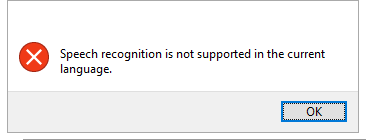

---
title: SpeechUXWiz.exe | Speech UX Configuration
excerpt: What is SpeechUXWiz.exe?
---

# SpeechUXWiz.exe 

* File Path: `C:\Windows\system32\Speech\SpeechUX\SpeechUXWiz.exe`
* Description: Speech UX Configuration

## Screenshot

## Hashes

Type | Hash
-- | --
MD5 | `BE50185ACB3EAC15CF46EC3297C436AC`
SHA1 | `B72C6F430D9462ECA650E0E2F0C1A4107A23BF7F`
SHA256 | `C1F6AAA423B4C95C48201AA21C3062D7512CFA36B4E20C3076A54507D8CA6F32`
SHA384 | `B03EC896F4257BE11FA3C602CF06D5EC9DC1CC72F6A68A933977030DCAB5D71268CC72CD2A3895CCC2061774B26A9D06`
SHA512 | `029A97363A23699B09FA9E89CC593E50566E40040ABC87DC48FC11408B67E05ABFECF3655ED6490CF31536CCB5B73FCBA719B7817D240222DB8B450B80C9B4ED`
SSDEEP | `12288:6wc771uSH9hBp8YbVe0TIrf8NbywLkRLgLBAgVF:H3+9h/82VLTIrfMy8oLgp`

## Signature

* Status: Signature verified.
* Serial: `3300000266BD1580EFA75CD6D3000000000266`
* Thumbprint: `A4341B9FD50FB9964283220A36A1EF6F6FAA7840`
* Issuer: CN=Microsoft Windows Production PCA 2011, O=Microsoft Corporation, L=Redmond, S=Washington, C=US
* Subject: CN=Microsoft Windows, O=Microsoft Corporation, L=Redmond, S=Washington, C=US

## File Metadata

* Original Filename: SpeechUXWiz.exe.mui
* Product Name: Microsoft Windows Operating System
* Company Name: Microsoft Corporation
* File Version: 10.0.14393.0 (rs1_release.160715-1616)
* Product Version: 10.0.14393.0
* Language: English (United States)
* Legal Copyright:  Microsoft Corporation. All rights reserved.

## File Similarity (ssdeep match)

File | Score
-- | --
[C:\Windows\system32\Speech\SpeechUX\sapi.cpl](sapi.cpl-2BBBD624B2A736A3806D00280DF1AD3E.md) | 46
[C:\Windows\system32\Speech\SpeechUX\speechuxcpl.dll](speechuxcpl.dll-F80452AD1ED856C3C07F4EC41188A22B.md) | 43
[C:\Windows\system32\Speech\SpeechUX\SpeechUXWiz.exe](SpeechUXWiz.exe-02BCE04D6192EB6BC85A195E0187E707.md) | 75
[C:\Windows\system32\Speech\SpeechUX\SpeechUXWiz.exe](SpeechUXWiz.exe-12BEDBBE10C9281CADB3A1CE54F716E5.md) | 69
[C:\WINDOWS\system32\Speech\SpeechUX\SpeechUXWiz.exe](SpeechUXWiz.exe-9D1E6FB81C0550862FDEF8112DF97ED0.md) | 43
[C:\WINDOWS\system32\Speech\SpeechUX\SpeechUXWiz.exe](SpeechUXWiz.exe-FAE658436615C362C1DE0464C028F227.md) | 71
[C:\Windows\SysWOW64\Speech\SpeechUX\sapi.cpl](sapi.cpl-17C07E2F8D1EC3FA10F83523ACD38829.md) | 47

MIT License. Copyright (c) 2020-2021 Strontic.

