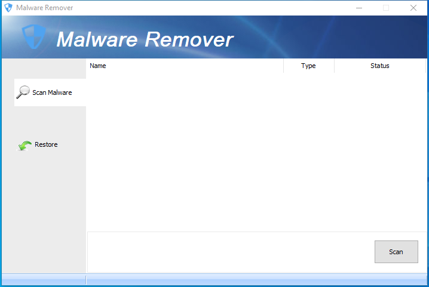

---
title: SpyRemover.exe | Glary Utilities SpyRemover
excerpt: What is SpyRemover.exe?
---

# SpyRemover.exe 

* File Path: `C:\program files (x86)\Glary Utilities 5\SpyRemover.exe`
* Description: Glary Utilities SpyRemover

## Screenshot

## Hashes

Type | Hash
-- | --
MD5 | `49C40981F711E83777816DAEA71AF2D6`
SHA1 | `A1DEE30EF5E5039330CC0170E2C4EB07093CD66D`
SHA256 | `386F4E06C488C48220B9B8D277487A59EA06225EF152C8FB91097F40057DC771`
SHA384 | `73CCD71E04E810D0707DBCCDC32DECEA2FA0C0B139DDE7A008D5B2FF340DB19298A34E06030CAF1A0DA1B8EB617B87B9`
SHA512 | `1B3B7471722D88664D2F8DAE8C5F0263BBF901388D50A973A8268C26B1EEE59FE40887D2ADF3D7D3A8F7ABD11CB9FFBF7705C397B44B2F5B3233996F9367CD90`
SSDEEP | `768:SgJgex7DOKjVVVVVVVVkZIOzYzz+zz4zzzszzz3zzzTZzzzjzzzzfzzzzgzzzzPd:JJgedOKjVVVVVVVVkZIOzYzz+zz4zzzX`

## Runtime Data

### Window Title:
Malware Remover

### Open Handles:

Path | Type
-- | --
(R-D)   C:\Windows\Fonts\StaticCache.dat | File
(R-D)   C:\Windows\SysWOW64\en-US\user32.dll.mui | File
(RW-)   C:\Program Files (x86)\Glary Utilities 5 | File
(RW-)   C:\Users\user\Documents | File
(RW-)   C:\Windows | File
(RW-)   C:\Windows\WinSxS\x86_microsoft.vc90.crt_1fc8b3b9a1e18e3b_9.0.30729.9625_none_508ef7e4bcbbe589 | File
(RW-)   C:\Windows\WinSxS\x86_microsoft.windows.common-controls_6595b64144ccf1df_6.0.19041.1_none_fd031af45b0106f2 | File
(RW-)   C:\Windows\WinSxS\x86_microsoft.windows.gdiplus_6595b64144ccf1df_1.1.19041.450_none_4294d6e08a97344a | File
\BaseNamedObjects\NLS_CodePage_1252_3_2_0_0 | Section
\BaseNamedObjects\NLS_CodePage_437_3_2_0_0 | Section
\Sessions\1\Windows\Theme4048709601 | Section
\Windows\Theme603176458 | Section

### Loaded Modules:

Path |
-- |
C:\program files (x86)\Glary Utilities 5\SpyRemover.exe |
C:\Windows\SYSTEM32\ntdll.dll |
C:\Windows\System32\wow64.dll |
C:\Windows\System32\wow64cpu.dll |
C:\Windows\System32\wow64win.dll |

## Signature

* Status: Signature verified.
* Serial: `0F05AE21CDC17B9F3CF09D7BFC659BA3`
* Thumbprint: `362EBB303E088105BDCC07D94E6B7875D30C0D06`
* Issuer: CN=DigiCert Assured ID Code Signing CA-1, OU=www.digicert.com, O=DigiCert Inc, C=US
* Subject: CN=Glarysoft LTD, O=Glarysoft LTD, S=Beijing, C=CN

## File Metadata

* Original Filename: SpyRemover.exe
* Product Name: Glary Utilities
* Company Name: Glarysoft Ltd
* File Version: 5.0.0.5
* Product Version: 5.0.0.1
* Language: Chinese (Simplified, China)
* Legal Copyright: Copyright (c) 2003-2020 Glarysoft Ltd

## File Similarity (ssdeep match)

File | Score
-- | --
[C:\Program Files (x86)\Glary Utilities 5\SpyRemover.exe](SpyRemover.exe-2327A2C252ADC79A2F1FA37CE76D10DA.md) | 96
[C:\program files (x86)\Glary Utilities 5\TracksEraser.exe](TracksEraser.exe-A364BDE5FD75712D95F1772396F08C28.md) | 41
[C:\Program Files (x86)\Glary Utilities 5\TracksEraser.exe](TracksEraser.exe-B0CCA5153453B97D382000262F713E0A.md) | 43

MIT License. Copyright (c) 2020 Strontic.

