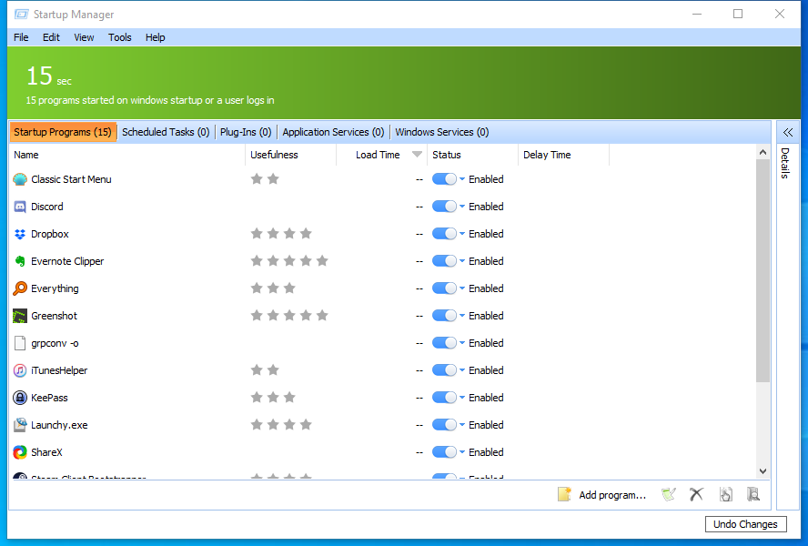

---
title: StartupManager.exe | Glary Utilities StartupManager
---

# StartupManager.exe 

* File Path: `C:\Program Files (x86)\Glary Utilities 5\StartupManager.exe`
* Description: Glary Utilities StartupManager

## Screenshot

## Hashes

Type | Hash
-- | --
MD5 | `9082F7EEF400E723649B8CCFA0214459`
SHA1 | `F189C0AA6F59CBEF4C7E9FEFF14F78640FC6F56D`
SHA256 | `40502A6848F26E282ADA9EEBCE6D034A04EC5D59D31E7AA38CFA50898B9D95E1`
SHA384 | `0BF3C7D6E8C7190046533A25064DC92C1C89A50CC2CBDA32A9B997A42330946A4958B87067EDA1BE50C8432258EC4597`
SHA512 | `C15F5EA551C0DBC5B87C77844F05366F81C1EF28591A08FECA2D27C91731FD3141F1DD453E793DFD7D31A356903105E4A030DEFA0024C05CAFCE098D6476AC78`
SSDEEP | `768:/+eZsDOEjMvwTGkZH9R/KW7zO1idMeKgMZxV1DGRUf2hn:/+eKOEjMv6G4HT/KW7zO1iiembVuUf2`

## Runtime Data

### Child Processes:
x64ProcessAssistSvc.exe

## Signature

* Status: Signature verified.
* Serial: `0F05AE21CDC17B9F3CF09D7BFC659BA3`
* Thumbprint: `362EBB303E088105BDCC07D94E6B7875D30C0D06`
* Issuer: CN=DigiCert Assured ID Code Signing CA-1, OU=www.digicert.com, O=DigiCert Inc, C=US
* Subject: CN=Glarysoft LTD, O=Glarysoft LTD, S=Beijing, C=CN

## File Metadata

* Original Filename: StartupManager.exe
* Product Name: Glary Utilities
* Company Name: Glarysoft Ltd
* File Version: 5.10.0.145
* Product Version: 5.10.0.1
* Language: Chinese (Simplified, China)
* Legal Copyright:  Copyright (c) 2003-2020 Glarysoft Ltd

MIT License. Copyright (c) 2020 Strontic.

