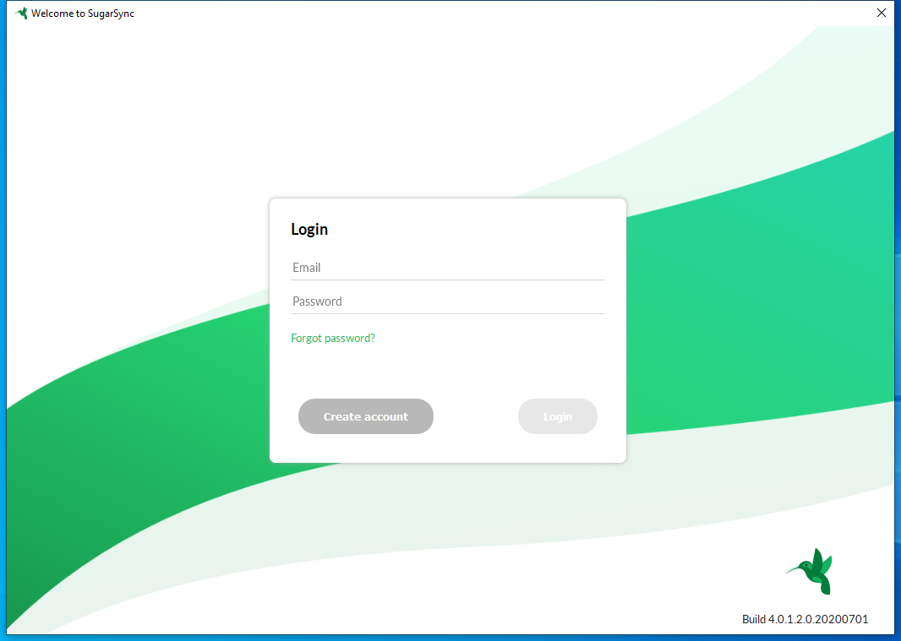

---
title: SugarSync.exe | SugarSync
excerpt: What is SugarSync.exe?
---

# SugarSync.exe 

* File Path: `C:\program files (x86)\SugarSync\SugarSync.exe`
* Description: SugarSync

## Screenshot

## Hashes

Type | Hash
-- | --
MD5 | `612271D081945AE8C8B3038DD143AB13`
SHA1 | `5E16A801EFFFB6FC7C36EAF3FF47E6171A8165DD`
SHA256 | `C5DF8C3E494BB99E1685A7136385BFF38F2A00CC2653BAFB83688289A463F9EE`
SHA384 | `CEBF941CCD37E9C8A53C38C76CF87525EF2A7FA03361CCC957B6CF3DA6596F279418EC8C1103B46A241CF3EC2CA8A611`
SHA512 | `30421BE013186BF5BE7C1711668335861C0EC7E5B9DB1B300D8E3917FDB8B57F68D0D989FE09D0C08EEB3EA1A1A77321B9294D53A8D320C47672425DA6158E09`
SSDEEP | `393216:6+PfzelSqNQEC17NloTo+bhhMmPm8Aac:vPkNQHfL+b/MmPm8f`

## Runtime Data

### Window Title:
Welcome to SugarSync

### Open Handles:

Path | Type
-- | --
(R-D)   C:\Windows\System32\en-US\KernelBase.dll.mui | File
(R-D)   C:\Windows\System32\en-US\propsys.dll.mui | File
(R-D)   C:\Windows\System32\en-US\UIAutomationCore.dll.mui | File
(R-D)   C:\Windows\SysWOW64\en-US\user32.dll.mui | File
(RW-)   C:\Program Files (x86)\SugarSync | File
(RW-)   C:\Users\user\AppData\Local\SugarSync\fslink.db\default_db.sqlite | File
(RW-)   C:\Users\user\AppData\Local\SugarSync\fslink.db\default_db.sqlite-shm | File
(RW-)   C:\Users\user\AppData\Local\SugarSync\fslink.db\default_db.sqlite-wal | File
(RW-)   C:\Users\user\AppData\Local\SugarSync\lvol.db\default_db.sqlite | File
(RW-)   C:\Users\user\AppData\Local\SugarSync\lvol.db\default_db.sqlite-shm | File
(RW-)   C:\Users\user\AppData\Local\SugarSync\lvol.db\default_db.sqlite-wal | File
(RW-)   C:\Users\user\AppData\Local\SugarSync\THUMBNAILS_CACHE\cache.sqlite | File
(RW-)   C:\Users\user\AppData\Local\Temp\qtsingleapp-SugarS-c0b6-1-lockfile | File
(RW-)   C:\Windows | File
(RW-)   C:\Windows\SysWOW64 | File
(RWD)   C:\Users\user\AppData\Local\SugarSync\sc1.log | File
\BaseNamedObjects\__ComCatalogCache__ | Section
\BaseNamedObjects\C:\*ProgramData\*Microsoft\*Windows\*Caches\*{6AF0698E-D558-4F6E-9B3C-3716689AF493}.2.ver0x0000000000000002.db | Section
\BaseNamedObjects\C:\*ProgramData\*Microsoft\*Windows\*Caches\*{DDF571F2-BE98-426D-8288-1A9A39C3FDA2}.2.ver0x0000000000000001.db | Section
\BaseNamedObjects\C:\*ProgramData\*Microsoft\*Windows\*Caches\*cversions.2.ro | Section
\BaseNamedObjects\NLS_CodePage_1252_3_2_0_0 | Section
\BaseNamedObjects\NLS_CodePage_437_3_2_0_0 | Section
\BaseNamedObjects\windows_shell_global_counters | Section
\Sessions\1\BaseNamedObjects\166cHWNDInterface:3d0312 | Section
\Sessions\1\BaseNamedObjects\windows_shell_global_counters | Section
\Sessions\1\Windows\Theme4048709601 | Section
\Windows\Theme603176458 | Section

### Loaded Modules:

Path |
-- |
C:\program files (x86)\SugarSync\SugarSync.exe |
C:\Windows\SYSTEM32\ntdll.dll |
C:\Windows\System32\wow64.dll |
C:\Windows\System32\wow64cpu.dll |
C:\Windows\System32\wow64win.dll |

## Signature

* Status: The file C:\program files (x86)\SugarSync\SugarSync.exe is not digitally signed. You cannot run this script on the current system. For more information about running scripts and setting execution policy, see about_Execution_Policies at https:/go.microsoft.com/fwlink/?LinkID=135170
* Serial: ``
* Thumbprint: ``
* Issuer: 
* Subject: 

## File Metadata

* Original Filename: SugarSync.exe
* Product Name: SugarSync
* Company Name: KeepItSafe, Inc.
* File Version: 4.0.1.2
* Product Version: 4.0.1.2
* Language: English (United States)
* Legal Copyright: (c) 2020 KeepItSafe, Inc.

MIT License. Copyright (c) 2020 Strontic.

