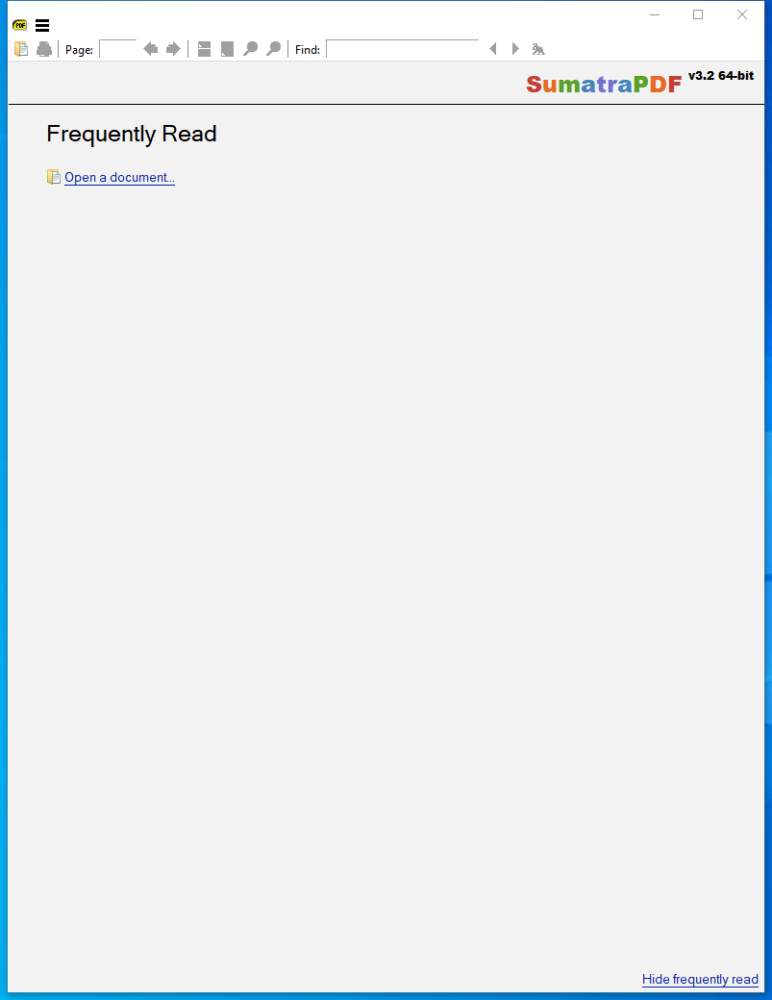

---
title: SumatraPDF.exe | SumatraPDF
---

# SumatraPDF.exe 

* File Path: `C:\Program Files\SumatraPDF\SumatraPDF.exe`
* Description: SumatraPDF

## Screenshot

## Hashes

Type | Hash
-- | --
MD5 | `632416F20AF1EF3140C74EAF14C16587`
SHA1 | `E1359FFBF4015BB446CBE537F889A889D329F72F`
SHA256 | `36D95DADF36CEAE35F49BA0DFF47FF628E3433B1150FB5A845F646BE67F90198`
SHA384 | `C6F4892A19FE0E5EED7C443061057D9AF47C6F6F7CBD383FBBC3899477BFF987A3E58DA9CE9E7A1CBA34BA13C534830E`
SHA512 | `EECD835F37074E6EE33D4CD3A93F1FE2BF2DA338EAE82A5BABCF473ABD2A1974F8FECCE968D37208535E6FECE8D3BAE55F5D786A3B02290A6E718F6287B2BF45`
SSDEEP | `98304:wrjWbUfpUa5ac/8aW+pY6IbSuOWOrIWPCZC01IrP7xDqmca3tBX2gL+CkSmETu:wmUtBPdOVuUW216z1nca3tY27kvEy`

## Signature

* Status: Signature verified.
* Serial: `00DA99CFF4EFE6B3EDA63DDFF3B69993E4`
* Thumbprint: `8D9034D25A9C8794C01E21D51A748D3F543AD443`
* Issuer: CN=COMODO RSA Code Signing CA, O=COMODO CA Limited, L=Salford, S=Greater Manchester, C=GB
* Subject: CN=Krzysztof Kowalczyk, O=Krzysztof Kowalczyk, STREET=3388 17th st, STREET="#202", L=San Francisco, S=California, PostalCode=94110, C=US

## File Metadata

* Original Filename: 
* Product Name: SumatraPDF
* Company Name: Krzysztof Kowalczyk
* File Version: 3.2
* Product Version: 3.2
* Language: English (United States)
* Legal Copyright: Copyright 2006-2020 all authors (GPLv3)

MIT License. Copyright (c) 2020 Strontic.

