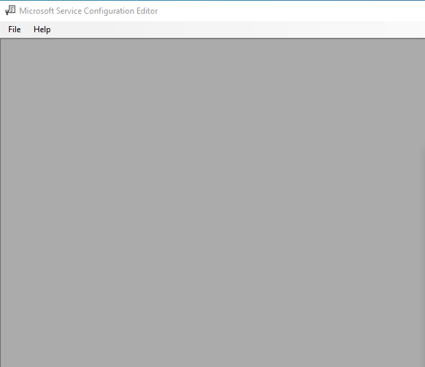

---
title: SvcConfigEditor.exe | SvcConfigEditor.exe
excerpt: What is SvcConfigEditor.exe?
---

# SvcConfigEditor.exe 

* File Path: `C:\Program Files (x86)\Microsoft SDKs\Windows\v10.0A\bin\NETFX 4.8 Tools\SvcConfigEditor.exe`
* Description: SvcConfigEditor.exe
* Comments: Flavor=Retail

## Screenshot

## Hashes

Type | Hash
-- | --
MD5 | `F3F98CD1524F4C835C264CA3494F657A`
SHA1 | `7D755ED8B37C4B3EEF50FEBEBD9D02A9A1B81AF0`
SHA256 | `5C0B2BF4AD320EC0FA48C12BC546B04701C5A5DD196D953DF310402190EB853C`
SHA384 | `4C49614538BE55B2EF46032087DC5FD6B01D2E53DEF2193223D37516D9E365D7803B2AA1BB266E8A8D83855D3FD2A913`
SHA512 | `DE0A1E22E14E49BE97246377293B207B3823603208DEA753E2D855C6A2BF38344EA59A2A0540867BD9595F3C0B1A99328791F5F6D52B25C963AF96F0CCE0BDE0`
SSDEEP | `24576:YcMKecTmJMBo9Dob1pk6K8Vv0ne6xwTY22IOZMMauGDwoDTZvvRFJyWWt8Kki4ey:sU/BU0Q6K8Vv0ne6xwTY2MGDwqFgWkRU`
IMP | `F34D5F2D4577ED6D9CEEC516C1F5A744`
PESHA1 | `B0D61783FD380AA5D035A14C28BBADBE133B7361`
PE256 | `4EA8F5CCA022D1C7F282DF2516255F299E397DDF8FE3B47DD0B810BC4B2A8CA3`

## Runtime Data

### Window Title:
Microsoft Service Configuration Editor

### Open Handles:

Path | Type
-- | --
(R-D)   C:\Windows\Fonts\StaticCache.dat | File
(R-D)   C:\Windows\Microsoft.NET\assembly\GAC_64\mscorlib\v4.0_4.0.0.0__b77a5c561934e089\mscorlib.dll | File
(R-D)   C:\Windows\Microsoft.NET\assembly\GAC_MSIL\Accessibility\v4.0_4.0.0.0__b03f5f7f11d50a3a\Accessibility.dll | File
(R-D)   C:\Windows\Microsoft.NET\assembly\GAC_MSIL\System.Configuration\v4.0_4.0.0.0__b03f5f7f11d50a3a\System.Configuration.dll | File
(R-D)   C:\Windows\Microsoft.NET\assembly\GAC_MSIL\System.Drawing\v4.0_4.0.0.0__b03f5f7f11d50a3a\System.Drawing.dll | File
(R-D)   C:\Windows\Microsoft.NET\assembly\GAC_MSIL\System.IdentityModel\v4.0_4.0.0.0__b77a5c561934e089\System.IdentityModel.dll | File
(R-D)   C:\Windows\Microsoft.NET\assembly\GAC_MSIL\System.ServiceModel.Activities\v4.0_4.0.0.0__31bf3856ad364e35\System.ServiceModel.Activities.dll | File
(R-D)   C:\Windows\Microsoft.NET\assembly\GAC_MSIL\System.ServiceModel.Channels\v4.0_4.0.0.0__31bf3856ad364e35\System.ServiceModel.Channels.dll | File
(R-D)   C:\Windows\Microsoft.NET\assembly\GAC_MSIL\System.ServiceModel.Discovery\v4.0_4.0.0.0__31bf3856ad364e35\System.ServiceModel.Discovery.dll | File
(R-D)   C:\Windows\Microsoft.NET\assembly\GAC_MSIL\System.ServiceModel.Routing\v4.0_4.0.0.0__31bf3856ad364e35\System.ServiceModel.Routing.dll | File
(R-D)   C:\Windows\Microsoft.NET\assembly\GAC_MSIL\System.ServiceModel.Web\v4.0_4.0.0.0__31bf3856ad364e35\System.ServiceModel.Web.dll | File
(R-D)   C:\Windows\Microsoft.NET\assembly\GAC_MSIL\System.ServiceModel\v4.0_4.0.0.0__b77a5c561934e089\System.ServiceModel.dll | File
(R-D)   C:\Windows\Microsoft.NET\assembly\GAC_MSIL\System.Windows.Forms\v4.0_4.0.0.0__b77a5c561934e089\System.Windows.Forms.dll | File
(R-D)   C:\Windows\Microsoft.NET\assembly\GAC_MSIL\System.WorkflowServices\v4.0_4.0.0.0__31bf3856ad364e35\System.WorkflowServices.dll | File
(R-D)   C:\Windows\Microsoft.NET\assembly\GAC_MSIL\System.Xml\v4.0_4.0.0.0__b77a5c561934e089\System.XML.dll | File
(R-D)   C:\Windows\Microsoft.NET\assembly\GAC_MSIL\System\v4.0_4.0.0.0__b77a5c561934e089\System.dll | File
(R-D)   C:\Windows\System32\en-US\user32.dll.mui | File
(R-D)   C:\Windows\SystemResources\imageres.dll.mun | File
(RW-)   C:\Users\user | File
(RW-)   C:\Windows\WinSxS\amd64_microsoft.windows.common-controls_6595b64144ccf1df_5.82.19041.488_none_4238de57f6b64d28 | File
(RW-)   C:\Windows\WinSxS\amd64_microsoft.windows.common-controls_6595b64144ccf1df_6.0.19041.488_none_ca04af081b815d21 | File
(RW-)   C:\Windows\WinSxS\amd64_microsoft.windows.gdiplus_6595b64144ccf1df_1.1.19041.685_none_faeca4db76168538 | File
\...\Cor_SxSPublic_IPCBlock | Section
\BaseNamedObjects\__ComCatalogCache__ | Section
\BaseNamedObjects\C:\*ProgramData\*Microsoft\*Windows\*Caches\*{6AF0698E-D558-4F6E-9B3C-3716689AF493}.2.ver0x0000000000000002.db | Section
\BaseNamedObjects\C:\*ProgramData\*Microsoft\*Windows\*Caches\*{DDF571F2-BE98-426D-8288-1A9A39C3FDA2}.2.ver0x0000000000000002.db | Section
\BaseNamedObjects\C:\*ProgramData\*Microsoft\*Windows\*Caches\*cversions.2 | Section
\BaseNamedObjects\Cor_Private_IPCBlock_v4_4756 | Section
\BaseNamedObjects\NLS_CodePage_1252_3_2_0_0 | Section
\BaseNamedObjects\NLS_CodePage_437_3_2_0_0 | Section
\Sessions\1\BaseNamedObjects\1294HWNDInterface:230672 | Section
\Sessions\1\BaseNamedObjects\windows_shell_global_counters | Section
\Sessions\1\Windows\Theme1383959086 | Section
\Windows\Theme2042523233 | Section

### Loaded Modules:

Path |
-- |
C:\Program Files (x86)\Microsoft SDKs\Windows\v10.0A\bin\NETFX 4.8 Tools\SvcConfigEditor.exe |
C:\Windows\System32\ADVAPI32.dll |
C:\Windows\System32\KERNEL32.dll |
C:\Windows\System32\KERNELBASE.dll |
C:\Windows\SYSTEM32\MSCOREE.DLL |
C:\Windows\System32\msvcrt.dll |
C:\Windows\SYSTEM32\ntdll.dll |
C:\Windows\System32\RPCRT4.dll |
C:\Windows\System32\sechost.dll |

## Signature

* Status: Signature verified.
* Serial: `33000001519E8D8F4071A30E41000000000151`
* Thumbprint: `62009AAABDAE749FD47D19150958329BF6FF4B34`
* Issuer: CN=Microsoft Code Signing PCA 2011, O=Microsoft Corporation, L=Redmond, S=Washington, C=US
* Subject: CN=Microsoft Corporation, O=Microsoft Corporation, L=Redmond, S=Washington, C=US

## File Metadata

* Original Filename: SvcConfigEditor.exe
* Product Name: Microsoft .NET Framework
* Company Name: Microsoft Corporation
* File Version: 4.8.4084.0 built by: NET48REL1
* Product Version: 4.8.4084.0
* Language: English (United States)
* Legal Copyright:  Microsoft Corporation.  All rights reserved.
* Machine Type: 32-bit

## File Scan

* VirusTotal Detections: 0/73
* VirusTotal Link: https://www.virustotal.com/gui/file/5c0b2bf4ad320ec0fa48c12bc546b04701c5a5dd196d953df310402190eb853c/detection

MIT License. Copyright (c) 2020-2021 Strontic.

