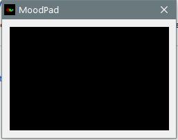

---
title: SynMood.exe | MoodPad
---

# SynMood.exe 

* File Path: `C:\WINDOWS\system32\DriverStore\FileRepository\synpd.inf_amd64_318aa16b062fddc3\SynMood.exe`
* Description: MoodPad
* Comments: 

## Screenshot



## Hashes

Type | Hash
-- | --
MD5 | `21E5C738C1AD87061D80710744711DBE`
SHA1 | `76437EFE0D34D45502274E514C6A8D8203731052`
SHA256 | `12F1048BD9F8734C145783B758D73C246D42527716D479AB51405735EDFA56B4`
SHA384 | `74BFBBA428E66A53961EB15A5B39E0CB5EC58D5C42830CB53657E6771828AF5034BFAEBF5FCFFCEAAA22E83F54AF3A35`
SHA512 | `4323CB6469C8282BD91933EBFF7E4F431EF3216FE4C5E3A746050A4CDE6DC9A6729B975B985D343203C2BE6298B6A29800E7DD2E905E1994A91653BA8F654C62`
SSDEEP | `49152:+dLX12B2xBeT0MMvaoI6PbmW9aqm2pbg79uVTpKbdaXs5EXV:++2jeT0MOa4PbmW9aqrgRuVTpKbAX`

## Runtime Data

### Usage (stdout):
```Batchfile

```

### Usage (stderr):
```Batchfile

```

### Child Processes:


## Signature

* Status: Signature verified.
* Serial: `33000000244D59538809906EA7000100000024`
* Thumbprint: `06F36DDE6035DDBFF8C1DC173ABDADDCAECFA0F3`
* Issuer: CN=Microsoft Windows Hardware Compatibility PCA, O=Microsoft Corporation, L=Redmond, S=Washington, C=US
* Subject: CN=Microsoft Windows Hardware Compatibility Publisher, OU=MOPR, O=Microsoft Corporation, L=Redmond, S=Washington, C=US

## File Metadata

* Original Filename: SynMood.exe
* Product Name: Synaptics Pointing Device Driver
* Company Name: Synaptics Incorporated
* File Version: 19.3.31.31 16Aug17
* Product Version: 19.3.31.31 16Aug17
* Language: English (United States)
* Legal Copyright: Copyright (C) Synaptics Incorporated 1996-2017


MIT License. Copyright (c) 2020 Strontic.


