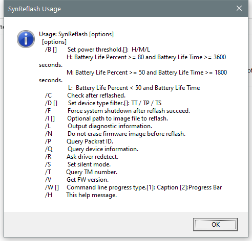

---
title: SynReflash.exe | TouchPad Reflash
excerpt: What is SynReflash.exe?
---

# SynReflash.exe 

* File Path: `C:\WINDOWS\system32\DriverStore\FileRepository\synpd.inf_amd64_4e500223b4e4a9e4\SynReflash.exe`
* Description: TouchPad Reflash

## Screenshot

## Hashes

Type | Hash
-- | --
MD5 | `64698D3A7FDB7F1BB635B6E9EB9D848A`
SHA1 | `ABDAE16FD4E2F26BDC82B7BC400D92FA9716AACA`
SHA256 | `BD25C770BEEEABA613E5B8F1C6474289952F0BE97036FBFF69D0975763ABCD04`
SHA384 | `511327E68DA9D7665BCC976921882BFDB86EEEE2687D8DA25BB71E51DB03B5A9862E04C4EE690D9F6C09A45A598B7C80`
SHA512 | `4B7AA3F042E68FAD83402A3FD428501DA10581E3E888C75A9CBA582CFB686AEB3E23B2945285D743DE73200D9F2057EF324AE852CC9B1A89501DE1C81F0F2A13`
SSDEEP | `24576:6nQNZz4L5PWFIutBzQ1zCjakbmq920WDU5VM0XS:GsEwzQ1zCjakbd2NU56CS`

## Signature

* Status: Signature verified.
* Serial: `3300000010D1EBBCBE1C4C7C49000100000010`
* Thumbprint: `C802CA01BC3064BFC0510CC762FFAA20BFE8EC61`
* Issuer: CN=Microsoft Windows Hardware Compatibility PCA, O=Microsoft Corporation, L=Redmond, S=Washington, C=US
* Subject: CN=Microsoft Windows Hardware Compatibility Publisher, OU=MOPR, O=Microsoft Corporation, L=Redmond, S=Washington, C=US

## File Metadata

* Original Filename: SynReflash.exe
* Product Name: Synaptics TouchPad Reflash Application
* Company Name: Synaptics Incorporated
* File Version: 19.0.12.95 06Jul15
* Product Version: 19.0.12.95 06Jul15
* Language: English (United States)
* Legal Copyright: Copyright (C) Synaptics Incorporated 1996-2015

MIT License. Copyright (c) 2020-2021 Strontic.

