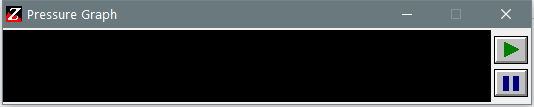

---
title: SynZMetr.exe | Synaptics Pressure Graph
---

# SynZMetr.exe 

* File Path: `C:\WINDOWS\system32\DriverStore\FileRepository\synpd.inf_amd64_b28b907efbdd0634\SynZMetr.exe`
* Description: Synaptics Pressure Graph

## Screenshot

## Hashes

Type | Hash
-- | --
MD5 | `3B7CFE31D309489A25E66C16FEE77BDC`
SHA1 | `DC341D36398177CC12748D4AE03A14FF55D788E1`
SHA256 | `CB2D3A82D8A824814509D4DFA3A73A4FEA9CCF864C0A58D1391BD4867435E84C`
SHA384 | `DD275FFEB31484030B940D5F32B27F8EAD42432B1C003925BDE2E59CB7AAD2617C8790E03CCB384949B32DBB5F76234E`
SHA512 | `18C6D82E5A0BA6E5AEBED4286F2910888C2849E63B82ACB924E96A341F625AAC97138A84BC946D5C5E83A99DF437D2624A90DB6CECB740A7BE592FF3BCECFFD7`
SSDEEP | `3072:JIWrQgt6PmvebEc5jQQMalHt/TM03bXu75nZwpJ8k1wr73U1QfK5IC/tJ4IOTa7:OW/t6Pmvegy02t/b+73w3R+ID`

### Loaded Modules:

Path |
-- |
C:\program files (x86)\Common Files\Apple\Mobile Device Support\SyncUIHandler.exe |
C:\Windows\SYSTEM32\ntdll.dll |
C:\Windows\System32\wow64.dll |
C:\Windows\System32\wow64cpu.dll |
C:\Windows\System32\wow64win.dll |

## Signature

* Status: Signature verified.
* Serial: `610C2E31000200000014`
* Thumbprint: `6700495D48ED947225EC79804D391FD00DF8E842`
* Issuer: CN=Microsoft Windows Hardware Compatibility PCA, OU=Copyright (c) 2002 Microsoft Corp., O=Microsoft Corporation, L=Redmond, S=Washington, C=US
* Subject: CN=Microsoft Windows Hardware Compatibility Publisher, OU=MOPR, O=Microsoft Corporation, L=Redmond, S=Washington, C=US

## File Metadata

* Original Filename: Zmeter2.exe
* Product Name: Synaptics Pointing Device Driver
* Company Name: Synaptics Incorporated
* File Version: 15.3.29 13Oct11
* Product Version: 15.3.29 13Oct11
* Language: English (United States)
* Legal Copyright: Copyright (C) Synaptics Incorporated 1996-2011

MIT License. Copyright (c) 2020 Strontic.

