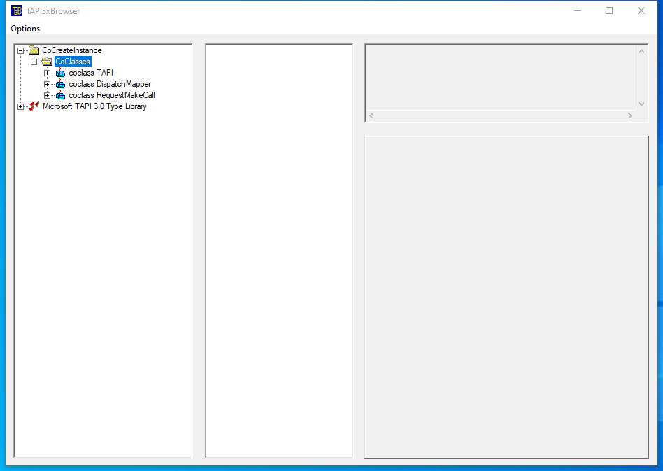

---
title: TB3x.exe | TAPIBrowser MFC Application
excerpt: What is TB3x.exe?
---

# TB3x.exe 

* File Path: `C:\Program Files (x86)\Windows Kits\10\bin\10.0.19041.0\x64\TB3x.exe`
* Description: TAPIBrowser MFC Application

## Screenshot

## Hashes

Type | Hash
-- | --
MD5 | `ABE2CE6E0609B472A3693C143B65D729`
SHA1 | `30916C17483635406628E045CF96D28623823975`
SHA256 | `002310FBD6E1C459164DC8A9C4169F639D35E4FA0901179DF891D7443A311D21`
SHA384 | `0DB0D8EBD0DA371288E7CDF40D0F4B385EAB3B87BE2DB5C832AD3A3838B49EE76901D2646475198D58F0AD4A1FFCCAF4`
SHA512 | `65C0581AAB43D6833A17A273E689E25D10202E5949DFD371968B1F3D84DE052F33247AD54F5514BC908362B61DC046311549572692104FB29910E4F7CF22BC15`
SSDEEP | `3072:bPhOf+7daDzoduWcGBfDhUQLJoHIKnhm7oaLJ0Mmfa:DhOEdaDzo3cgfDhWXM`
IMP | `ADA44F727467671751E405C611F7D044`
PESHA1 | `B28629A419B2A67E3BFC803CE15321E105B1977E`
PE256 | `FAF3FFFA9E80CDD96AFA77AA15234E6D426EAE594ABEFAF01F413EB752527ABB`

## Runtime Data

### Window Title:
TAPI3xBrowser

### Open Handles:

Path | Type
-- | --
(R-D)   C:\Windows\Fonts\StaticCache.dat | File
(R-D)   C:\Windows\System32\en-US\MFC42u.dll.mui | File
(R-D)   C:\Windows\System32\en-US\user32.dll.mui | File
(R-D)   C:\Windows\System32\stdole2.tlb | File
(RW-)   C:\Users\user | File
(RW-)   C:\Windows\WinSxS\amd64_microsoft.windows.common-controls_6595b64144ccf1df_5.82.19041.488_none_4238de57f6b64d28 | File
(RW-)   C:\Windows\WinSxS\amd64_microsoft.windows.common-controls_6595b64144ccf1df_6.0.19041.488_none_ca04af081b815d21 | File
(RWD)   C:\Windows\System32\quartz.dll | File
(RWD)   C:\Windows\System32\tapi3.dll | File
\BaseNamedObjects\C:\*ProgramData\*Microsoft\*Windows\*Caches\*{6AF0698E-D558-4F6E-9B3C-3716689AF493}.2.ver0x0000000000000002.db | Section
\BaseNamedObjects\C:\*ProgramData\*Microsoft\*Windows\*Caches\*{DDF571F2-BE98-426D-8288-1A9A39C3FDA2}.2.ver0x0000000000000002.db | Section
\BaseNamedObjects\C:\*ProgramData\*Microsoft\*Windows\*Caches\*cversions.2 | Section
\BaseNamedObjects\NLS_CodePage_1252_3_2_0_0 | Section
\BaseNamedObjects\NLS_CodePage_437_3_2_0_0 | Section
\Sessions\1\Windows\Theme1383959086 | Section
\Windows\Theme2042523233 | Section

### Loaded Modules:

Path |
-- |
C:\Program Files (x86)\Windows Kits\10\bin\10.0.19041.0\x64\TB3x.exe |
C:\Windows\System32\ADVAPI32.dll |
C:\Windows\System32\GDI32.dll |
C:\Windows\System32\gdi32full.dll |
C:\Windows\System32\KERNEL32.DLL |
C:\Windows\System32\KERNELBASE.dll |
C:\Windows\System32\msvcp_win.dll |
C:\Windows\System32\msvcrt.dll |
C:\Windows\SYSTEM32\ntdll.dll |
C:\Windows\System32\RPCRT4.dll |
C:\Windows\System32\sechost.dll |
C:\Windows\System32\ucrtbase.dll |
C:\Windows\System32\USER32.dll |
C:\Windows\System32\win32u.dll |

## Signature

* Status: Signature verified.
* Serial: `33000002CF6D2CC57CAA65A6D80000000002CF`
* Thumbprint: `1A221B3B4FEF088B17BA6704FD088DF192D9E0EF`
* Issuer: CN=Microsoft Code Signing PCA 2010, O=Microsoft Corporation, L=Redmond, S=Washington, C=US
* Subject: CN=Microsoft Corporation, O=Microsoft Corporation, L=Redmond, S=Washington, C=US

## File Metadata

* Original Filename: TAPIBrowser.EXE
* Product Name: TAPIBrowser Application
* Company Name: 
* File Version: 1, 0, 0, 1
* Product Version: 1, 0, 0, 1
* Language: English (United States)
* Legal Copyright: Copyright (C) 2000
* Machine Type: 64-bit

## File Scan

* VirusTotal Detections: Unknown
* VirusTotal Link: n/a

MIT License. Copyright (c) 2020 Strontic.

