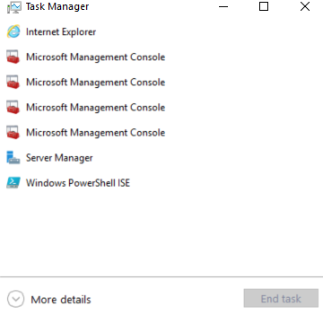

---
title: Taskmgr.exe | Task Manager
---

# Taskmgr.exe 

* File Path: `C:\WINDOWS\system32\Taskmgr.exe`
* Description: Task Manager

## Screenshot

## Hashes

Type | Hash
-- | --
MD5 | `33FACAAB13A58251BF45E9AC958B15FA`
SHA1 | `8A4882EE93E1F23BF9241E4BA0BF7BD67F88A364`
SHA256 | `0AF6B3F8628E38B1551EC76277E482F8A2605B661F57C164C47ACEBB14B1A81B`
SHA384 | `6FE8B7A4A07A85522A96D6D82152C88846CF0F1AE043F67680DB43A99E576EB61841E5C064879DC95B7F930E535F1C54`
SHA512 | `394519BB646F9D13A60E965CBCCB17D0C700B65C2FDB86BD579D7A4390C7B213BF3EE761FD946E318336B07A568A9F636EC0C2A0C37BACD45044A7AAA9502648`
SSDEEP | `24576:1HfSfSSuG4ODz4JXEJNZx37nE9JDc80KXpVydVnVJ:pasmUVEJNXMDp0K5Vydt`

## Signature

* Status: Signature verified.
* Serial: `330000023241FB59996DCC4DFF000000000232`
* Thumbprint: `FF82BC38E1DA5E596DF374C53E3617F7EDA36B06`
* Issuer: CN=Microsoft Windows Production PCA 2011, O=Microsoft Corporation, L=Redmond, S=Washington, C=US
* Subject: CN=Microsoft Windows, O=Microsoft Corporation, L=Redmond, S=Washington, C=US

## File Metadata

* Original Filename: Taskmgr.exe.mui
* Product Name: Microsoft Windows Operating System
* Company Name: Microsoft Corporation
* File Version: 10.0.18362.1 (WinBuild.160101.0800)
* Product Version: 10.0.18362.1
* Language: English (United States)
* Legal Copyright:  Microsoft Corporation. All rights reserved.

## Possible Misuse

*The following table contains possible examples of `Taskmgr.exe` being misused. While `Taskmgr.exe` is **not** inherently malicious, its legitimate functionality can by abused for malicious purposes.*

Source | Source File | Example | License
-- | -- | -- | --
[sigma](https://github.com/Neo23x0/sigma) | [win_alert_lsass_access.yml](https://github.com/Neo23x0/sigma/blob/master/rules/windows/builtin/win_alert_lsass_access.yml) | `    - Some Taskmgr.exe related activity` | [DRL 1.0](https://github.com/Neo23x0/sigma/blob/master/LICENSE.Detection.Rules.md)
[sigma](https://github.com/Neo23x0/sigma) | [win_susp_lsass_dump_generic.yml](https://github.com/Neo23x0/sigma/blob/master/rules/windows/builtin/win_susp_lsass_dump_generic.yml) | `            - '\taskmgr.exe'` | [DRL 1.0](https://github.com/Neo23x0/sigma/blob/master/LICENSE.Detection.Rules.md)
[sigma](https://github.com/Neo23x0/sigma) | [sysmon_creation_system_file.yml](https://github.com/Neo23x0/sigma/blob/master/rules/windows/file_event/sysmon_creation_system_file.yml) | `            - '*\Taskmgr.exe'` | [DRL 1.0](https://github.com/Neo23x0/sigma/blob/master/LICENSE.Detection.Rules.md)
[sigma](https://github.com/Neo23x0/sigma) | [sysmon_creation_system_file.yml](https://github.com/Neo23x0/sigma/blob/master/rules/windows/file_event/sysmon_creation_system_file.yml) | `            - '*\taskmgr.exe'` | [DRL 1.0](https://github.com/Neo23x0/sigma/blob/master/LICENSE.Detection.Rules.md)
[sigma](https://github.com/Neo23x0/sigma) | [sysmon_cred_dump_lsass_access.yml](https://github.com/Neo23x0/sigma/blob/master/rules/windows/process_access/sysmon_cred_dump_lsass_access.yml) | `            - '\taskmgr.exe'` | [DRL 1.0](https://github.com/Neo23x0/sigma/blob/master/LICENSE.Detection.Rules.md)
[sigma](https://github.com/Neo23x0/sigma) | [sysmon_lsass_memdump.yml](https://github.com/Neo23x0/sigma/blob/master/rules/windows/process_access/sysmon_lsass_memdump.yml) | `description: Detects process LSASS memory dump using procdump or taskmgr based on the CallTrace pointing to dbghelp.dll or dbgcore.dll for win10` | [DRL 1.0](https://github.com/Neo23x0/sigma/blob/master/LICENSE.Detection.Rules.md)
[sigma](https://github.com/Neo23x0/sigma) | [sysmon_lsass_memdump.yml](https://github.com/Neo23x0/sigma/blob/master/rules/windows/process_access/sysmon_lsass_memdump.yml) | `    - https://blog.menasec.net/2019/02/threat-hunting-21-procdump-or-taskmgr.html` | [DRL 1.0](https://github.com/Neo23x0/sigma/blob/master/LICENSE.Detection.Rules.md)
[sigma](https://github.com/Neo23x0/sigma) | [win_susp_taskmgr_localsystem.yml](https://github.com/Neo23x0/sigma/blob/master/rules/windows/process_creation/win_susp_taskmgr_localsystem.yml) | `title: Taskmgr as LOCAL_SYSTEM` | [DRL 1.0](https://github.com/Neo23x0/sigma/blob/master/LICENSE.Detection.Rules.md)
[sigma](https://github.com/Neo23x0/sigma) | [win_susp_taskmgr_localsystem.yml](https://github.com/Neo23x0/sigma/blob/master/rules/windows/process_creation/win_susp_taskmgr_localsystem.yml) | `description: Detects the creation of taskmgr.exe process in context of LOCAL_SYSTEM` | [DRL 1.0](https://github.com/Neo23x0/sigma/blob/master/LICENSE.Detection.Rules.md)
[sigma](https://github.com/Neo23x0/sigma) | [win_susp_taskmgr_localsystem.yml](https://github.com/Neo23x0/sigma/blob/master/rules/windows/process_creation/win_susp_taskmgr_localsystem.yml) | `        Image: '*\taskmgr.exe'` | [DRL 1.0](https://github.com/Neo23x0/sigma/blob/master/LICENSE.Detection.Rules.md)
[sigma](https://github.com/Neo23x0/sigma) | [win_susp_taskmgr_parent.yml](https://github.com/Neo23x0/sigma/blob/master/rules/windows/process_creation/win_susp_taskmgr_parent.yml) | `title: Taskmgr as Parent` | [DRL 1.0](https://github.com/Neo23x0/sigma/blob/master/LICENSE.Detection.Rules.md)
[sigma](https://github.com/Neo23x0/sigma) | [win_susp_taskmgr_parent.yml](https://github.com/Neo23x0/sigma/blob/master/rules/windows/process_creation/win_susp_taskmgr_parent.yml) | `        ParentImage: '*\taskmgr.exe'` | [DRL 1.0](https://github.com/Neo23x0/sigma/blob/master/LICENSE.Detection.Rules.md)
[sigma](https://github.com/Neo23x0/sigma) | [win_susp_taskmgr_parent.yml](https://github.com/Neo23x0/sigma/blob/master/rules/windows/process_creation/win_susp_taskmgr_parent.yml) | `            - '*\taskmgr.exe'` | [DRL 1.0](https://github.com/Neo23x0/sigma/blob/master/LICENSE.Detection.Rules.md)
[sigma](https://github.com/Neo23x0/sigma) | [win_system_exe_anomaly.yml](https://github.com/Neo23x0/sigma/blob/master/rules/windows/process_creation/win_system_exe_anomaly.yml) | `            - '*\Taskmgr.exe'` | [DRL 1.0](https://github.com/Neo23x0/sigma/blob/master/LICENSE.Detection.Rules.md)
[signature-base](https://github.com/Neo23x0/signature-base) | [crime_cn_campaign_njrat.yar](https://github.com/Neo23x0/signature-base/blob/master/yara/crime_cn_campaign_njrat.yar) |       $a3 = "taskkill /f /im taskmgr.exe" fullword ascii | [CC BY-NC 4.0](https://github.com/Neo23x0/signature-base/blob/master/LICENSE)
[signature-base](https://github.com/Neo23x0/signature-base) | [gen_cn_hacktools.yar](https://github.com/Neo23x0/signature-base/blob/master/yara/gen_cn_hacktools.yar) | 		$s2 = "Kiwi Taskmgr no-gpo" fullword wide | [CC BY-NC 4.0](https://github.com/Neo23x0/signature-base/blob/master/LICENSE)
[signature-base](https://github.com/Neo23x0/signature-base) | [thor_inverse_matches.yar](https://github.com/Neo23x0/signature-base/blob/master/yara/thor_inverse_matches.yar) |       description = "Anomaly rule looking for certain strings in a system file (maybe false positive on certain systems) - file taskmgr.exe" | [CC BY-NC 4.0](https://github.com/Neo23x0/signature-base/blob/master/LICENSE)
[signature-base](https://github.com/Neo23x0/signature-base) | [thor_inverse_matches.yar](https://github.com/Neo23x0/signature-base/blob/master/yara/thor_inverse_matches.yar) |       $s1 = "taskmgr.chm" fullword | [CC BY-NC 4.0](https://github.com/Neo23x0/signature-base/blob/master/LICENSE)
[signature-base](https://github.com/Neo23x0/signature-base) | [thor_inverse_matches.yar](https://github.com/Neo23x0/signature-base/blob/master/yara/thor_inverse_matches.yar) |       ( filename == "taskmgr.exe" or filename == "Taskmgr.exe" ) and not 1 of ($s*) and not WINDOWS_UPDATE_BDC | [CC BY-NC 4.0](https://github.com/Neo23x0/signature-base/blob/master/LICENSE)

MIT License. Copyright (c) 2020 Strontic.

