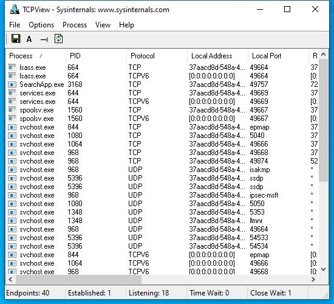

---
title: Tcpview.exe | TCP/UDP endpoint viewer
excerpt: What is Tcpview.exe?
---

# Tcpview.exe 

* File Path: `C:\SysinternalsSuite\Tcpview.exe`
* Description: TCP/UDP endpoint viewer

## Screenshot

## Hashes

Type | Hash
-- | --
MD5 | `9AA5A93712C584ACDCAA7EEF9D25EF4D`
SHA1 | `9589B7B51791C5BB819CBEE9F85D49249602768A`
SHA256 | `C00D90C50A5E05D270B796645D5F12DEE94A31CA94B8DDC90C91AF1F9E208850`
SHA384 | `253AE488DA327F2F8C762C97A48019A4C5F3FC87DFA9693622DFFAF33005DE317E3F05C7E93E03FF4414754430B0592D`
SHA512 | `21B4C6B7E16CDC3E729FB708B5E9BDED3386DBF6BDB8F286BD4AE8E9F0F59F935674730B96ECA2D266E648A7BADF3973E1A9AE9D365ADAD2FC24816DE98A8E9A`
SSDEEP | `6144:51o12lUr7EbaK1fw9mdo7DZJ/wDAUZlYm3UhM9lY:5C1ZobTw9tDZJwDrPYmOf`
IMP | `3CE43DCC9F8226B50B65387F4477DE91`
PESHA1 | `4B08489C56BD95A840C889D854B98B70E814EF91`
PE256 | `388B81CB392289C944CC6140CE1F386ACECA83F2282FCC77CDCF224D495A2177`

## Runtime Data

### Window Title:
TCPView - Sysinternals: www.sysinternals.com

### Open Handles:

Path | Type
-- | --
(R-D)   C:\Windows\Fonts\StaticCache.dat | File
(RW-)   C:\Windows | File
(RW-)   C:\Windows\WinSxS\x86_microsoft.windows.common-controls_6595b64144ccf1df_6.0.19041.488_none_11b1e5df2ffd8627 | File
(RW-)   C:\xCyclopedia | File
\BaseNamedObjects\__ComCatalogCache__ | Section
\BaseNamedObjects\NLS_CodePage_1252_3_2_0_0 | Section
\BaseNamedObjects\NLS_CodePage_437_3_2_0_0 | Section
\BaseNamedObjects\windows_shell_global_counters | Section
\Sessions\1\BaseNamedObjects\windows_shell_global_counters | Section
\Sessions\1\Windows\Theme2036293991 | Section
\Windows\Theme1324212991 | Section

### Loaded Modules:

Path |
-- |
C:\SysinternalsSuite\Tcpview.exe |
C:\Windows\SYSTEM32\ntdll.dll |
C:\Windows\System32\wow64.dll |
C:\Windows\System32\wow64cpu.dll |
C:\Windows\System32\wow64win.dll |

## Signature

* Status: Signature verified.
* Serial: `6108775F00000000004A`
* Thumbprint: `9BF69D5E8D01A92F413B60A4BE003E323CB52F7F`
* Issuer: CN=Microsoft Code Signing PCA, O=Microsoft Corporation, L=Redmond, S=Washington, C=US
* Subject: CN=Microsoft Corporation, OU=MOPR, O=Microsoft Corporation, L=Redmond, S=Washington, C=US

## File Metadata

* Original Filename: 
* Product Name: Sysinternals TCPView
* Company Name: Sysinternals - www.sysinternals.com
* File Version: 3.05
* Product Version: 3.05
* Language: English (United States)
* Legal Copyright: Copyright (C) 1998-2011 Mark Russinovich and Bryce Cogswell
* Machine Type: 32-bit

## File Scan

* VirusTotal Detections: 0/69
* VirusTotal Link: https://www.virustotal.com/gui/file/c00d90c50a5e05d270b796645d5f12dee94a31ca94b8ddc90c91af1f9e208850/detection/

## Possible Misuse

*The following table contains possible examples of `Tcpview.exe` being misused. While `Tcpview.exe` is **not** inherently malicious, its legitimate functionality can be abused for malicious purposes.*

Source | Source File | Example | License
-- | -- | -- | --
[signature-base](https://github.com/Neo23x0/signature-base) | [apt_apt41.yar](https://github.com/Neo23x0/signature-base/blob/master/yara/apt_apt41.yar) | $s2 = "tcpview.exe" fullword ascii | [CC BY-NC 4.0](https://github.com/Neo23x0/signature-base/blob/master/LICENSE)
[signature-base](https://github.com/Neo23x0/signature-base) | [apt_apt41.yar](https://github.com/Neo23x0/signature-base/blob/master/yara/apt_apt41.yar) | $x1 = ";procmon64.exe;netmon.exe;tcpview.exe;MiniSniffer.exe;smsniff.exe" ascii | [CC BY-NC 4.0](https://github.com/Neo23x0/signature-base/blob/master/LICENSE)

MIT License. Copyright (c) 2020 Strontic.

