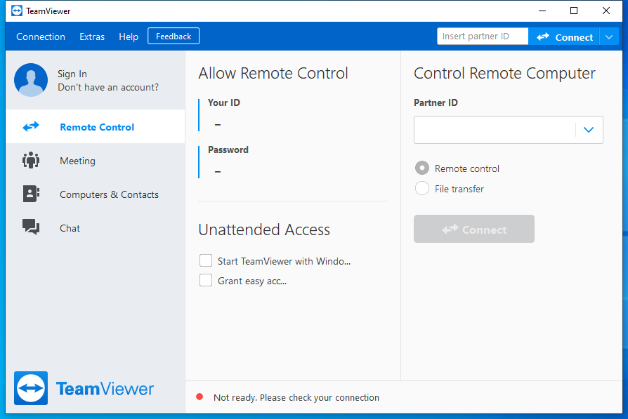
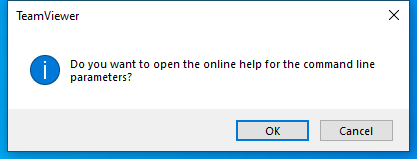

---
title: TeamViewer.exe | TeamViewer
excerpt: What is TeamViewer.exe?
---

# TeamViewer.exe 

* File Path: `C:\Program Files (x86)\TeamViewer\TeamViewer.exe`
* Description: TeamViewer

## Screenshot

## Hashes

Type | Hash
-- | --
MD5 | `DC7A10E3A6F2448FBCBB2E444FA67F70`
SHA1 | `6B365607D8D41F7741C31704B5D88FC5BE8EC6D4`
SHA256 | `4647A694120276BE1BC772645FC3CF8013169D43E91DEA6ADA9F9455A302946C`
SHA384 | `68A9D31459348A349808E00FC155103E1D0C36ECBE859D2F26A9D89E1C05B795393ED351BFBE0B1024931A7C5925139F`
SHA512 | `BDD390989EB86CB5203738883EEF7919FA5732DC526BED816FB7B96BDA997009345F0B90048331CC1B105A98244460AEF4C167CB84C738BECC7F6B83151182F1`
SSDEEP | `1572864:xt3zCttCBb10gxJDH8oBRU5eHj//jojoEjXKdBtqnqqb+K8KIyM:xt3zCtvstp7XtwM`

## Signature

* Status: Signature verified.
* Serial: `0B446546C36525BF5F084F6BBBBA7097`
* Thumbprint: `05CDF79B0EFFFF361DAC0363ADAA75B066C49DE0`
* Issuer: CN=DigiCert Assured ID Code Signing CA-1, OU=www.digicert.com, O=DigiCert Inc, C=US
* Subject: CN=TeamViewer Germany GmbH, O=TeamViewer Germany GmbH, L=Gppingen, S=Baden-Wrttemberg, C=DE

## File Metadata

* Original Filename: TeamViewer.exe
* Product Name: TeamViewer
* Company Name: TeamViewer Germany GmbH
* File Version: 15.8.3.0
* Product Version: 15.8.3.0
* Language: English (United Kingdom)
* Legal Copyright: TeamViewer Germany GmbH

## Possible Misuse

*The following table contains possible examples of `TeamViewer.exe` being misused. While `TeamViewer.exe` is **not** inherently malicious, its legitimate functionality can be abused for malicious purposes.*

Source | Source File | Example | License
-- | -- | -- | --
[sigma](https://github.com/Neo23x0/sigma) | [proxy_ua_apt.yml](https://github.com/Neo23x0/sigma/blob/master/rules/proxy/proxy_ua_apt.yml) | `- 'Mozilla/4.0 (compatible; RMS)'  # Attacks on industrial enterprises using RMS and TeamViewer https://goo.gl/GthvTw`{:.highlight .language-yaml} | [DRL 1.0](https://github.com/Neo23x0/sigma/blob/master/LICENSE.Detection.Rules.md)
[sigma](https://github.com/Neo23x0/sigma) | [proxy_ua_apt.yml](https://github.com/Neo23x0/sigma/blob/master/rules/proxy/proxy_ua_apt.yml) | `- 'Mozilla/4.0 (compatible; MSIE 6.0; DynGate)'  # Attacks on industrial enterprises using RMS and TeamViewer https://goo.gl/GthvTw`{:.highlight .language-yaml} | [DRL 1.0](https://github.com/Neo23x0/sigma/blob/master/LICENSE.Detection.Rules.md)
[atomic-red-team](https://github.com/redcanaryco/atomic-red-team) | [index.md](https://github.com/redcanaryco/atomic-red-team/blob/master/atomics/Indexes/Indexes-Markdown/index.md) | - Atomic Test #10: Delete TeamViewer Log Files [windows] | [MIT License. © 2018 Red Canary](https://github.com/redcanaryco/atomic-red-team/blob/master/LICENSE.txt)
[atomic-red-team](https://github.com/redcanaryco/atomic-red-team) | [index.md](https://github.com/redcanaryco/atomic-red-team/blob/master/atomics/Indexes/Indexes-Markdown/index.md) | - Atomic Test #1: TeamViewer Files Detected Test on Windows [windows] | [MIT License. © 2018 Red Canary](https://github.com/redcanaryco/atomic-red-team/blob/master/LICENSE.txt)
[atomic-red-team](https://github.com/redcanaryco/atomic-red-team) | [windows-index.md](https://github.com/redcanaryco/atomic-red-team/blob/master/atomics/Indexes/Indexes-Markdown/windows-index.md) | - Atomic Test #10: Delete TeamViewer Log Files [windows] | [MIT License. © 2018 Red Canary](https://github.com/redcanaryco/atomic-red-team/blob/master/LICENSE.txt)
[atomic-red-team](https://github.com/redcanaryco/atomic-red-team) | [windows-index.md](https://github.com/redcanaryco/atomic-red-team/blob/master/atomics/Indexes/Indexes-Markdown/windows-index.md) | - Atomic Test #1: TeamViewer Files Detected Test on Windows [windows] | [MIT License. © 2018 Red Canary](https://github.com/redcanaryco/atomic-red-team/blob/master/LICENSE.txt)
[atomic-red-team](https://github.com/redcanaryco/atomic-red-team) | [T1070.004.md](https://github.com/redcanaryco/atomic-red-team/blob/master/atomics/T1070.004/T1070.004.md) | - [Atomic Test #10 - Delete TeamViewer Log Files](#atomic-test-10---delete-teamviewer-log-files) | [MIT License. © 2018 Red Canary](https://github.com/redcanaryco/atomic-red-team/blob/master/LICENSE.txt)
[atomic-red-team](https://github.com/redcanaryco/atomic-red-team) | [T1070.004.md](https://github.com/redcanaryco/atomic-red-team/blob/master/atomics/T1070.004/T1070.004.md) | ## Atomic Test #10 - Delete TeamViewer Log Files | [MIT License. © 2018 Red Canary](https://github.com/redcanaryco/atomic-red-team/blob/master/LICENSE.txt)
[atomic-red-team](https://github.com/redcanaryco/atomic-red-team) | [T1070.004.md](https://github.com/redcanaryco/atomic-red-team/blob/master/atomics/T1070.004/T1070.004.md) | Adversaries may delete TeamViewer log files to hide activity. This should provide a high true-positive alert ration. | [MIT License. © 2018 Red Canary](https://github.com/redcanaryco/atomic-red-team/blob/master/LICENSE.txt)
[atomic-red-team](https://github.com/redcanaryco/atomic-red-team) | [T1070.004.md](https://github.com/redcanaryco/atomic-red-team/blob/master/atomics/T1070.004/T1070.004.md) | This test just places the files in a non-TeamViewer folder, a detection would just check for a deletion event matching the TeamViewer | [MIT License. © 2018 Red Canary](https://github.com/redcanaryco/atomic-red-team/blob/master/LICENSE.txt)
[atomic-red-team](https://github.com/redcanaryco/atomic-red-team) | [T1070.004.md](https://github.com/redcanaryco/atomic-red-team/blob/master/atomics/T1070.004/T1070.004.md) | \| teamviewer_log_file \| Teamviewer log file to delete. Run the prereq command to create it if it does not exist. \| String \| $env:TEMP&#92;TeamViewer_54.log\| | [MIT License. © 2018 Red Canary](https://github.com/redcanaryco/atomic-red-team/blob/master/LICENSE.txt)
[atomic-red-team](https://github.com/redcanaryco/atomic-red-team) | [T1219.md](https://github.com/redcanaryco/atomic-red-team/blob/master/atomics/T1219/T1219.md) | <blockquote>An adversary may use legitimate desktop support and remote access software, such as Team Viewer, Go2Assist, LogMein, AmmyyAdmin, etc, to establish an interactive command and control channel to target systems within networks. These services are commonly used as legitimate technical support software, and may be allowed by application control within a target environment. Remote access tools like VNC, Ammyy, and Teamviewer are used frequently when compared with other legitimate software commonly used by adversaries. (Citation: Symantec Living off the Land) | [MIT License. © 2018 Red Canary](https://github.com/redcanaryco/atomic-red-team/blob/master/LICENSE.txt)
[atomic-red-team](https://github.com/redcanaryco/atomic-red-team) | [T1219.md](https://github.com/redcanaryco/atomic-red-team/blob/master/atomics/T1219/T1219.md) | Admin tools such as TeamViewer have been used by several groups targeting institutions in countries of interest to the Russian state and criminal campaigns. (Citation: CrowdStrike 2015 Global Threat Report) (Citation: CrySyS Blog TeamSpy)</blockquote> | [MIT License. © 2018 Red Canary](https://github.com/redcanaryco/atomic-red-team/blob/master/LICENSE.txt)
[atomic-red-team](https://github.com/redcanaryco/atomic-red-team) | [T1219.md](https://github.com/redcanaryco/atomic-red-team/blob/master/atomics/T1219/T1219.md) | - [Atomic Test #1 - TeamViewer Files Detected Test on Windows](#atomic-test-1---teamviewer-files-detected-test-on-windows) | [MIT License. © 2018 Red Canary](https://github.com/redcanaryco/atomic-red-team/blob/master/LICENSE.txt)
[atomic-red-team](https://github.com/redcanaryco/atomic-red-team) | [T1219.md](https://github.com/redcanaryco/atomic-red-team/blob/master/atomics/T1219/T1219.md) | ## Atomic Test #1 - TeamViewer Files Detected Test on Windows | [MIT License. © 2018 Red Canary](https://github.com/redcanaryco/atomic-red-team/blob/master/LICENSE.txt)
[atomic-red-team](https://github.com/redcanaryco/atomic-red-team) | [T1219.md](https://github.com/redcanaryco/atomic-red-team/blob/master/atomics/T1219/T1219.md) | An adversary may attempt to trick the user into downloading teamviewer and using this to maintain access to the machine. Download of TeamViewer installer will be at the destination location when sucessfully executed. | [MIT License. © 2018 Red Canary](https://github.com/redcanaryco/atomic-red-team/blob/master/LICENSE.txt)
[atomic-red-team](https://github.com/redcanaryco/atomic-red-team) | [T1219.md](https://github.com/redcanaryco/atomic-red-team/blob/master/atomics/T1219/T1219.md) | Invoke-WebRequest -OutFile C:\Users\$env:username\Desktop\TeamViewer_Setup.exe https://download.teamviewer.com/download/TeamViewer_Setup.exe | [MIT License. © 2018 Red Canary](https://github.com/redcanaryco/atomic-red-team/blob/master/LICENSE.txt)
[atomic-red-team](https://github.com/redcanaryco/atomic-red-team) | [T1219.md](https://github.com/redcanaryco/atomic-red-team/blob/master/atomics/T1219/T1219.md) | Start-Process 'C:\Program Files (x86)\TeamViewer\TeamViewer.exe' | [MIT License. © 2018 Red Canary](https://github.com/redcanaryco/atomic-red-team/blob/master/LICENSE.txt)
[atomic-red-team](https://github.com/redcanaryco/atomic-red-team) | [T1219.md](https://github.com/redcanaryco/atomic-red-team/blob/master/atomics/T1219/T1219.md) | $file = 'C:\Program Files (x86)\TeamViewer\uninstall.exe' | [MIT License. © 2018 Red Canary](https://github.com/redcanaryco/atomic-red-team/blob/master/LICENSE.txt)
[atomic-red-team](https://github.com/redcanaryco/atomic-red-team) | [T1564.004.md](https://github.com/redcanaryco/atomic-red-team/blob/master/atomics/T1564.004/T1564.004.md) | type C:\temp\evil.exe > "C:\Program Files (x86)\TeamViewer\TeamViewer12_Logfile.log:evil.exe" | [MIT License. © 2018 Red Canary](https://github.com/redcanaryco/atomic-red-team/blob/master/LICENSE.txt)
[signature-base](https://github.com/Neo23x0/signature-base) | [generic_anomalies.yar](https://github.com/Neo23x0/signature-base/blob/master/yara/generic_anomalies.yar) | and not filepath contains "teamviewer" | [CC BY-NC 4.0](https://github.com/Neo23x0/signature-base/blob/master/LICENSE)
[signature-base](https://github.com/Neo23x0/signature-base) | [thor_inverse_matches.yar](https://github.com/Neo23x0/signature-base/blob/master/yara/thor_inverse_matches.yar) | and not filepath contains "teamviewer" | [CC BY-NC 4.0](https://github.com/Neo23x0/signature-base/blob/master/LICENSE)

MIT License. Copyright (c) 2020-2021 Strontic.

