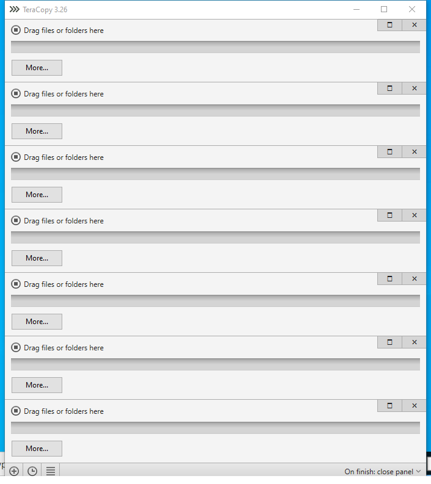

---
title: TeraCopy.exe | TeraCopy
excerpt: What is TeraCopy.exe?
---

# TeraCopy.exe 

* File Path: `C:\Program Files\TeraCopy\TeraCopy.exe`
* Description: TeraCopy

## Screenshot

## Hashes

Type | Hash
-- | --
MD5 | `3130E763ADAF55BC94694EB71459668D`
SHA1 | `1E41DB86D44EEACCE2947E4FA384AB9B58601D75`
SHA256 | `19E6A69B7F10D8342DA2172D683F87664B8DCD0D28F80ADE3E8357AEC9BB1314`
SHA384 | `D2D522318AF53779CE6FA73B2D5F0977F61A6A411DCF1C1EDE799CF8A77C6C7AA9ABB0072E73BD4B8039D883C0DD7AF2`
SHA512 | `912DC34C5E92418AF0163DAFA04E857D380E14ED0F3E8BA93621D809CF4643E31CDF1E6EA2B1C127190D45F55F2CB7EA3718F62625AE1C70A45F8DD1B5EEA69F`
SSDEEP | `98304:2OYYYYYYYYYYYRYYYYYYYYYYB6adUmTviCJ:m6aCmTvia`
IMP | `E3BDCEFE93DA27957A3F4247DA0B6F29`
PESHA1 | `2D51E1C5B2915891A45F9289439D37DE0E23738C`
PE256 | `2654E08E80FCD9BBE3361FEF7E35264377CA773115DB2C5F45A6374ADC79986E`

## Runtime Data

### Child Processes:
TeraCopy.exe WerFault.exe

### Window Title:
TeraCopy 3.26

### Open Handles:

Path | Type
-- | --
(R-D)   C:\Windows\apppatch\DirectXApps_FOD.sdb | File
(R-D)   C:\Windows\Fonts\StaticCache.dat | File
(R-D)   C:\Windows\SysWOW64\en-US\user32.dll.mui | File
(RW-)   C:\Users\user\AppData\Roaming\TeraCopy\History\200924-222935.db | File
(RW-)   C:\Users\user\AppData\Roaming\TeraCopy\History\200924-222935.db-shm | File
(RW-)   C:\Users\user\AppData\Roaming\TeraCopy\History\200924-222935.db-wal | File
(RW-)   C:\Users\user\AppData\Roaming\TeraCopy\History\200924-222937.db | File
(RW-)   C:\Users\user\AppData\Roaming\TeraCopy\History\200924-222937.db-shm | File
(RW-)   C:\Users\user\AppData\Roaming\TeraCopy\History\200924-222937.db-wal | File
(RW-)   C:\Users\user\AppData\Roaming\TeraCopy\History\200924-222940.db | File
(RW-)   C:\Users\user\AppData\Roaming\TeraCopy\History\200924-222940.db-shm | File
(RW-)   C:\Users\user\AppData\Roaming\TeraCopy\History\200924-222940.db-wal | File
(RW-)   C:\Users\user\AppData\Roaming\TeraCopy\History\200924-222942.db | File
(RW-)   C:\Users\user\AppData\Roaming\TeraCopy\History\200924-222942.db-shm | File
(RW-)   C:\Users\user\AppData\Roaming\TeraCopy\History\200924-222942.db-wal | File
(RW-)   C:\Users\user\AppData\Roaming\TeraCopy\History\200924-222945.db | File
(RW-)   C:\Users\user\AppData\Roaming\TeraCopy\History\200924-222945.db-shm | File
(RW-)   C:\Users\user\AppData\Roaming\TeraCopy\History\200924-222945.db-wal | File
(RW-)   C:\Users\user\AppData\Roaming\TeraCopy\History\200924-222947.db | File
(RW-)   C:\Users\user\AppData\Roaming\TeraCopy\History\200924-222947.db-shm | File
(RW-)   C:\Users\user\AppData\Roaming\TeraCopy\History\200924-222947.db-wal | File
(RW-)   C:\Users\user\AppData\Roaming\TeraCopy\History\200924-222950.db | File
(RW-)   C:\Users\user\AppData\Roaming\TeraCopy\History\200924-222950.db-shm | File
(RW-)   C:\Users\user\AppData\Roaming\TeraCopy\History\200924-222950.db-wal | File
(RW-)   C:\Users\user\AppData\Roaming\TeraCopy\History\200924-222953.db | File
(RW-)   C:\Users\user\AppData\Roaming\TeraCopy\main.db | File
(RW-)   C:\Windows | File
(RW-)   C:\Windows\WinSxS\x86_microsoft.windows.common-controls_6595b64144ccf1df_6.0.19041.488_none_11b1e5df2ffd8627 | File
(RW-)   C:\xCyclopedia | File
\BaseNamedObjects\__ComCatalogCache__ | Section
\BaseNamedObjects\NLS_CodePage_1252_3_2_0_0 | Section
\BaseNamedObjects\NLS_CodePage_437_3_2_0_0 | Section
\BaseNamedObjects\windows_shell_global_counters | Section
\Sessions\1\BaseNamedObjects\madExceptSettingsBuf2$1778 | Section
\Sessions\1\BaseNamedObjects\madExceptThreadNameBuf$1778 | Section
\Sessions\1\BaseNamedObjects\windows_shell_global_counters | Section
\Sessions\1\Windows\Theme2547664911 | Section
\Windows\Theme3854699184 | Section

### Loaded Modules:

Path |
-- |
C:\Program Files\TeraCopy\TeraCopy.exe |
C:\Windows\SYSTEM32\ntdll.dll |
C:\Windows\System32\wow64.dll |
C:\Windows\System32\wow64cpu.dll |
C:\Windows\System32\wow64win.dll |

## Signature

* Status: Signature verified.
* Serial: `10EB1CAFF23CFA81BF0649EFD5024332`
* Thumbprint: `8EFBA7200B7D9D7F891CB78897A848F2427F4DD4`
* Issuer: CN=COMODO RSA Code Signing CA, O=COMODO CA Limited, L=Salford, S=Greater Manchester, C=GB
* Subject: CN=Code Sector, O=Code Sector, STREET=506/78 Mountain St, STREET=Ultimo, L=Sydney, S=NSW, PostalCode=2007, C=AU

## File Metadata

* Original Filename: TeraCopy.exe
* Product Name: TeraCopy
* Company Name: Code Sector
* File Version: 3.2.6.0
* Product Version: 3.2.6.0
* Language: English
* Legal Copyright: (C) 2007-2017 Code Sector
* Machine Type: 32-bit

## File Scan

* VirusTotal Detections: 0/73
* VirusTotal Link: https://www.virustotal.com/gui/file/19e6a69b7f10d8342da2172d683f87664b8dcd0d28f80ade3e8357aec9bb1314/detection/

## File Similarity (ssdeep match)

File | Score
-- | --
[C:\windows\explorer.exe](explorer.exe-B3541A5A20C6264781909B1B7FE54836.md) | 40
[C:\windows\SysWOW64\explorer.exe](explorer.exe-97A7A0521E059D242907EFB73A844F29.md) | 35

MIT License. Copyright (c) 2020 Strontic.

