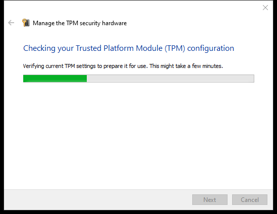
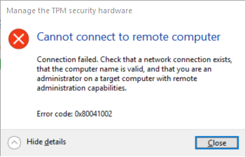

---
title: TpmInit.exe | TPM Initialization Wizard
excerpt: What is TpmInit.exe?
---

# TpmInit.exe 

* File Path: `C:\WINDOWS\system32\TpmInit.exe`
* Description: TPM Initialization Wizard

## Screenshot

## Hashes

Type | Hash
-- | --
MD5 | `C601DD6B0449412E9BC6903B9AEBAA5B`
SHA1 | `4C689F5C13AABF2D6D80EC4A83008D2BB4DB9AB5`
SHA256 | `6D456FA1D2DF8096263C145961EAC5F03076DBFDCE5CD827987A47A9727834AF`
SHA384 | `94BDD9CA64E744EB122034651E8D4D0BE3F95FF3EB1904117BA312616571AFE98C810F11DAA03D044B26130B20B0231C`
SHA512 | `1A3CC5BDCE930E3AAF6606751CED1A91886F8AABF992EE5E3354CAB97C979F141A0828807BD7D61DEA42F71404EA8F6D4B129B0D076FD5F8177EC79983841B49`
SSDEEP | `1536:s6/XFhLJWzBBgQ63Z0NpluGiceY0lA3CJHkxUM:sIFhLot7NpEPYfSFkx1`

## Signature

* Status: Signature verified.
* Serial: `330000023241FB59996DCC4DFF000000000232`
* Thumbprint: `FF82BC38E1DA5E596DF374C53E3617F7EDA36B06`
* Issuer: CN=Microsoft Windows Production PCA 2011, O=Microsoft Corporation, L=Redmond, S=Washington, C=US
* Subject: CN=Microsoft Windows, O=Microsoft Corporation, L=Redmond, S=Washington, C=US

## File Metadata

* Original Filename: TpmInit.EXE.MUI
* Product Name: Microsoft Windows Operating System
* Company Name: Microsoft Corporation
* File Version: 10.0.18362.1 (WinBuild.160101.0800)
* Product Version: 10.0.18362.1
* Language: English (United States)
* Legal Copyright:  Microsoft Corporation. All rights reserved.

## File Similarity (ssdeep match)

File | Score
-- | --
[C:\Windows\system32\tpmcompc.dll](tpmcompc.dll-72B06E97FDB4367DB82EADABAF2AE0F3.md) | 58
[C:\WINDOWS\system32\TpmInit.exe](TpmInit.exe-19C208A19DF23B1E29C87827A77D819D.md) | 49
[C:\Windows\system32\TpmInit.exe](TpmInit.exe-2EF855672A91AA4443E8B4C2E1AE278E.md) | 57
[C:\Windows\system32\TpmInit.exe](TpmInit.exe-578EF2B7D0C63504C39DD1BF3CADB2A8.md) | 60
[C:\Windows\system32\TpmInit.exe](TpmInit.exe-8828BBB0A8A2EC40E4A976DCE47BD15F.md) | 47
[C:\windows\system32\TpmInit.exe](TpmInit.exe-F0D6FA1110EFFFD3A773757A2DB0C950.md) | 35
[C:\Windows\SysWOW64\tpmcompc.dll](tpmcompc.dll-AB4D8679A9877AF6CB100DBF897A26B5.md) | 54
[C:\WINDOWS\SysWOW64\TpmInit.exe](TpmInit.exe-12FAFE0BEEE577E091F1781FDDF57CB3.md) | 55
[C:\Windows\SysWOW64\TpmInit.exe](TpmInit.exe-22A202B729CB70DF605D7E81D77B9B41.md) | 55
[C:\Windows\SysWOW64\TpmInit.exe](TpmInit.exe-23E73EAD4C5304744E76E8ECE21273BC.md) | 54
[C:\WINDOWS\SysWOW64\TpmInit.exe](TpmInit.exe-56FFC2D70D4BC13886245ECE35498CAA.md) | 55
[C:\windows\SysWOW64\TpmInit.exe](TpmInit.exe-6C56049244A18816695CA8719A6A1BB2.md) | 50
[C:\Windows\SysWOW64\TpmInit.exe](TpmInit.exe-BD19D000F87EA4CD0DEC6203207E9D03.md) | 46

## Possible Misuse

*The following table contains possible examples of `TpmInit.exe` being misused. While `TpmInit.exe` is **not** inherently malicious, its legitimate functionality can be abused for malicious purposes.*

Source | Source File | Example | License
-- | -- | -- | --
[malware-ioc](https://github.com/eset/malware-ioc) | [nukesped_lazarus](https://github.com/eset/malware-ioc/blob/master/nukesped_lazarus/README.adoc) | `.`TpmInit.EXE``{:.highlight .language-cmhg} | [© ESET 2014-2018](https://github.com/eset/malware-ioc/blob/master/LICENSE)

MIT License. Copyright (c) 2020-2021 Strontic.

