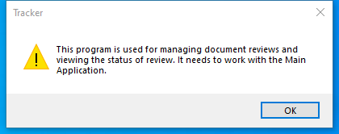

---
title: TrackReview.exe | Track Review
---

# TrackReview.exe 

* File Path: `C:\program files (x86)\Foxit Software\Foxit Reader\TrackReview.exe`
* Description: Track Review

## Screenshot

## Hashes

Type | Hash
-- | --
MD5 | `2DF609D10FA5A5D83939E193B18F2FBA`
SHA1 | `8EBDB8E4C9372B38499E416FF16018BAD1C42165`
SHA256 | `B424A3A50EF871F188CD5180C64A86E96171455F90A4421B100D49055FCBA676`
SHA384 | `4FBE2D8F491D99E6A6B32714B0C3D796EE53708173C93F315E195706451BC317523D15728C23EFACC38290112340646C`
SHA512 | `60B75017BD09540936408B3D3D4A3362FBD5A81E2027C760E9EC3729BA99D1B815A39E8384FEA546DC1B31F9AC3DBCCCAAEAA25CEE45B814F6CA2AD2DCDC331C`
SSDEEP | `98304:A9noklabfkfRNqwBtmoG8mOoMbdi0nbqYypX:2n5EbfeNfu8/AYy`

## Runtime Data

### Window Title:
Tracker

### Open Handles:

Path | Type
-- | --
(R-D)   C:\Windows\Fonts\StaticCache.dat | File
(R-D)   C:\Windows\SystemResources\imageres.dll.mun | File
(RW-)   C:\Users\user\Documents | File
(RW-)   C:\Windows | File
(RW-)   C:\Windows\WinSxS\x86_microsoft.windows.common-controls_6595b64144ccf1df_6.0.19041.1_none_fd031af45b0106f2 | File
(RW-)   C:\Windows\WinSxS\x86_microsoft.windows.gdiplus_6595b64144ccf1df_1.1.19041.450_none_4294d6e08a97344a | File
\BaseNamedObjects\NLS_CodePage_1252_3_2_0_0 | Section
\BaseNamedObjects\NLS_CodePage_437_3_2_0_0 | Section
\Sessions\1\Windows\Theme4048709601 | Section
\Windows\Theme603176458 | Section

### Loaded Modules:

Path |
-- |
C:\program files (x86)\Foxit Software\Foxit Reader\TrackReview.exe |
C:\Windows\SYSTEM32\ntdll.dll |
C:\Windows\System32\wow64.dll |
C:\Windows\System32\wow64cpu.dll |
C:\Windows\System32\wow64win.dll |

## Signature

* Status: Signature verified.
* Serial: `08404767E0D6C26CBD443F664AEF0A5C`
* Thumbprint: `45C6EB08FB79930455F7C26198AB61C7952B5447`
* Issuer: CN=DigiCert EV Code Signing CA, OU=www.digicert.com, O=DigiCert Inc, C=US
* Subject: CN=FOXIT SOFTWARE INC., O=FOXIT SOFTWARE INC., L=Fremont, S=California, C=US, SERIALNUMBER=C3105953, OID.2.5.4.15=Private Organization, OID.1.3.6.1.4.1.311.60.2.1.2=California, OID.1.3.6.1.4.1.311.60.2.1.3=US

## File Metadata

* Original Filename: Foxit Track Review
* Product Name: Foxit Track Review
* Company Name: Foxit Software Inc.
* File Version: 10.0.1.35811
* Product Version: 10.0.1.35811
* Language: Language Neutral
* Legal Copyright: Copyright  2014-2020 Foxit Software Inc. All Rights Reserved.

MIT License. Copyright (c) 2020 Strontic.

