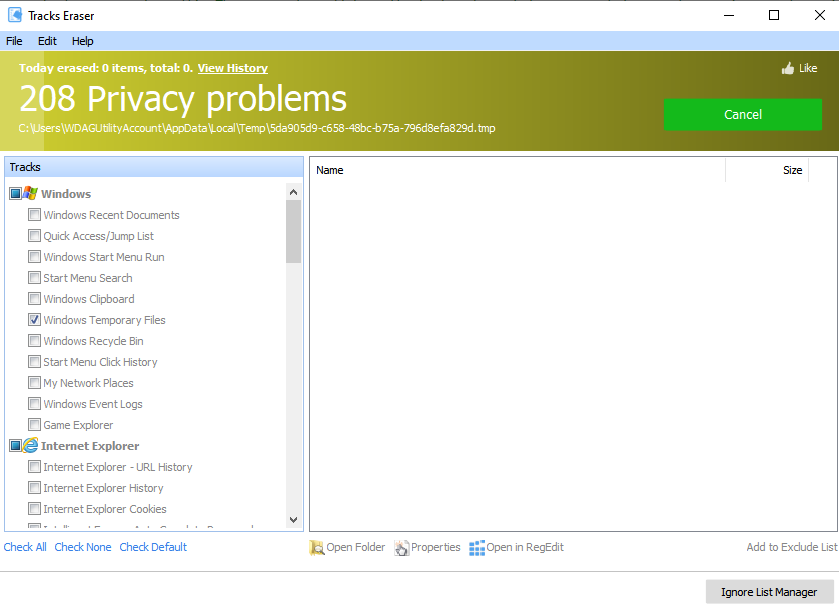

---
title: TracksEraser.exe | Glary Utilities TracksEraser
excerpt: What is TracksEraser.exe?
---

# TracksEraser.exe 

* File Path: `C:\program files (x86)\Glary Utilities 5\TracksEraser.exe`
* Description: Glary Utilities TracksEraser

## Screenshot

## Hashes

Type | Hash
-- | --
MD5 | `A364BDE5FD75712D95F1772396F08C28`
SHA1 | `18E8B783E978923EC7EDAE9D3CF24F637C6A255F`
SHA256 | `E9B2F44DF50DA9D9A385A36B58678EC494BD60B50E0C1AC1B4D9DFFF0ADFD3F8`
SHA384 | `793C3C5F6B53F0BA55C6146CB271F92CD04777FE4C55AF34160E279247EA78EA3EBA590710053200531FB12A3BFA52FD`
SHA512 | `ECDA2395B13E862306AA8DA46CE7282EB60B0F20B298C98F4FF7F89C98AC7796103AC678A47B827AE3CAF9CF86CFCB2AA20C381169042FD5D75BCC69F9AF71D8`
SSDEEP | `768:SZgKNDOCA59PL9HzzzFzzzz3zzzzzHzzzXK1111111111111111/zzzzzzzC+Xjx:Ag+OCqL9HzzzFzzzz3zzzzzHzzzXAzzl`

## Runtime Data

### Window Title:
Tracks Eraser

### Open Handles:

Path | Type
-- | --
(R-D)   C:\Windows\Fonts\StaticCache.dat | File
(R-D)   C:\Windows\SysWOW64\en-US\user32.dll.mui | File
(RW-)   C:\Program Files (x86)\Glary Utilities 5 | File
(RW-)   C:\Users\user\Documents | File
(RW-)   C:\Windows | File
(RW-)   C:\Windows\WinSxS\x86_microsoft.vc90.crt_1fc8b3b9a1e18e3b_9.0.30729.9625_none_508ef7e4bcbbe589 | File
(RW-)   C:\Windows\WinSxS\x86_microsoft.windows.common-controls_6595b64144ccf1df_6.0.19041.1_none_fd031af45b0106f2 | File
(RW-)   C:\Windows\WinSxS\x86_microsoft.windows.gdiplus_6595b64144ccf1df_1.1.19041.450_none_4294d6e08a97344a | File
\BaseNamedObjects\__ComCatalogCache__ | Section
\BaseNamedObjects\C:\*ProgramData\*Microsoft\*Windows\*Caches\*{6AF0698E-D558-4F6E-9B3C-3716689AF493}.2.ver0x0000000000000002.db | Section
\BaseNamedObjects\C:\*ProgramData\*Microsoft\*Windows\*Caches\*{DDF571F2-BE98-426D-8288-1A9A39C3FDA2}.2.ver0x0000000000000001.db | Section
\BaseNamedObjects\C:\*ProgramData\*Microsoft\*Windows\*Caches\*cversions.2.ro | Section
\BaseNamedObjects\NLS_CodePage_1252_3_2_0_0 | Section
\BaseNamedObjects\NLS_CodePage_437_3_2_0_0 | Section
\BaseNamedObjects\windows_shell_global_counters | Section
\Sessions\1\BaseNamedObjects\windows_shell_global_counters | Section
\Sessions\1\BaseNamedObjects\windows_webcache_counters_{9B6AB5B3-91BC-4097-835C-EA2DEC95E9CC}_S-1-5-21-2047949552-857980807-821054962-504 | Section
\Sessions\1\Windows\Theme4048709601 | Section
\Windows\Theme603176458 | Section

### Loaded Modules:

Path |
-- |
C:\program files (x86)\Glary Utilities 5\TracksEraser.exe |
C:\Windows\SYSTEM32\ntdll.dll |
C:\Windows\System32\wow64.dll |
C:\Windows\System32\wow64cpu.dll |
C:\Windows\System32\wow64win.dll |

## Signature

* Status: Signature verified.
* Serial: `0F05AE21CDC17B9F3CF09D7BFC659BA3`
* Thumbprint: `362EBB303E088105BDCC07D94E6B7875D30C0D06`
* Issuer: CN=DigiCert Assured ID Code Signing CA-1, OU=www.digicert.com, O=DigiCert Inc, C=US
* Subject: CN=Glarysoft LTD, O=Glarysoft LTD, S=Beijing, C=CN

## File Metadata

* Original Filename: TracksEraser.exe
* Product Name: Glary Utilities
* Company Name: Glarysoft Ltd
* File Version: 5.0.0.186
* Product Version: 5.0.0.1
* Language: Chinese (Simplified, China)
* Legal Copyright: Copyright (c) 2003-2020 Glarysoft Ltd

## File Similarity (ssdeep match)

File | Score
-- | --
[C:\Program Files (x86)\Glary Utilities 5\SpyRemover.exe](SpyRemover.exe-2327A2C252ADC79A2F1FA37CE76D10DA.md) | 41
[C:\program files (x86)\Glary Utilities 5\SpyRemover.exe](SpyRemover.exe-49C40981F711E83777816DAEA71AF2D6.md) | 41
[C:\Program Files (x86)\Glary Utilities 5\SpyRemover.exe](SpyRemover.exe-9F02F3CD1EE1E26FC53115E0E7089BDD.md) | 43
[C:\Program Files (x86)\Glary Utilities 5\TracksEraser.exe](TracksEraser.exe-54C83AE9F55B299D7AEC2B59ACF4E688.md) | 94
[C:\Program Files (x86)\Glary Utilities 5\TracksEraser.exe](TracksEraser.exe-B0CCA5153453B97D382000262F713E0A.md) | 94

MIT License. Copyright (c) 2020-2021 Strontic.

