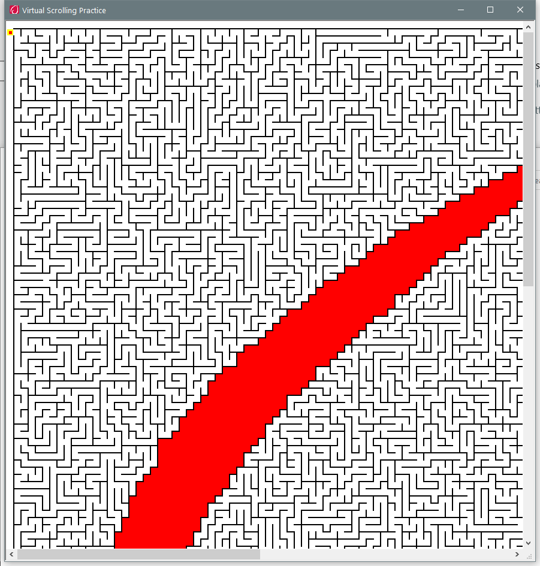

---
title: Tutorial.exe | Synaptics Pointing Device Tutorial
excerpt: What is Tutorial.exe?
---

# Tutorial.exe 

* File Path: `C:\WINDOWS\system32\DriverStore\FileRepository\synpd.inf_amd64_318aa16b062fddc3\Tutorial.exe`
* Description: Synaptics Pointing Device Tutorial

## Screenshot

## Hashes

Type | Hash
-- | --
MD5 | `71961510E02A9F42C7E89ABA1C08C1B4`
SHA1 | `26B4009565F529502C9FF0B987825390B56263DB`
SHA256 | `06C6C4A399B1E50CCBA31D96BA888211CFC070D91A419CAAC4E4EF47AFC3388F`
SHA384 | `6AA7399B681327989771F7B695858F5930F84ED9127EFBEAD7E862E3F86E440ED5F0D5BCE22959DE190D819D63BE0E6A`
SHA512 | `D1D611CFC509264F286AE1B698F207A5301FF6349303547321C3BC7867289035D20DF3BFF026A2359C1F2495D8D160BD9ED463670E067A640D35AAB28C59FC57`
SSDEEP | `49152:Yf3ZoG3UCj5qzWt2skmzb2R3NBHCYcMuCqy+XyTmp6I3:gZP3UCj50WtQwb2R3N9cMuCqy+Xn`

## Signature

* Status: Signature verified.
* Serial: `33000000244D59538809906EA7000100000024`
* Thumbprint: `06F36DDE6035DDBFF8C1DC173ABDADDCAECFA0F3`
* Issuer: CN=Microsoft Windows Hardware Compatibility PCA, O=Microsoft Corporation, L=Redmond, S=Washington, C=US
* Subject: CN=Microsoft Windows Hardware Compatibility Publisher, OU=MOPR, O=Microsoft Corporation, L=Redmond, S=Washington, C=US

## File Metadata

* Original Filename: Tutorial.exe
* Product Name: Synaptics Pointing Device Driver
* Company Name: Synaptics Incorporated
* File Version: 19.3.31.31 16Aug17
* Product Version: 19.3.31.31 16Aug17
* Language: English (United States)
* Legal Copyright: Copyright (C) Synaptics Incorporated 1996-2017

## Possible Misuse

*The following table contains possible examples of `Tutorial.exe` being misused. While `Tutorial.exe` is **not** inherently malicious, its legitimate functionality can be abused for malicious purposes.*

Source | Source File | Example | License
-- | -- | -- | --
[sigma](https://github.com/Neo23x0/sigma) | [win_susp_vssadmin_ntds_activity.yml](https://github.com/Neo23x0/sigma/blob/master/rules/windows/deprecated/win_susp_vssadmin_ntds_activity.yml) | `- https://www.trustwave.com/Resources/SpiderLabs-Blog/Tutorial-for-NTDS-goodness-(VSSADMIN,-WMIS,-NTDS-dit,-SYSTEM)/`{:.highlight .language-yaml} | [DRL 1.0](https://github.com/Neo23x0/sigma/blob/master/LICENSE.Detection.Rules.md)
[sigma](https://github.com/Neo23x0/sigma) | [win_shadow_copies_creation.yml](https://github.com/Neo23x0/sigma/blob/master/rules/windows/process_creation/win_shadow_copies_creation.yml) | `- https://www.trustwave.com/en-us/resources/blogs/spiderlabs-blog/tutorial-for-ntds-goodness-vssadmin-wmis-ntdsdit-system/`{:.highlight .language-yaml} | [DRL 1.0](https://github.com/Neo23x0/sigma/blob/master/LICENSE.Detection.Rules.md)

MIT License. Copyright (c) 2020-2021 Strontic.

