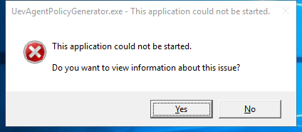

---
title: UevAgentPolicyGenerator.exe |  
excerpt: What is UevAgentPolicyGenerator.exe?
---

# UevAgentPolicyGenerator.exe 

* File Path: `C:\Windows\system32\UevAgentPolicyGenerator.exe`
* Description:  

## Screenshot

## Hashes

Type | Hash
-- | --
MD5 | `C048906265AB5C4EA7118084A1E316CF`
SHA1 | `73FEB9C5E827548E309DC69A14E833F7F13F2EF1`
SHA256 | `C43CD630EE07A72181E255EBFF2BD63F7479622D8F895249614DE94A8611B3F8`
SHA384 | `EA8A396373E6E8BA664ED0A73B1FCA145BFED1D9B4A6FDE493CCD3B493D1791B90C424A25E5B13FB72CA406FC777B975`
SHA512 | `72A4A2FA3444F4B7A8F02BCC2FCE2D820743A44AB7F2C88AE7F58BAD135A378700514F5F64C8E28482655BF2D7E30A80F471D908721567BFAFD80F719D950A67`
SSDEEP | `384:kZm0fhsl8PKzKq06MUt3jt/KJSaI3DDvQS114fOmDH1J/8rfZuKRSfDOya2VFkmB:kkllzqD2ZRP2VFk8vnjHn6tPC9`
IMP | `F34D5F2D4577ED6D9CEEC516C1F5A744`
PESHA1 | `00BDC3C0952893BB6503EB2E6D28D056E8B99A7B`
PE256 | `94877114A0EC2DA6A886F0591070809BCD5871BB550EF8D55D985DFBC293024E`

## Runtime Data

### Child Processes:
conhost.exe

### Window Title:
UevAgentPolicyGenerator.exe - This application could not be started.

### Open Handles:

Path | Type
-- | --
(R-D)   C:\Windows\Fonts\StaticCache.dat | File
(R-D)   C:\Windows\SysWOW64\en-US\user32.dll.mui | File
(RW-)   C:\Users\user | File
(RW-)   C:\Windows | File
(RW-)   C:\Windows\WinSxS\x86_microsoft.windows.common-controls_6595b64144ccf1df_5.82.19041.488_none_89e6152f0b32762e | File
\BaseNamedObjects\C:\*ProgramData\*Microsoft\*Windows\*Caches\*{6AF0698E-D558-4F6E-9B3C-3716689AF493}.2.ver0x0000000000000002.db | Section
\BaseNamedObjects\C:\*ProgramData\*Microsoft\*Windows\*Caches\*{DDF571F2-BE98-426D-8288-1A9A39C3FDA2}.2.ver0x0000000000000002.db | Section
\BaseNamedObjects\C:\*ProgramData\*Microsoft\*Windows\*Caches\*cversions.2 | Section
\BaseNamedObjects\NLS_CodePage_1252_3_2_0_0 | Section
\BaseNamedObjects\NLS_CodePage_437_3_2_0_0 | Section
\Sessions\1\Windows\Theme1175649999 | Section
\Windows\Theme601709542 | Section

### Loaded Modules:

Path |
-- |
C:\Windows\SYSTEM32\ntdll.dll |
C:\Windows\system32\UevAgentPolicyGenerator.exe |
C:\Windows\System32\wow64.dll |
C:\Windows\System32\wow64cpu.dll |
C:\Windows\System32\wow64win.dll |

## Signature

* Status: Signature verified.
* Serial: `3300000266BD1580EFA75CD6D3000000000266`
* Thumbprint: `A4341B9FD50FB9964283220A36A1EF6F6FAA7840`
* Issuer: CN=Microsoft Windows Production PCA 2011, O=Microsoft Corporation, L=Redmond, S=Washington, C=US
* Subject: CN=Microsoft Windows, O=Microsoft Corporation, L=Redmond, S=Washington, C=US

## File Metadata

* Original Filename: UevAgentPolicyGenerator.exe
* Product Name: Microsoft (R) Windows (R) Operating System
* Company Name: Microsoft Corporation
* File Version: 10.0.19041.1
* Product Version: 10.0.19041.1
* Language: Language Neutral
* Legal Copyright: Copyright (c) Microsoft Corporation. All rights reserved.
* Machine Type: 32-bit

## File Scan

* VirusTotal Detections: 0/74
* VirusTotal Link: https://www.virustotal.com/gui/file/c43cd630ee07a72181e255ebff2bd63f7479622d8f895249614de94a8611b3f8/detection

## File Similarity (ssdeep match)

File | Score
-- | --
[C:\Windows\system32\UevAgentPolicyGenerator.exe](UevAgentPolicyGenerator.exe-0AEAB028DC23060EC1BC1C2D0A79B925.md) | 66
[C:\Windows\system32\UevAgentPolicyGenerator.exe](UevAgentPolicyGenerator.exe-23DEA2A17AB38BB991A593070F4CEC6A.md) | 97
[C:\WINDOWS\system32\UevAgentPolicyGenerator.exe](UevAgentPolicyGenerator.exe-D0FAE5B975B76D12F35EA91C6DFFD198.md) | 54
[C:\WINDOWS\system32\UevAgentPolicyGenerator.exe](UevAgentPolicyGenerator.exe-DB9581764DBE3AC8FF9AB2F52F2C7A2D.md) | 99

MIT License. Copyright (c) 2020-2021 Strontic.

