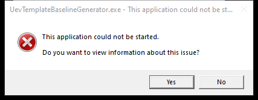

---
title: UevTemplateBaselineGenerator.exe |  
---

# UevTemplateBaselineGenerator.exe 

* File Path: `C:\Windows\system32\UevTemplateBaselineGenerator.exe`
* Description:  

## Screenshot

## Hashes

Type | Hash
-- | --
MD5 | `D748880CFCC6FC33A14BD6A9CF7CCF25`
SHA1 | `453C43A0E55AE3CD1A9AE65E566C52B40236AEAE`
SHA256 | `B188598D844F927A8B361622A6E16E004D7D1BC6D86D0DF17B2E1A66995D0EA3`
SHA384 | `56B759F7D03254D80A36464642D5B0D9AB36FA29A13067A256CD91F171996A2272082EB8063BBFAFA688FE9770BBEBFD`
SHA512 | `1F03F6AE73CB4B85F3CD3F630C4BE814D70F01A3838B2439EF200620532876BBAC5F9CF22D1CF695344D1EE4B39D495E5732B8E093EB0E5BC13944602B4D3A8F`
SSDEEP | `384:/aL8CUA6oNTSAkBcYKPdIQX6GIp0t6PMSK+NWIJWGZ:y4CbTSviBqAIp`

## Runtime Data

### Child Processes:
conhost.exe

### Window Title:
UevTemplateBaselineGenerator.exe - This application could not be started.

### Open Handles:

Path | Type
-- | --
(R-D)   C:\Windows\Fonts\StaticCache.dat | File
(R-D)   C:\Windows\SysWOW64\en-US\user32.dll.mui | File
(RW-)   C:\Users\Administrator\Documents | File
(RW-)   C:\Windows | File
(RW-)   C:\Windows\WinSxS\x86_microsoft.windows.common-controls_6595b64144ccf1df_5.82.17763.1397_none_b4b37d196e75f95f | File
\BaseNamedObjects\NLS_CodePage_1252_3_2_0_0 | Section
\BaseNamedObjects\NLS_CodePage_437_3_2_0_0 | Section
\Sessions\2\Windows\Theme4283305886 | Section
\Windows\Theme1956823608 | Section

### Loaded Modules:

Path |
-- |
C:\Windows\SYSTEM32\ntdll.dll |
C:\Windows\system32\UevTemplateBaselineGenerator.exe |
C:\Windows\System32\wow64.dll |

## Signature

* Status: Signature verified.
* Serial: `3300000266BD1580EFA75CD6D3000000000266`
* Thumbprint: `A4341B9FD50FB9964283220A36A1EF6F6FAA7840`
* Issuer: CN=Microsoft Windows Production PCA 2011, O=Microsoft Corporation, L=Redmond, S=Washington, C=US
* Subject: CN=Microsoft Windows, O=Microsoft Corporation, L=Redmond, S=Washington, C=US

## File Metadata

* Original Filename: UevTemplateBaselineGenerator.exe
* Product Name: Microsoft (R) Windows (R) Operating System
* Company Name: Microsoft Corporation
* File Version: 10.0.17763.1
* Product Version: 10.0.17763.1
* Language: Language Neutral
* Legal Copyright: Copyright (c) Microsoft Corporation. All rights reserved.

## File Similarity (ssdeep match)

File | Score
-- | --
[C:\Windows\system32\UevTemplateBaselineGenerator.exe](UevTemplateBaselineGenerator.exe-C85A5D2C00FF444E9E7D3E31977234AE.md) | 86
[C:\Windows\system32\UevTemplateBaselineGenerator.exe](UevTemplateBaselineGenerator.exe-CB80D6493F9D8BD662CE6A9C4A76001E.md) | 68
[C:\WINDOWS\system32\UevTemplateBaselineGenerator.exe](UevTemplateBaselineGenerator.exe-E795EE1C8792EDCEAD5A380438FDBFCA.md) | 86

MIT License. Copyright (c) 2020 Strontic.

