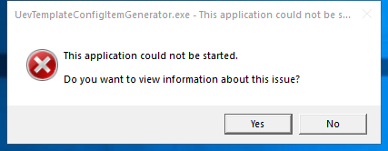

---
title: UevTemplateConfigItemGenerator.exe |  
excerpt: What is UevTemplateConfigItemGenerator.exe?
---

# UevTemplateConfigItemGenerator.exe 

* File Path: `C:\Windows\system32\UevTemplateConfigItemGenerator.exe`
* Description:  

## Screenshot

## Hashes

Type | Hash
-- | --
MD5 | `57C26AF3682374941B185A50C4DBFA8A`
SHA1 | `E033B9E3A1208F72D47331ECA3D2BBB7E3F264AB`
SHA256 | `ED370E58E64E68C3DBDE73CFAD811D35048452688A7001A202C1C1CD630A5B29`
SHA384 | `9373C9D64F8AA7A94C533D4E3C7B6569282113450B6AAF9359D99BA88BCBB506DA466B11BABF6B75E9BF2C10FBAAE819`
SHA512 | `70FE75577F552E69BA69517ADA7E0C7B1C620816DB0A25D3D2D8337239FC9E45666462946E842A12C9B24DEBD1EF2572317A4B110EAE039ACFF63F1DA6D7F5A1`
SSDEEP | `192:Lq0JHU41GGkZ1ElGTubagmrCdsa/2pEu0rqWp8eMPOHnQW3FW/zv:20pU4G1MCIbmOdsa/2pPWp8eqW3FW/L`
IMP | `F34D5F2D4577ED6D9CEEC516C1F5A744`
PESHA1 | `AAAA7525B0E9844BE23EF58CBF09D102C34C2E20`
PE256 | `33BDCC879FC3CBFD0EE55E56D9BF23119C508AAB60087667445F25674080D488`

## Runtime Data

### Child Processes:
conhost.exe

### Window Title:
UevTemplateConfigItemGenerator.exe - This application could not be started.

### Open Handles:

Path | Type
-- | --
(R-D)   C:\Windows\Fonts\StaticCache.dat | File
(R-D)   C:\Windows\SysWOW64\en-US\user32.dll.mui | File
(RW-)   C:\Users\user\Documents | File
(RW-)   C:\Windows | File
(RW-)   C:\Windows\WinSxS\x86_microsoft.windows.common-controls_6595b64144ccf1df_5.82.19041.488_none_89e6152f0b32762e | File
\BaseNamedObjects\NLS_CodePage_1252_3_2_0_0 | Section
\BaseNamedObjects\NLS_CodePage_437_3_2_0_0 | Section
\Sessions\1\Windows\Theme1703657751 | Section
\Windows\Theme1455388728 | Section

### Loaded Modules:

Path |
-- |
C:\Windows\SYSTEM32\ntdll.dll |
C:\Windows\system32\UevTemplateConfigItemGenerator.exe |
C:\Windows\System32\wow64.dll |
C:\Windows\System32\wow64cpu.dll |
C:\Windows\System32\wow64win.dll |

## Signature

* Status: Signature verified.
* Serial: `3300000266BD1580EFA75CD6D3000000000266`
* Thumbprint: `A4341B9FD50FB9964283220A36A1EF6F6FAA7840`
* Issuer: CN=Microsoft Windows Production PCA 2011, O=Microsoft Corporation, L=Redmond, S=Washington, C=US
* Subject: CN=Microsoft Windows, O=Microsoft Corporation, L=Redmond, S=Washington, C=US

## File Metadata

* Original Filename: UevTemplateConfigItemGenerator.exe
* Product Name: Microsoft (R) Windows (R) Operating System
* Company Name: Microsoft Corporation
* File Version: 10.0.19041.1
* Product Version: 10.0.19041.1
* Language: Language Neutral
* Legal Copyright: Copyright (c) Microsoft Corporation. All rights reserved.
* Machine Type: 32-bit

## File Scan

* VirusTotal Detections: 0/70
* VirusTotal Link: https://www.virustotal.com/gui/file/ed370e58e64e68c3dbde73cfad811d35048452688a7001a202c1c1cd630a5b29/detection/

## File Similarity (ssdeep match)

File | Score
-- | --
[C:\Windows\system32\UevTemplateConfigItemGenerator.exe](UevTemplateConfigItemGenerator.exe-45FB133A09574504B7548E74E3A27992.md) | 91
[C:\Windows\system32\UevTemplateConfigItemGenerator.exe](UevTemplateConfigItemGenerator.exe-6A804B9E53D255F4F7828E8C08A5635B.md) | 72
[C:\WINDOWS\system32\UevTemplateConfigItemGenerator.exe](UevTemplateConfigItemGenerator.exe-CAD9DF722BCCEED4CCA888650FCB2F80.md) | 93

MIT License. Copyright (c) 2020 Strontic.

