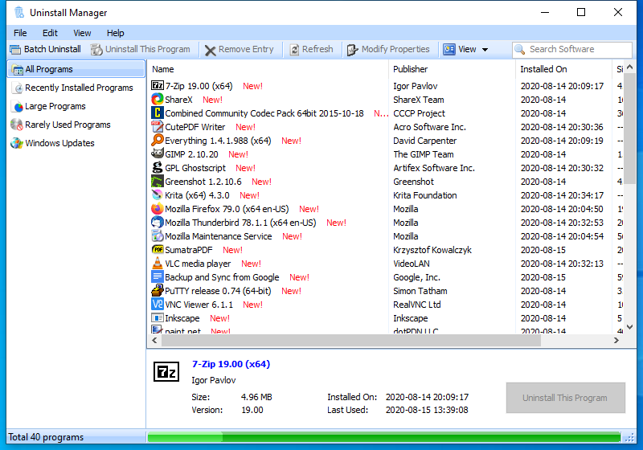

---
title: Uninstaller.exe | Glary Utilities Uninstaller
excerpt: What is Uninstaller.exe?
---

# Uninstaller.exe 

* File Path: `C:\program files (x86)\Glary Utilities 5\Uninstaller.exe`
* Description: Glary Utilities Uninstaller

## Screenshot

## Hashes

Type | Hash
-- | --
MD5 | `C1EC83CE8E0BC8BF186C638B10C4233C`
SHA1 | `E588AB104BFE7D31F508A77B50A31BEEF4C54CBC`
SHA256 | `E96176BA4E8E6A1D90C89BCBE305577915AB664EEE86262D0CABF570C64DF4AA`
SHA384 | `BE903681B4ED8D02C085DEC321E3D95595770B18DE6B07D8D98868F1A3CFEF2D55EFD633A71BA3B057DABDB3BB40BC84`
SHA512 | `6CC7E80D16111D3FA4CD9B1BB10D4744F09FACCD4AA790D898C863D90EAA563CBE07E3DCD0D5BAD7DDEA5FF29F93FB7F6017ABB82ABD231CE217EA4664A60CCE`
SSDEEP | `6144:eVWpmtlYjMRGDnHmTnED5yh/OGTPIiInUAQ8wbl:sqHjMRGLHqQ4hVSndQ8wbl`

## Runtime Data

### Window Title:
Uninstall Manager

### Open Handles:

Path | Type
-- | --
(R-D)   C:\Windows\Fonts\StaticCache.dat | File
(R-D)   C:\Windows\SysWOW64\en-US\user32.dll.mui | File
(RW-)   C:\Program Files (x86)\Glary Utilities 5 | File
(RW-)   C:\Users\user\Documents | File
(RW-)   C:\Windows | File
(RW-)   C:\Windows\WinSxS\x86_microsoft.vc90.crt_1fc8b3b9a1e18e3b_9.0.30729.9625_none_508ef7e4bcbbe589 | File
(RW-)   C:\Windows\WinSxS\x86_microsoft.windows.common-controls_6595b64144ccf1df_6.0.19041.1_none_fd031af45b0106f2 | File
(RW-)   C:\Windows\WinSxS\x86_microsoft.windows.gdiplus_6595b64144ccf1df_1.1.19041.450_none_4294d6e08a97344a | File
(RWD)   C:\Users\user\AppData\Local\Microsoft\Windows\Explorer\iconcache_16.db | File
(RWD)   C:\Users\user\AppData\Local\Microsoft\Windows\Explorer\iconcache_32.db | File
(RWD)   C:\Users\user\AppData\Local\Microsoft\Windows\Explorer\iconcache_idx.db | File
\BaseNamedObjects\__ComCatalogCache__ | Section
\BaseNamedObjects\NLS_CodePage_1252_3_2_0_0 | Section
\BaseNamedObjects\NLS_CodePage_437_3_2_0_0 | Section
\BaseNamedObjects\windows_shell_global_counters | Section
\Sessions\1\BaseNamedObjects\windows_shell_global_counters | Section
\Sessions\1\Windows\Theme4048709601 | Section
\Windows\Theme603176458 | Section

### Loaded Modules:

Path |
-- |
C:\program files (x86)\Glary Utilities 5\Uninstaller.exe |
C:\Windows\SYSTEM32\ntdll.dll |
C:\Windows\System32\wow64.dll |
C:\Windows\System32\wow64cpu.dll |
C:\Windows\System32\wow64win.dll |

## Signature

* Status: Signature verified.
* Serial: `0F05AE21CDC17B9F3CF09D7BFC659BA3`
* Thumbprint: `362EBB303E088105BDCC07D94E6B7875D30C0D06`
* Issuer: CN=DigiCert Assured ID Code Signing CA-1, OU=www.digicert.com, O=DigiCert Inc, C=US
* Subject: CN=Glarysoft LTD, O=Glarysoft LTD, S=Beijing, C=CN

## File Metadata

* Original Filename: unInstaller.exe
* Product Name: Glary Utilities
* Company Name: Glarysoft Ltd
* File Version: 5.3.0.28
* Product Version: 5.3.0.1
* Language: Chinese (Simplified, China)
* Legal Copyright: Copyright (c) 2003-2020 Glarysoft Ltd

## File Similarity (ssdeep match)

File | Score
-- | --
[C:\Program Files (x86)\Glary Utilities 5\Uninstaller.exe](Uninstaller.exe-6F21F9194F24996C8D7322BA72742296.md) | 94
[C:\Program Files (x86)\Glary Utilities 5\Uninstaller.exe](Uninstaller.exe-D4A5B0E1591FE45B9D3661F11D27E3B6.md) | 96

## Possible Misuse

*The following table contains possible examples of `Uninstaller.exe` being misused. While `Uninstaller.exe` is **not** inherently malicious, its legitimate functionality can be abused for malicious purposes.*

Source | Source File | Example | License
-- | -- | -- | --
[malware-ioc](https://github.com/eset/malware-ioc) | [evilnum](https://github.com/eset/malware-ioc/blob/master/evilnum/README.adoc) | `\|`919C812C524EAE95781E64FE9B9B035542727FD0`\|MagicTransfers.exe\|NVIDIA Uninstaller Utility (unsigned)\|`738020EBFDAEBE59F7F0AECBAC9DCBEE3CA62D55``{:.highlight .language-cmhg} | [© ESET 2014-2018](https://github.com/eset/malware-ioc/blob/master/LICENSE)
[malware-ioc](https://github.com/eset/malware-ioc) | [misp-kryptocibule.json](https://github.com/eset/malware-ioc/blob/master/kryptocibule/misp-kryptocibule.json) | `"value": "magnet:?xt=urn:btih:icwxb43ebmema4xnk42aines3f2jfmpd&dn=Ashampoo UnInstaller v8.00.12 (2-click run).zip&xl=30490782&fc=1",`{:.highlight .language-cmhg} | [© ESET 2014-2018](https://github.com/eset/malware-ioc/blob/master/LICENSE)
[malware-ioc](https://github.com/eset/malware-ioc) | [kryptocibule](https://github.com/eset/malware-ioc/blob/master/kryptocibule/README.adoc) | `\|`magnet[:]?xt=urn[:]btih[:]icwxb43ebmema4xnk42aines3f2jfmpd&dn=Ashampoo UnInstaller v8.00.12 (2-click run).zip&xl=30490782&fc=1`\| - `{:.highlight .language-cmhg} | [© ESET 2014-2018](https://github.com/eset/malware-ioc/blob/master/LICENSE)
[atomic-red-team](https://github.com/redcanaryco/atomic-red-team) | [T1562.001.md](https://github.com/redcanaryco/atomic-red-team/blob/master/atomics/T1562.001/T1562.001.md) | Uninstall Crowdstrike Falcon. If the WindowsSensor.exe path is not provided as an argument we need to search for it. Since the executable is located in a folder named with a random guid we need to identify it before invoking the uninstaller. | [MIT License. © 2018 Red Canary](https://github.com/redcanaryco/atomic-red-team/blob/master/LICENSE.txt)
[signature-base](https://github.com/Neo23x0/signature-base) | [apt_wildneutron.yar](https://github.com/Neo23x0/signature-base/blob/master/yara/apt_wildneutron.yar) | $s4 = " Player Installer/Uninstaller" fullword wide /* PEStudio Blacklist: strings */ /* score: '11.42' */ | [CC BY-NC 4.0](https://github.com/Neo23x0/signature-base/blob/master/LICENSE)

MIT License. Copyright (c) 2020-2021 Strontic.

