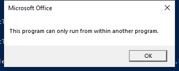

---
title: VPREVIEW.EXE | Microsoft Office Visio Previewer
excerpt: What is VPREVIEW.EXE?
---

# VPREVIEW.EXE 

* File Path: `C:\Program Files (x86)\Microsoft Office\root\Office16\VPREVIEW.EXE`
* Description: Microsoft Office Visio Previewer

## Screenshot

## Hashes

Type | Hash
-- | --
MD5 | `EF9A2517C6B87E2E24F0173F2BAB6658`
SHA1 | `5E4DEC116AC008F78302674DD3D2D96130237BB8`
SHA256 | `18315D9377F1A0773DA4BCBFB5DA80B068F2EFC7CBA79D31EF22011EF87EEE2C`
SHA384 | `BF5572C79C0D1DEEAE676411B222BD4BB0024FD14B0E82A08A4831A3D7E3BAB9DD1E8B619E649D33F0054843B045C18D`
SHA512 | `03AED0FF6982C91E4D9580FC17509C6254B197B26DC9B6BF95666252FE56FE4408BBAC0C12E3633C12309D1F13BABDA120076C337006BA333734EB225BDC9A6D`
SSDEEP | `12288:Wq9X4b6Gw1hwLElQ8erY8QeH3KdiYPEx2cKlW:Wq9X49MwElQ8eDVXPYPEgcKlW`
IMP | `4E5A0C30CDA8D2E47B0161D70A16C1B6`
PESHA1 | `7B0123B7B35F373FF538EFC0C1CD0D6BF675A0F9`
PE256 | `79D3F3B7AE3F1E2A3952E5D0F51EE4A6407922B2F4BAABA3B8F2D89AACBAD473`

## Runtime Data

### Window Title:
Microsoft Office

### Open Handles:

Path | Type
-- | --
(R--)   C:\ProgramData\Microsoft\Office\ClickToRunPackageLocker | File
(R-D)   C:\Windows\Fonts\StaticCache.dat | File
(RW-)   C:\Users\user\Documents | File
(RW-)   C:\Windows | File
\BaseNamedObjects\NLS_CodePage_1252_3_2_0_0 | Section
\BaseNamedObjects\NLS_CodePage_437_3_2_0_0 | Section
\Sessions\1\Windows\Theme64749523 | Section
\Windows\Theme1120315852 | Section

### Loaded Modules:

Path |
-- |
C:\Program Files (x86)\Microsoft Office\root\Office16\VPREVIEW.EXE |
C:\Windows\SYSTEM32\ntdll.dll |
C:\Windows\System32\wow64.dll |
C:\Windows\System32\wow64cpu.dll |
C:\Windows\System32\wow64win.dll |

## Signature

* Status: Signature verified.
* Serial: `33000002CE7C9ACE7D905ED2B70000000002CE`
* Thumbprint: `B10607FB914700B40F794610850C1DE0A21566C1`
* Issuer: CN=Microsoft Code Signing PCA 2010, O=Microsoft Corporation, L=Redmond, S=Washington, C=US
* Subject: CN=Microsoft Corporation, O=Microsoft Corporation, L=Redmond, S=Washington, C=US

## File Metadata

* Original Filename: VPREVIEW.EXE
* Product Name: Microsoft Office
* Company Name: Microsoft Corporation
* File Version: 16.0.12527.20482
* Product Version: 16.0.12527.20482
* Language: Language Neutral
* Legal Copyright: 
* Machine Type: 32-bit

## File Scan

* VirusTotal Detections: 0/71
* VirusTotal Link: https://www.virustotal.com/gui/file/18315d9377f1a0773da4bcbfb5da80b068f2efc7cba79d31ef22011ef87eee2c/detection/

MIT License. Copyright (c) 2020-2021 Strontic.

