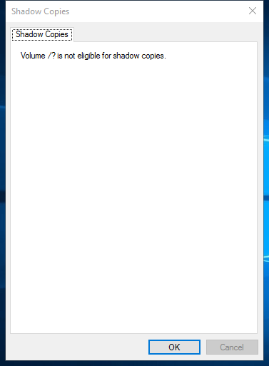

---
title: VSSUIRUN.exe | Configure Shadow Copies
excerpt: What is VSSUIRUN.exe?
---

# VSSUIRUN.exe 

* File Path: `C:\windows\system32\VSSUIRUN.exe`
* Description: Configure Shadow Copies

## Screenshot

## Hashes

Type | Hash
-- | --
MD5 | `A8DB29BB5AF418AB2C9931EF48514647`
SHA1 | `1D17402D4DC026130D9F3154CCEAAA65F14153EB`
SHA256 | `663E604DC83ECCDF109B8D5B0C9896338D15E8B599F8EC754226983D78D9F187`
SHA384 | `C7FCBDE4AB83544D74E1DEDBDABCF75705E7C1A8CC331049FC48C3749DE5BED84974D663599F84B8748E7B56C7B23177`
SHA512 | `D91901E6659DB941E121408CF31701B0B5B36DC6AA9378266CDA1798C2AD08B416C1B4DB41C5D7B64A046F044491E4D8518C1D5840EF2B197DE5E37FC75BF128`
SSDEEP | `768:ifO5vJznp9QLkkIy7KltVqCgTH1w/2zZBzqjYyZlokDbnVXDHLpGpKAIx0zbkN40:roKVqCgbhBmjYy8uV1TAIx0fk64inb`

## Signature

* Status: The file C:\windows\system32\VSSUIRUN.exe is not digitally signed. You cannot run this script on the current system. For more information about running scripts and setting execution policy, see about_Execution_Policies at http://go.microsoft.com/fwlink/?LinkID=135170
* Serial: ``
* Thumbprint: ``
* Issuer: 
* Subject: 

## File Metadata

* Original Filename: VSSUIRUN.EXE
* Product Name: Microsoft Windows Operating System
* Company Name: Microsoft Corporation
* File Version: 6.3.9600.16384 (winblue_rtm.130821-1623)
* Product Version: 6.3.9600.16384
* Language: English (United States)
* Legal Copyright:  Microsoft Corporation. All rights reserved.

## File Similarity (ssdeep match)

File | Score
-- | --
[C:\Windows\system32\VSSUIRUN.exe](VSSUIRUN.exe-19C1BE4655954E6E7AB7394C627A270F.md) | 32
[C:\Windows\system32\VSSUIRUN.exe](VSSUIRUN.exe-5BDDD40C274F2D118FBF9CB58DC188AE.md) | 36
[C:\Windows\SysWOW64\VSSUIRUN.exe](VSSUIRUN.exe-743C6EAF570F5E54A822D6839C91F308.md) | 35
[C:\Windows\SysWOW64\VSSUIRUN.exe](VSSUIRUN.exe-D19CB960CB648DE1C660BC81CE100243.md) | 43
[C:\windows\SysWOW64\VSSUIRUN.exe](VSSUIRUN.exe-D5DB2E9D9EAAF91382DD9D9A3BDA4F5F.md) | 43

MIT License. Copyright (c) 2020-2021 Strontic.

