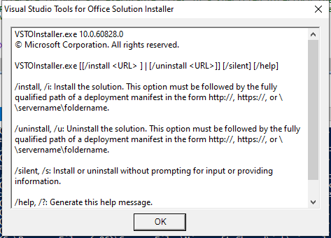
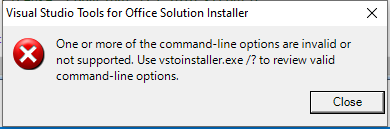

---
title: VSTOInstaller.exe | Visual Studio Tools for Office Solution Installer
excerpt: What is VSTOInstaller.exe?
---

# VSTOInstaller.exe 

* File Path: `C:\Program Files (x86)\Common Files\Microsoft Shared\VSTO\10.0\VSTOInstaller.exe`
* Description: Visual Studio Tools for Office Solution Installer

## Screenshot

## Hashes

Type | Hash
-- | --
MD5 | `D2A9BEB443467EAC08A7F069B8E81114`
SHA1 | `7B9FCA8E0C3EB8ECC874EAE7B6DA000980BA7C42`
SHA256 | `B7DEFDBB386B421F6CD4D380D051C0B7D738B89D6CBA3B5B70144F40C9409E55`
SHA384 | `2466C1A05571EC9BAB8265A5309FD9E1572C08817A17A830740E90AE7B8445A2FDD218617A2D77520C59153914D817D2`
SHA512 | `EFEB2D0BB36F575909D6D3C44444200FF833DCBD2E98240D63A4C498C40123388001CCDE741E84CF292D0875F8543DBEB174EB86149C9AA9C5BA79293D7D9AD2`
SSDEEP | `1536:ElZ1VNq9uCUOFVSiHdq+sxne2FPo1065sPMgurHdCOSdBX2VPT:Er1Vg9uCRFRzsxeuPo10JOSdhuPT`
IMP | `172BF155EDC21E9F9AA496EF53FE9293`
PESHA1 | `641217A31C185B83475E8FF905D1DFBB62ACE3F0`
PE256 | `911D901BDCD3F5C55BE4F6DC394A08DFE7757E52F7130D68315ADFF60A8DE467`

## Runtime Data

### Window Title:
Visual Studio Tools for Office Solution Installer

### Open Handles:

Path | Type
-- | --
(R--)   C:\Windows\assembly\pubpol36.dat | File
(R-D)   C:\Windows\Microsoft.NET\assembly\GAC_32\mscorlib\v4.0_4.0.0.0__b77a5c561934e089\mscorlib.dll | File
(R-D)   C:\Windows\Microsoft.NET\assembly\GAC_MSIL\Accessibility\v4.0_4.0.0.0__b03f5f7f11d50a3a\Accessibility.dll | File
(R-D)   C:\Windows\Microsoft.NET\assembly\GAC_MSIL\Microsoft.VisualStudio.Tools.Applications.Hosting\v4.0_10.0.0.0__b03f5f7f11d50a3a\Microsoft.VisualStudio.Tools.Applications.Hosting.dll | File
(R-D)   C:\Windows\Microsoft.NET\assembly\GAC_MSIL\Microsoft.VisualStudio.Tools.Applications.ServerDocument\v4.0_10.0.0.0__b03f5f7f11d50a3a\Microsoft.VisualStudio.Tools.Applications.ServerDocument.dll | File
(R-D)   C:\Windows\Microsoft.NET\assembly\GAC_MSIL\Microsoft.VisualStudio.Tools.Office.Runtime\v4.0_10.0.0.0__b03f5f7f11d50a3a\Microsoft.VisualStudio.Tools.Office.Runtime.dll | File
(R-D)   C:\Windows\Microsoft.NET\assembly\GAC_MSIL\System.Configuration\v4.0_4.0.0.0__b03f5f7f11d50a3a\System.Configuration.dll | File
(R-D)   C:\Windows\Microsoft.NET\assembly\GAC_MSIL\System.Drawing\v4.0_4.0.0.0__b03f5f7f11d50a3a\System.Drawing.dll | File
(R-D)   C:\Windows\Microsoft.NET\assembly\GAC_MSIL\System.Windows.Forms\v4.0_4.0.0.0__b77a5c561934e089\System.Windows.Forms.dll | File
(R-D)   C:\Windows\Microsoft.NET\assembly\GAC_MSIL\System.Xml\v4.0_4.0.0.0__b77a5c561934e089\System.XML.dll | File
(R-D)   C:\Windows\Microsoft.NET\assembly\GAC_MSIL\System\v4.0_4.0.0.0__b77a5c561934e089\System.dll | File
(R-D)   C:\Windows\SysWOW64\en-US\user32.dll.mui | File
(RW-)   C:\Users\user\Documents | File
(RW-)   C:\Windows | File
(RW-)   C:\Windows\WinSxS\x86_microsoft.windows.common-controls_6595b64144ccf1df_5.82.19041.488_none_89e6152f0b32762e | File
(RW-)   C:\Windows\WinSxS\x86_microsoft.windows.gdiplus_6595b64144ccf1df_1.1.19041.508_none_429cdbca8a8ffa94 | File
(RWD)   C:\Windows\Fonts\micross.ttf | File
(RWD)   C:\Windows\Fonts\segoeui.ttf | File
\...\Cor_SxSPublic_IPCBlock | Section
\BaseNamedObjects\__ComCatalogCache__ | Section
\BaseNamedObjects\Cor_Private_IPCBlock_v4_2696 | Section
\BaseNamedObjects\NLS_CodePage_1252_3_2_0_0 | Section
\BaseNamedObjects\NLS_CodePage_437_3_2_0_0 | Section
\Sessions\1\BaseNamedObjects\windows_shell_global_counters | Section
\Sessions\1\Windows\Theme64749523 | Section
\Windows\Theme1120315852 | Section

### Loaded Modules:

Path |
-- |
C:\Program Files (x86)\Common Files\Microsoft Shared\VSTO\10.0\VSTOInstaller.exe |
C:\Windows\SYSTEM32\ntdll.dll |
C:\Windows\System32\wow64.dll |
C:\Windows\System32\wow64cpu.dll |
C:\Windows\System32\wow64win.dll |

## Signature

* Status: Signature verified.
* Serial: `33000001797C2E574E52E1CAD6000100000179`
* Thumbprint: `5EAD300DC7E4D637948ECB0ED829A072BD152E17`
* Issuer: CN=Microsoft Code Signing PCA, O=Microsoft Corporation, L=Redmond, S=Washington, C=US
* Subject: CN=Microsoft Corporation, OU=MOPR, O=Microsoft Corporation, L=Redmond, S=Washington, C=US

## File Metadata

* Original Filename: VSTOInstaller.exe
* Product Name: Microsoft Visual Studio 2010
* Company Name: Microsoft Corporation
* File Version: 10.0.60828.0 built by: VSTO_Rel
* Product Version: 10.0.60828.0
* Language: English (United States)
* Legal Copyright:  Microsoft Corporation. All rights reserved.
* Machine Type: 32-bit

## File Scan

* VirusTotal Detections: 0/71
* VirusTotal Link: https://www.virustotal.com/gui/file/b7defdbb386b421f6cd4d380d051c0b7d738b89d6cba3b5b70144f40c9409e55/detection/

MIT License. Copyright (c) 2020-2021 Strontic.

