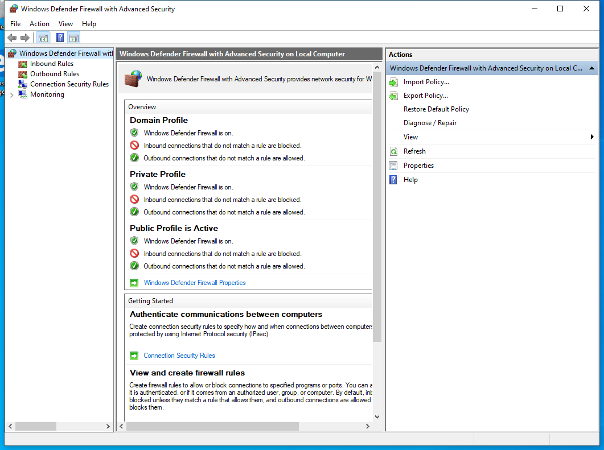

---
title: WF.msc | 
excerpt: What is WF.msc?
---

# WF.msc 

* File Path: `C:\Windows\system32\WF.msc`
* Description: Windows Defender Firewall with Advanced Security (Window Title)

## Screenshot

## Hashes

Type | Hash
-- | --
MD5 | `CB74567907F74DB11AAEC85865FDF35E`
SHA1 | `EC7FE51736A8A81EDD9A19C9FE7235E9158805DF`
SHA256 | `4C9DA9127D2B6D8AB495148B2EF258EB2C8B7EFE4E5AC9D400DE1189A1E8D62A`
SHA384 | `5A46223B2678B001994212088999B5469366C36F4B4208525EE39DE0CC80DCD85E04F03C613B51679C90C9D7AF8056B8`
SHA512 | `F130A7448126219C4385DBCB643DAA55234FD15A784EB79BF2251D66282F916C0FB9928C620506A04480A273778D932D716BD4953063C18948E705517CF0FBD6`
SSDEEP | `384:LMza1yrq3vCDAQvuFOH5Q3R0gm8VPRI65m83DiYPNPNPE11GkPV0XspJn6XratTO:LyrEv2ju8i35RI65mwhPNPNPlER6XG0`
PESHA1 | `EC7FE51736A8A81EDD9A19C9FE7235E9158805DF`
PE256 | `4C9DA9127D2B6D8AB495148B2EF258EB2C8B7EFE4E5AC9D400DE1189A1E8D62A`

## Runtime Data

### Window Title:
Windows Defender Firewall with Advanced Security

### Open Handles:

Path | Type
-- | --
(R-D)   C:\Windows\assembly\GAC_MSIL\Microsoft.ManagementConsole\3.0.0.0__31bf3856ad364e35\Microsoft.ManagementConsole.dll | File
(R-D)   C:\Windows\assembly\GAC_MSIL\MMCEx\3.0.0.0__31bf3856ad364e35\MMCEx.dll | File
(R-D)   C:\Windows\assembly\GAC_MSIL\MMCFxCommon\3.0.0.0__31bf3856ad364e35\MMCFxCommon.dll | File
(R-D)   C:\Windows\Fonts\StaticCache.dat | File
(R-D)   C:\Windows\Microsoft.NET\assembly\GAC_64\mscorlib\v4.0_4.0.0.0__b77a5c561934e089\mscorlib.dll | File
(R-D)   C:\Windows\Microsoft.NET\assembly\GAC_MSIL\Accessibility\v4.0_4.0.0.0__b03f5f7f11d50a3a\Accessibility.dll | File
(R-D)   C:\Windows\Microsoft.NET\assembly\GAC_MSIL\System.Configuration\v4.0_4.0.0.0__b03f5f7f11d50a3a\System.Configuration.dll | File
(R-D)   C:\Windows\Microsoft.NET\assembly\GAC_MSIL\System.Drawing\v4.0_4.0.0.0__b03f5f7f11d50a3a\System.Drawing.dll | File
(R-D)   C:\Windows\Microsoft.NET\assembly\GAC_MSIL\System.Windows.Forms\v4.0_4.0.0.0__b77a5c561934e089\System.Windows.Forms.dll | File
(R-D)   C:\Windows\Microsoft.NET\assembly\GAC_MSIL\System.Xml\v4.0_4.0.0.0__b77a5c561934e089\System.XML.dll | File
(R-D)   C:\Windows\Microsoft.NET\assembly\GAC_MSIL\System\v4.0_4.0.0.0__b77a5c561934e089\System.dll | File
(R-D)   C:\Windows\System32\AuthFWSnapin.dll | File
(R-D)   C:\Windows\System32\en-US\KernelBase.dll.mui | File
(R-D)   C:\Windows\System32\en-US\MFC42u.dll.mui | File
(R-D)   C:\Windows\System32\en-US\mmc.exe.mui | File
(R-D)   C:\Windows\System32\en-US\mmcbase.dll.mui | File
(R-D)   C:\Windows\System32\en-US\mmcndmgr.dll.mui | File
(R-D)   C:\Windows\System32\en-US\user32.dll.mui | File
(R-D)   C:\Windows\SystemResources\mmcbase.dll.mun | File
(R-D)   C:\Windows\SystemResources\mmcndmgr.dll.mun | File
(RW-)   C:\Users\user | File
(RW-)   C:\Windows\WinSxS\amd64_microsoft.windows.common-controls_6595b64144ccf1df_5.82.19041.488_none_4238de57f6b64d28 | File
(RW-)   C:\Windows\WinSxS\amd64_microsoft.windows.common-controls_6595b64144ccf1df_6.0.19041.746_none_ca02b4b61b8320a4 | File
(RW-)   C:\Windows\WinSxS\amd64_microsoft.windows.gdiplus_6595b64144ccf1df_1.1.19041.789_none_faf0a7e97612e7bb | File
(RWD)   C:\Windows\Fonts\marlett.ttf | File
(RWD)   C:\Windows\Fonts\micross.ttf | File
(RWD)   C:\Windows\Fonts\segoeui.ttf | File
(RWD)   C:\Windows\Fonts\segoeuib.ttf | File
(RWD)   C:\Windows\Fonts\segoeuii.ttf | File
(RWD)   C:\Windows\Fonts\segoeuiz.ttf | File
\...\Cor_SxSPublic_IPCBlock | Section
\BaseNamedObjects\__ComCatalogCache__ | Section
\BaseNamedObjects\C:\*ProgramData\*Microsoft\*Windows\*Caches\*{6AF0698E-D558-4F6E-9B3C-3716689AF493}.2.ver0x0000000000000002.db | Section
\BaseNamedObjects\C:\*ProgramData\*Microsoft\*Windows\*Caches\*{DDF571F2-BE98-426D-8288-1A9A39C3FDA2}.2.ver0x0000000000000002.db | Section
\BaseNamedObjects\C:\*ProgramData\*Microsoft\*Windows\*Caches\*cversions.2 | Section
\BaseNamedObjects\Cor_Private_IPCBlock_v4_7016 | Section
\BaseNamedObjects\NLS_CodePage_1252_3_2_0_0 | Section
\BaseNamedObjects\NLS_CodePage_437_3_2_0_0 | Section
\BaseNamedObjects\windows_shell_global_counters | Section
\Sessions\1\BaseNamedObjects\1b68HWNDInterface:4e0548 | Section
\Sessions\1\BaseNamedObjects\1b68HWNDInterface:6b0494 | Section
\Sessions\1\BaseNamedObjects\SessionImmersiveColorPreference | Section
\Sessions\1\BaseNamedObjects\windows_shell_global_counters | Section
\Sessions\1\Windows\Theme3205582532 | Section
\Windows\Theme3800351183 | Section

### Loaded Modules:

Path |
-- |
C:\Windows\SYSTEM32\AcGenral.dll |
C:\Windows\SYSTEM32\apphelp.dll |
C:\Windows\System32\GDI32.dll |
C:\Windows\System32\KERNEL32.DLL |
C:\Windows\System32\KERNELBASE.dll |
C:\Windows\SYSTEM32\mmc.exe |
C:\Windows\System32\msvcrt.dll |
C:\Windows\SYSTEM32\ntdll.dll |
C:\Windows\System32\RPCRT4.dll |
C:\Windows\System32\sechost.dll |
C:\Windows\System32\SHLWAPI.dll |
C:\Windows\System32\USER32.dll |
C:\Windows\System32\win32u.dll |

## Signature

* Status: Signature verified.
* Serial: `3300000266BD1580EFA75CD6D3000000000266`
* Thumbprint: `A4341B9FD50FB9964283220A36A1EF6F6FAA7840`
* Issuer: CN=Microsoft Windows Production PCA 2011, O=Microsoft Corporation, L=Redmond, S=Washington, C=US
* Subject: CN=Microsoft Windows, O=Microsoft Corporation, L=Redmond, S=Washington, C=US

## File Metadata

* Original Filename: 
* Product Name: 
* Company Name: 
* File Version: 
* Product Version: 
* Language: 
* Legal Copyright: 

## File Scan

* VirusTotal Detections: 0/75
* VirusTotal Link: https://www.virustotal.com/gui/file/4c9da9127d2b6d8ab495148b2ef258eb2c8b7efe4e5ac9d400de1189a1e8d62a/detection

## File Similarity (ssdeep match)

File | Score
-- | --
[C:\Windows\system32\en-US\WF.msc](WF.msc-CB74567907F74DB11AAEC85865FDF35E.md) | 100
[C:\Windows\SysWOW64\en-US\WF.msc](WF.msc-CB74567907F74DB11AAEC85865FDF35E.md) | 100
[C:\Windows\SysWOW64\WF.msc](WF.msc-CB74567907F74DB11AAEC85865FDF35E.md) | 100

MIT License. Copyright (c) 2020-2021 Strontic.

