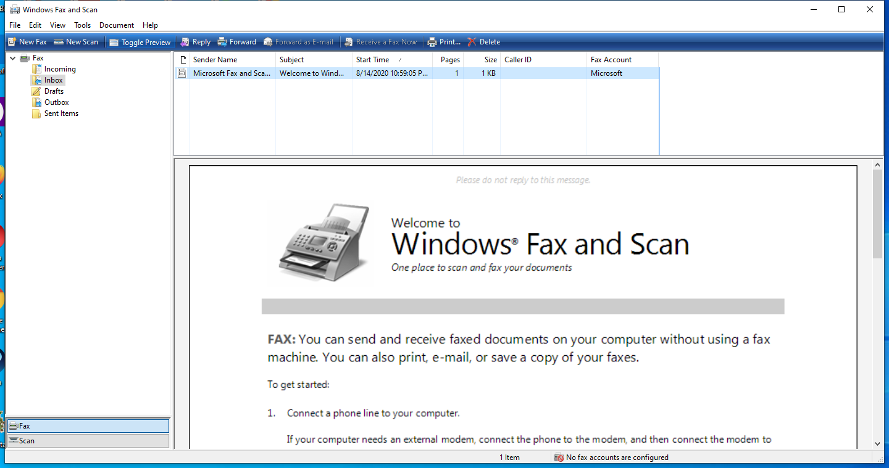

---
title: WFS.exe | Microsoft  Windows Fax and Scan
excerpt: What is WFS.exe?
---

# WFS.exe 

* File Path: `C:\Windows\system32\WFS.exe`
* Description: Microsoft  Windows Fax and Scan

## Screenshot

## Hashes

Type | Hash
-- | --
MD5 | `8E8507B0C0C16F1698A24BFD038EA54D`
SHA1 | `75E7B9572EBA6C56B471F77D312EE5109942FBEC`
SHA256 | `8FBAC98180BCF2D79CCEA364F3D7E1301E1592727B99C712B1DB5E2E50A7BF25`
SHA384 | `8A1648C3F341B788FC7A16B595414962F30C8ACC7F2C1DABA7C28DE733E8E3FF1BB37B1634D4635BD7288409FA0B8A46`
SHA512 | `3AA65B72F4038CA02ABF0C70BFC64B66F1CE485EF515C71ED65DF9ABF6221CDAC0C82CD9834322BFE6CD04B1EEE815C8616ABE92769105A1D3F5F1E5786DB4B9`
SSDEEP | `12288:p1rNsTOtu0K0ZNY2cXxnedaK5Hp5GUlDY+xt4vFe:X05BU5G+evFe`

## Runtime Data

### Window Title:
Windows Fax and Scan

### Open Handles:

Path | Type
-- | --
(R-D)   C:\Windows\Fonts\StaticCache.dat | File
(R-D)   C:\Windows\System32\en-US\KernelBase.dll.mui | File
(R-D)   C:\Windows\System32\en-US\MFC42u.dll.mui | File
(R-D)   C:\Windows\System32\en-US\scansetting.dll.mui | File
(R-D)   C:\Windows\System32\en-US\WFSR.dll.mui | File
(RW-)   C:\Users\ADMINI~1\AppData\Local\Temp\2\FXSAPIDebugLogFile.txt | File
(RW-)   C:\Users\user\Documents | File
(RW-)   C:\Windows\WinSxS\amd64_microsoft.windows.common-controls_6595b64144ccf1df_6.0.17763.1397_none_de7645305346d5dc | File
(RW-)   C:\Windows\WinSxS\amd64_microsoft.windows.gdiplus_6595b64144ccf1df_1.1.17763.1397_none_0f613815add94faa | File
\BaseNamedObjects\__ComCatalogCache__ | Section
\BaseNamedObjects\NLS_CodePage_1252_3_2_0_0 | Section
\BaseNamedObjects\NLS_CodePage_437_3_2_0_0 | Section
\BaseNamedObjects\windows_shell_global_counters | Section
\Sessions\2\BaseNamedObjects\windows_shell_global_counters | Section
\Sessions\2\Windows\Theme4283305886 | Section
\Windows\Theme1956823608 | Section

### Loaded Modules:

Path |
-- |
C:\Windows\System32\ADVAPI32.dll |
C:\Windows\System32\KERNEL32.DLL |
C:\Windows\System32\KERNELBASE.dll |
C:\Windows\System32\msvcrt.dll |
C:\Windows\SYSTEM32\ntdll.dll |
C:\Windows\system32\WFS.exe |

## Signature

* Status: Signature verified.
* Serial: `33000001C422B2F79B793DACB20000000001C4`
* Thumbprint: `AE9C1AE54763822EEC42474983D8B635116C8452`
* Issuer: CN=Microsoft Windows Production PCA 2011, O=Microsoft Corporation, L=Redmond, S=Washington, C=US
* Subject: CN=Microsoft Windows, O=Microsoft Corporation, L=Redmond, S=Washington, C=US

## File Metadata

* Original Filename: ClientConsole.EXE
* Product Name: Microsoft Windows Operating System
* Company Name: Microsoft Corporation
* File Version: 10.0.17763.1 (WinBuild.160101.0800)
* Product Version: 10.0.17763.1
* Language: English (United States)
* Legal Copyright:  Microsoft Corporation. All rights reserved.

## File Similarity (ssdeep match)

File | Score
-- | --
[C:\Windows\system32\FXSST.dll](FXSST.dll-805DA5DFA15387C0528B441B9EE8C4E4.md) | 30
[C:\Windows\system32\WFS.exe](WFS.exe-7C1E8C5382FF4F55BF242B0377DA3EC5.md) | 36
[C:\WINDOWS\system32\WFS.exe](WFS.exe-7D05DBCCB67C329AD2F2E5FCAEE84260.md) | 40
[C:\Windows\system32\WFS.exe](WFS.exe-EECE3DAFAF89C27DE21E23F1D9A27B55.md) | 36
[C:\Windows\system32\WFSR.dll](WFSR.dll-2917EDF18AB86F81951DE976B6B98AC7.md) | 32

MIT License. Copyright (c) 2020 Strontic.

