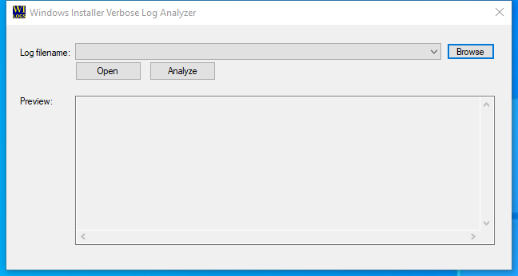

---
title: WiLogUtl.exe | Windows Installer Verbose Setup Log Analyzer
excerpt: What is WiLogUtl.exe?
---

# WiLogUtl.exe 

* File Path: `C:\Program Files (x86)\Windows Kits\10\bin\10.0.19041.0\arm\WiLogUtl.exe`
* Description: Windows Installer Verbose Setup Log Analyzer

## Screenshot

## Hashes

Type | Hash
-- | --
MD5 | `86682CEF1FB0E0702447EBFF7DC643CB`
SHA1 | `04834FBA323ACD9CA9236C94933073947DEDF03D`
SHA256 | `1C4920BCA1754BFACBC4EDCAC73D247F5FD45877191391D657A60C426EB673F3`
SHA384 | `8E3C2447B56C5A1A6F62C3F88C84F153DC8077A0937707884C4A76847C0093E928C016C5B3862E51ADD5DE96773F3865`
SHA512 | `8DDD1941267E673CAD0ECAA60834D3526E01912C474AE0B88AA10A05AD918816BFA0BD072D7023EC8DD2E97B86202FFBFB619D1C3DA50332AC3E15AB06D2B5F2`
SSDEEP | `3072:gBAcM71VZHpGagCoezIrOAt9WadAHVUfn6yLcDFEy13brvkVbFokvkN:g8pECoe4OaYFEy56u`
IMP | `5CACAA9C1D48B9312E5A1B4612FFD9D4`
PESHA1 | `60574F58F5B6737031238B9108A631093335281F`
PE256 | `118E4C830BCE63BF3EF0A1C2EB667011902C9F0589BB8E822244EBFE122925E2`

## Signature

* Status: Signature verified.
* Serial: `33000002B7E8E007A82AEF13150000000002B7`
* Thumbprint: `5A68625F1A516670A744F7EF919500A479D32A5B`
* Issuer: CN=Microsoft Code Signing PCA 2010, O=Microsoft Corporation, L=Redmond, S=Washington, C=US
* Subject: CN=Microsoft Windows Kits Publisher, O=Microsoft Corporation, L=Redmond, S=Washington, C=US

## File Metadata

* Original Filename: wilogutl.exe
* Product Name: Windows Installer
* Company Name: Microsoft Corporation
* File Version: 5.0.19041.1 (WinBuild.160101.0800)
* Product Version: 5.0.19041.1
* Language: English (United States)
* Legal Copyright:  Microsoft Corporation. All rights reserved.
* Machine Type: 452

## File Scan

* VirusTotal Detections: Unknown

## File Similarity (ssdeep match)

File | Score
-- | --
[C:\Program Files (x86)\Windows Kits\10\bin\10.0.19041.0\x86\WiLogUtl.exe](WiLogUtl.exe-33355395C57720FFCDAF3503E257E6FA.md) | 65

MIT License. Copyright (c) 2020-2021 Strontic.

